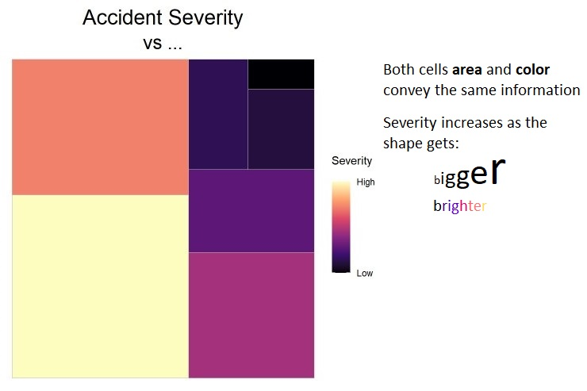

```{r global, include=FALSE}
# load data in 'global' chunk so it can be shared by all users of the dashboard

# ////////////////////////////////////////////////////////////////////////////////////////////////////
#  Packages
# ////////////////////////////////////////////////////////////////////////////////////////////////////

# for intro
library(rintrojs)

# for shiny inner workings
library(flexdashboard)
library(fontawesome)  # for icons
library(shiny)
library(shinyWidgets) # for more fancy input objects
library(htmlwidgets)  # for layer selection title
library(shinyalert)   # for popup alerts
library(shinyBS)      # for tooltips 
# library(shinyjs)  DON'T USE shinyjs... it creates conflicts/bugs that I could not identify

# for data manipulation
library(dplyr)
library(tidyr) #for pivot_longer
library(scales) #for rebalancing data

# for predictive stuff
library(lightgbm)
library(Matrix) 

# for reporting
library(DT)

# for graphs
library(plotly)
library(treemapify) 

# for maps
library(leaflet)
library(leaflet.extras) #to make things draggable
library(tmaptools) #for geocoding OSM
library(ggmap) #for geocoding Google
library(raster) #clashes  with "base::nrow" 
library(sf)   #for spatial operations
library(osrm) # for routing trajectory
library(rgdal)
library(leafpop)


# ////////////////////////////////////////////////////////////////////////////////////////////////////
#  Vehicle Shopper
# ////////////////////////////////////////////////////////////////////////////////////////////////////


# RDS consumes more memory than a .txt model
#lgb.fit.multi <- readRDS.lgb.Booster("lgb.fit.MODELv2.rds")
#lgb.fit.color <- readRDS.lgb.Booster("lgb.fit.COLOR.RDS")

lgb.fit.multi <- lgb.load("files/lgb.fit.MODELv6.txt")
lgb.fit.color <- lgb.load("files/lgb.fit.COLOR.txt")


# Data: Body Profiles 
df_vehi_unique <- readRDS("files/df_vehi_unique.rds")

# Data: Insurance Premium estimates
#df_prem <- readRDS("df_prem_final_newused.rds")
df_prem <- readRDS("files/df_prem_models.rds")

# Data: Fuel, CO2 and Smog rating
fuel <- readRDS("files/fuel.rds")

# Data: Safety Ratings
safercar <- readRDS("files/safercar.rds")

# Data: Age x Gender price curve
df_prem_age.gender <- readRDS("files/df_prem_age.gender.rds")


# ////////////////////////////////////////////////////////////////////////////////////////////////////
#  Map Risk
# ////////////////////////////////////////////////////////////////////////////////////////////////////


options(osrm.server = "https://routing.openstreetmap.de/") 
#options(osrm.server = "http://router.project-osrm.org/")   #backup server if first one is broken


#++++++++++++++++++++++++++++++++++++++++++++++++++++++++++++++++++++++++++++++++++++++++++++++++++
# GEOCODER:

# Insert your Google API key, with "Geocoder" and "Places" services enabled.

#google_key_internal = "your_private_key_here" #for internal usage
#google_key_http = google_key_internal
#google_key_ip   = google_key_internal

google_key_http = ""   #for shinyapps HTTP referrer restrictions
google_key_ip   = ""   #for shinyapps IP restriction

# google_key_http: I don't think this key will be visible. 
# google_key_http:  this key will be visible in the JS console. Therefore we are using a key restricted to the domain hacktuary.shinyapps.io/toolkit

# If you want autocomplete feature in the search boxes, set to TRUE.
# Needs to have a valid Google API key

google_autocomplete = FALSE


# Notes on Google API Key restrictions:

# HTTP referrer restriction can only work when invoking google from the browser/javascript
# Therefore it works with the autocomplete.
#
#
# However, it will not work with the server-side geocoding because it's not done on the user side.
# We need to switch the security to a IP limitation (instead of HTTP referrer)
# In google cloud api monitoring, I've whitelisted shinyapps.io to use my API key.
#
#
#  google_key_http
#     This key will be visible in the JS console. 
#     Therefore we are using a key restricted to the domain hacktuary.shinyapps.io 
#
#  google_key_ip
#     I don't think this key is visible...
#     It still is restricted to shinyapps.io IP server.


#++++++++++++++++++++++++++++++++++++++++++++++++++++++++++++++++++++++++++++++++++++++++++++++++++


resolution <- list("Montreal" = 300 ,
                   #"Toronto"  = 450 ,
                   "Toronto"  = 405 ,
                   "Parking"  = 200 )

pgons <- list(  "Montreal" = readRDS("files/pgons.mtl.inv.rds")
               , "Toronto" = readRDS("files/pgons.tor.inv.rds"))

routing_init <- readRDS("files/routes_init.rds")
speed_init <- readRDS("files/speed_init.rds")

KDR_both <- list("Montreal" = readRDS(paste0("files/KDR_both.mtl.",resolution[["Montreal"]],".rds")),
                 "Toronto"  = readRDS(paste0("files/KDR_both.tor.",resolution[["Toronto"]],".rds")))

KDR_ambu <- list("Montreal" = readRDS(paste0("files/KDR_ambu.mtl.",resolution[["Montreal"]],".rds")),
                 "Toronto"  = readRDS(paste0("files/KDR_ambu.tor.",resolution[["Toronto"]],".rds")))

KDR_parking <- list("theft.of.auto" = readRDS(paste0("files/KDR.theft.of.auto.",resolution[["Parking"]],".rds")),
                    "theft.in.auto" = readRDS(paste0("files/KDR.theft.in.auto.",resolution[["Parking"]],".rds")),
                    "theft.auto"    = readRDS(paste0("files/KDR.theft.auto."   ,resolution[["Parking"]],".rds")))


KDR_both_list <- list()
KDR_ambu_list <- list()

KDR.theft.of.auto.color <- colorNumeric(  #c("#FF0000", "#7D00CE", "#008ACE", "#00CE8A"), 
                                          c("#FFB800", "#AF820D", "#4F4019", "#0f0f0f"), 
                                          #domain = KDR_parking[[1]]@data@values, 
                                          domain = c(10,100),
                                          na.color = "transparent", reverse = TRUE)
  
KDR.theft.in.auto.color <- colorNumeric(c("#FFB800", "#AF820D", "#4F4019", "#0f0f0f"), 
                                          #domain = KDR_parking[[2]]@data@values, 
                                          domain = c(10,100),
                                          na.color = "transparent", reverse = TRUE)
  

cutoffs <- c(10,25,45)

for (i in cutoffs){
  for (city in c("Montreal","Toronto")){  
    KDR_temp <- KDR_both[[city]]
    KDR_temp@data@values[which(KDR_temp@data@values < i)] <- NA
    KDR_both_list[[city]][[which(cutoffs == i)]] <- KDR_temp
  }
}


for (i in cutoffs){
  for (city in c("Montreal","Toronto")){  
    KDR_temp <- KDR_ambu[[city]]
    KDR_temp@data@values[which(KDR_temp@data@values < i)] <- NA
    KDR_ambu_list[[city]][[which(cutoffs == i)]] <- KDR_temp
  }

}


KDR <- list( KDR_both_list ,
             KDR_ambu_list )

rm( KDR_temp, KDR_both_list, KDR_ambu_list, KDR_both , KDR_ambu )
invisible(gc())

print(summary(KDR[[1]][["Montreal"]][[1]]@data@values))

#create pal function for coloring the raster
KDR_col <- KDR
KDR_col[[1]][["Montreal"]][[1]] <- colorNumeric(c("#FF0000", "#7D00CE", "#008ACE", "#00CE8A"),
                                                #domain = KDR[[1]][["Montreal"]][[1]]@data@values,
                                                domain = c(10,100),
                                                na.color = "transparent", reverse = TRUE)
KDR_col[[1]][["Montreal"]][[2]] <- NA
KDR_col[[1]][["Montreal"]][[3]] <- NA


KDR_col[[2]][["Montreal"]][[1]] <- colorNumeric(c("#FF0000", "#7D00CE", "#008ACE", "#00CE8A"),
                                                #domain = KDR[[2]][["Montreal"]][[1]]@data@values,
                                                domain = c(10,100),
                                                na.color = "transparent", reverse = TRUE)
KDR_col[[2]][["Montreal"]][[2]] <- NA
KDR_col[[2]][["Montreal"]][[3]] <- NA


KDR_col[[1]][["Toronto"]][[1]] <- colorNumeric(c("#FF0000", "#7D00CE", "#008ACE", "#00CE8A"),
                                               #domain = base::range(KDR[[1]][["Toronto"]][[1]]@data@values, na.rm=TRUE),
                                               domain = c(10,100),
                                               na.color = "transparent", reverse = TRUE)
KDR_col[[1]][["Toronto"]][[2]] <- NA
KDR_col[[1]][["Toronto"]][[3]] <- NA


KDR_col[[2]][["Toronto"]][[1]] <- colorNumeric(c("#FF0000", "#7D00CE", "#008ACE", "#00CE8A"),
                                               #domain = KDR[[2]][["Toronto"]][[1]]@data@values,
                                               domain = c(10,100),
                                               na.color = "transparent", reverse = TRUE)
KDR_col[[2]][["Toronto"]][[2]] <- NA
KDR_col[[2]][["Toronto"]][[3]] <- NA

invisible(gc())


# OSRM utilities
{
  
  
  
  
  ## osrmIsochrone Utils
  #' @import sf
  isopoly <- function(x, breaks, 
                      xcoords = "COORDX", ycoords = "COORDY", var = "OUTPUT"){
    
    # get initial min and max values
    vmin <- min(x[[var]], na.rm = TRUE)
    vmax <- max(x[[var]], na.rm = TRUE)
    breaks <- sort(unique(c(vmin, breaks[breaks > vmin & breaks < vmax], vmax)))
    # data points to matrix
    m <- matrix(data = x[[var]], nrow = length(unique(x[[xcoords]])), 
                dimnames = list(unique(x[[xcoords]]), unique(x[[ycoords]])))
    # compute isobands
    lev_low = breaks[1:(length(breaks)-1)]
    lev_high = breaks[2:length(breaks)]
    raw <- isoband::isobands(x = as.numeric(rownames(m)), 
                             y = as.numeric(colnames(m)), z = t(m), 
                             levels_low = lev_low,
                             levels_high = c(lev_high[-length(lev_high)], 
                                             vmax + 1e-10))
    bands <- isoband::iso_to_sfg(raw)
    iso <- st_sf(id = 1:length(bands), 
                 min = lev_low, 
                 max = lev_high,
                 geometry = sf::st_sfc(bands), 
                 crs = st_crs(x))
    iso[1,"min"] <- 0
    iso$center = iso$min + (iso$max - iso$min) / 2
    
    # invalid polygons mgmnt
    st_geometry(iso) <- st_make_valid(st_geometry(iso))  
    
    
    if(methods::is(st_geometry(iso), "sfc_GEOMETRYCOLLECTION") || 
       methods::is(st_geometry(x), "sfc_GEOMETRY")){
      st_geometry(iso) <-   sf::st_collection_extract(st_geometry(iso), "POLYGON")
    }
    # get rid of out of breaks polys
    iso <- iso[-nrow(iso),]
    return(iso)
  }
  
  
  rgrid <- function(loc, dmax, res){
    # create a regular grid centerd on loc
    boxCoordX <- seq(from = sf::st_coordinates(loc)[1,1] - dmax,
                     to = sf::st_coordinates(loc)[1,1] + dmax,
                     length.out = res)
    boxCoordY <- seq(from = sf::st_coordinates(loc)[1,2] - dmax,
                     to = sf::st_coordinates(loc)[1,2] + dmax,
                     length.out = res)
    sgrid <- expand.grid(boxCoordX, boxCoordY)
    sgrid <- data.frame(ID = seq(1, nrow(sgrid), 1),
                        COORDX = sgrid[, 1],
                        COORDY = sgrid[, 2])
    sgrid <- sf::st_as_sf(sgrid,  coords = c("COORDX", "COORDY"),
                          crs = st_crs(loc), remove = FALSE)
    return(sgrid)
  }
  
  
  
  # output formating
  tab_format <- function(res, src, dst, type){
    if(type == "duration"){
      mat <- res$durations
      # From sec to minutes
      mat <- round(mat/(60), 1)
    }else{
      mat <- res$distances
      mat <- round(mat, 0)
    }
    # col and row names management
    dimnames(mat) <- list(src$id, dst$id)
    return(mat)
  }  
  
  
  coord_format <- function(res, src, dst){
    sources <- data.frame(matrix(unlist(res$sources$location, 
                                        use.names = T), 
                                 ncol = 2, byrow = T, 
                                 dimnames = list(src$id, c("lon", "lat"))))
    destinations <- data.frame(matrix(unlist(res$destinations$location, 
                                             use.names = T), 
                                      ncol = 2, byrow = T, 
                                      dimnames = list(dst$id, c("lon", "lat"))))
    return(list(sources = sources, destinations = destinations)
    )
  }
  
  
  
  
  input_route <- function(x, id, single = TRUE){
    # test various cases (vector, data.frame, with or without id, sf)
    oprj <- NA
    if(single){
      if(is.vector(x)){
        if(length(x) == 2){
          id <- id
          i <- 0
        }else{
          i <- 1
          id <- x[i]
        }
        lon <- clean_coord(x[i+1])
        lat <- clean_coord(x[i+2])       
      }
      if(is.data.frame(x)){
        if(methods::is(x,"sf")){
          oprj <- sf::st_crs(x)
          x <- sf_2_df(x)
          i <- 1
          id <- x[1, i]
        }else{
          if(length(x) == 2){
            i <- 0
            id <- id
          }else{
            i <- 1
            id <- x[1, i]
          }
        }
        lon <- clean_coord(x[1, i+1])
        lat <- clean_coord(x[1, i+2])       
      }
      return(list(id = id, lon = lon, lat = lat, oprj = oprj))
    }else{
      if(is.data.frame(x)){
        if(methods::is(x,"sf")){
          oprj <- sf::st_crs(x)
          x <- sf_2_df(x)
          i <- 1
          id1 <- x[1,1]
          id2 <- x[nrow(x),1]
        }else{
          if(length(x) == 2){
            i <- 0
            id1 <- "src"
            id2 <- "dst"
          }else{
            i <- 1
            id1 <- x[1,1]
            id2 <- x[nrow(x),1]
          }
        }
        lon <- clean_coord(x[, i+1])
        lat <- clean_coord(x[, i+2])       
      }
      return(list(id1 = id1, id2 = id2, lon = lon, lat = lat, oprj = oprj))
    }
  } 
  
  
  # construct the base url
  base_url <- function(osrm.server, osrm.profile, query){
    if(osrm.server == "https://routing.openstreetmap.de/") {
      url <- paste0(osrm.server, "routed-", osrm.profile, "/", 
                    query, "/v1/driving/")
    }else{
      url <- paste0(osrm.server, query, "/v1/", osrm.profile, "/")
    }
    return(url)
  }
  
  # create short and clean coordinates
  clean_coord <- function(x){
    format(round(as.numeric(x),5), scientific = FALSE, justify = "none", 
           trim = TRUE, nsmall = 5, digits = 5)
  }
  
  
  # this function takes an sf and transforms it into a dataframe  
  sf_2_df <- function(x){    
    # transform to centroid and to wgs84
    if (methods::is(sf::st_geometry(x), "sfc_GEOMETRY") ||  
        methods::is(sf::st_geometry(x), "sfc_GEOMETRYCOLLECTION")){
      x <- sf::st_collection_extract(x, "POLYGON", warn = FALSE)
    }
    if (methods::is(sf::st_geometry(x), "sfc_POLYGON") || 
        methods::is(sf::st_geometry(x), "sfc_MULTIPOLYGON")){
      sf::st_geometry(x) <- sf::st_centroid(x = sf::st_geometry(x),
                                            of_largest_polygon = TRUE)
    }
    x <- sf::st_transform(x = x, crs = 4326)
    coords <- sf::st_coordinates(x)
    x <- data.frame(id = row.names(x), 
                    lon = clean_coord(coords[,1]), 
                    lat = clean_coord(coords[,2]))
    return(x)
  }
  
  
  encode_coords <- function(x){
    
    x$lat <- as.numeric(as.character(x$lat))
    x$lon <- as.numeric(as.character(x$lon))
    paste0("polyline(", googlePolylines::encode(x[,c("lon","lat")]),")")
    # paste(clean_coord(x$lon), clean_coord(x$lat), sep=",",collapse = ";")
  }
  
  
  
  test_http_error <- function(r){
    if (r$status_code >= 400) {
      if (substr(r$type, 1, 16) != "application/json") {
        stop(
          sprintf(
            "OSRM API request failed [%s]", 
            r$status_code),
          call. = FALSE)
      }else{
        rep <- RcppSimdJson::fparse(rawToChar(r$content))
        stop(
          sprintf(
            "OSRM API request failed [%s]\n%s\n%s", 
            r$status_code, 
            rep$code, 
            rep$message
          ),
          call. = FALSE
        )
      }
    }
    return(NULL)
  }
  
  
}


# ////////////////////////////////////////////////////////////////////////////////////////////////////
# Risk Factors
# ////////////////////////////////////////////////////////////////////////////////////////////////////

df_coll <- readRDS("files/df_coll_list.rds")
invisible(list2env(df_coll ,.GlobalEnv))


# ////////////////////////////////////////////////////////////////////////////////////////////////////
# Custom Functions
# ////////////////////////////////////////////////////////////////////////////////////////////////////


radioTooltip <- function(id, choice, title, placement = "bottom", trigger = "hover", options = NULL){

  options = shinyBS:::buildTooltipOrPopoverOptionsList(title, placement, trigger, options)
  options = paste0("{'", paste(names(options), options, sep = "': '", collapse = "', '"), "'}")
  bsTag <- shiny::tags$script(shiny::HTML(paste0("
    $(document).ready(function() {
      setTimeout(function() {
        $('input', $('#", id, "')).each(function(){
          if(this.getAttribute('value') == '", choice, "') {
            opts = $.extend(", options, ", {html: true});
            $(this.parentElement).tooltip('destroy');
            $(this.parentElement).tooltip(opts);
          }
        })
      }, 500)
    });
  ")))
  htmltools::attachDependencies(bsTag, shinyBS:::shinyBSDep)
}


# Used to assign classes, to work with rintrojs
add_class <- function(x, class) {
  x$attribs <- append(x$attribs, list(class = class))
  x
}


```


 
 
 
 
 
<script>
$("body").on("shown.bs.tab", "a[data-toggle='tab']", function(e) {

   //var delayInMilliseconds = 700; //0.7 second
    //setTimeout(function() {
          Shiny.setInputValue("active_tab", $(e.target).parent().index());
  //  }, delayInMilliseconds);

})

$('.navbar-logo').wrap('<a href="https://www.casact.org/article/casualty-actuarial-society-announces-2022-cas-hacktuary-challenge" title="What started it all..." target="_blank">');

$(document).keyup(function(event) {
    if ($("#var_dest_from").is(":focus") && (event.key == "Enter")) {
    
    var delayInMilliseconds = 700; //0.7 second
    setTimeout(function() {
        $("#execute").click();
    }, delayInMilliseconds);


    }
});

$(document).keyup(function(event) {
    if ($("#var_dest_to").is(":focus") && (event.key == "Enter")) {
    
    var delayInMillisecondsTO = 700; //0.7 second
    setTimeout(function() {
        $("#execute").click();
    }, delayInMillisecondsTO);
    }
});


</script>

 
 
 
 
 
 
 
 
 
 
 
 
 
 
 
 
 
 
 
<style>


/*================================
        HOME           
================================*/

.table>tbody>tr>td, 
.table>tbody>tr>th, 
.table>tfoot>tr>td, 
.table>tfoot>tr>th, 
.table>thead>tr>td, 
.table>thead>tr>th {
      vertical-align: middle !important; 
 }


.pricingTable {
  margin: auto 30px;
}
.pricingTable > .pricingTable-title {
  text-align: center;
  color: #6e768d;
  font-size: 5em;
  font-size: 300%;
  margin-bottom: 20px;
  letter-spacing: 0.10em;
}
.pricingTable > .pricingTable-subtitle {
  text-align: center;
  color: #b4bdc6;
  font-size: 1.8em;
  letter-spacing: 0.04em;
  margin-bottom: 60px;
}
@media screen and (max-width: 480px) {
  .pricingTable > .pricingTable-subtitle {
    margin-bottom: 30px;
  }
}
.pricingTable-firstTable {
  list-style: none;
  padding-left: 2em;
  padding-right: 2em;
  text-align: center;
}
.pricingTable-firstTable_table {
  vertical-align: middle;
  width: 29%;
  background-color: #ffffff;
  display: inline-block;
  padding: 0px 30px 40px;
  text-align: center;
  max-width: 320px;
  transition: all 0.3s ease;
  border-radius: 5px;
}
@media screen and (max-width: 767px) {
  .pricingTable-firstTable_table {
    display: block;
    width: 90%;
    margin: 0 auto;
    max-width: 90%;
    margin-bottom: 20px;
    padding: 10px;
    padding-left: 20px;
  }
}
@media screen and (max-width: 767px) {
  .pricingTable-firstTable_table > * {
    display: inline-block;
    vertical-align: middle;
  }
}
@media screen and (max-width: 480px) {
  .pricingTable-firstTable_table > * {
    display: block;
    float: none;
  }
}
@media screen and (max-width: 767px) {
  .pricingTable-firstTable_table:after {
    display: table;
    content: "";
    clear: both;
  }
}
.pricingTable-firstTable_table:hover {
  transform: scale(1.08);
}
@media screen and (max-width: 767px) {
  .pricingTable-firstTable_table:hover {
    transform: none;
  }
}
.pricingTable-firstTable_table:not(:last-of-type) {
  margin-right: 3.5%;
}
@media screen and (max-width: 767px) {
  .pricingTable-firstTable_table:not(:last-of-type) {
    margin-right: auto;
  }
}
.pricingTable-firstTable_table:nth-of-type(2) {
  position: relative;
}
@media screen and (max-width: 767px) {
  .pricingTable-firstTable_table:nth-of-type(2) h1 {
    padding-top: 8%;
  }
}
.pricingTable-firstTable_table__header {
  font-size: 2.6em;
  padding: 40px 0px;
  border-bottom: 2px solid #ebedec;
  letter-spacing: 0.03em;
}
@media screen and (max-width: 1068px) {
  .pricingTable-firstTable_table__header {
    font-size: 1.45em;
  }
}
@media screen and (max-width: 767px) {
  .pricingTable-firstTable_table__header {
    padding: 0px;
    border-bottom: none;
    float: left;
    width: 33%;
    padding-top: 3%;
    padding-bottom: 2%;
  }
}
@media screen and (max-width: 610px) {
  .pricingTable-firstTable_table__header {
    font-size: 1.3em;
  }
}
@media screen and (max-width: 480px) {
  .pricingTable-firstTable_table__header {
    float: none;
    width: 100%;
    font-size: 1.8em;
    margin-bottom: 5px;
  }
}
.pricingTable-firstTable_table__pricing {
  font-size: 1.2em;
  padding: 10px 0px;
  <!-- border-bottom: 2px solid #ebedec; -->
  line-height: 1.2;
}
@media screen and (max-width: 1068px) {
  .pricingTable-firstTable_table__pricing {
    font-size: 2.8em;
  }
}
@media screen and (max-width: 767px) {
  .pricingTable-firstTable_table__pricing {
    border-bottom: none;
    padding: 0;
    float: left;
    clear: left;
    width: 33%;
  }
}
@media screen and (max-width: 610px) {
  .pricingTable-firstTable_table__pricing {
    font-size: 2.4em;
  }
}
@media screen and (max-width: 480px) {
  .pricingTable-firstTable_table__pricing {
    float: none;
    width: 100%;
    font-size: 3em;
    margin-bottom: 10px;
  }
}
.pricingTable-firstTable_table__pricing span:first-of-type {
  font-size: 0.35em;
  vertical-align: top;
  letter-spacing: 0.15em;
}
@media screen and (max-width: 1068px) {
  .pricingTable-firstTable_table__pricing span:first-of-type {
    font-size: 0.3em;
  }
}
.pricingTable-firstTable_table__pricing span:last-of-type {
  vertical-align: bottom;
  font-size: 0.3em;
  letter-spacing: 0.04em;
  padding-left: 0.2em;
}
@media screen and (max-width: 1068px) {
  .pricingTable-firstTable_table__pricing span:last-of-type {
    font-size: 0.25em;
  }
}
.pricingTable-firstTable_table__options {
  list-style: none;
  padding: 15px;
  font-size: 0.9em;
  border-bottom: 2px solid #ebedec;
}
@media screen and (max-width: 1068px) {
  .pricingTable-firstTable_table__options {
    font-size: 0.85em;
  }
}
@media screen and (max-width: 767px) {
  .pricingTable-firstTable_table__options {
    border-bottom: none;
    padding: 0;
    margin-right: 10%;
  }
}
@media screen and (max-width: 610px) {
  .pricingTable-firstTable_table__options {
    font-size: 0.7em;
    margin-right: 8%;
  }
}
@media screen and (max-width: 480px) {
  .pricingTable-firstTable_table__options {
    font-size: 1.3em;
    margin-right: none;
    margin-bottom: 10px;
  }
}
.pricingTable-firstTable_table__options > li {
  padding: 8px 0px;
}
@media screen and (max-width: 767px) {
  .pricingTable-firstTable_table__options > li {
    text-align: left;
  }
}
@media screen and (max-width: 610px) {
  .pricingTable-firstTable_table__options > li {
    padding: 5px 0;
  }
}
@media screen and (max-width: 480px) {
  .pricingTable-firstTable_table__options > li {
    text-align: center;
  }
}
.pricingTable-firstTable_table__options > li:before {
  content: "✓";
  display: inline-flex;
  margin-right: 15px;
  color: white;
  background-color: #74ce6a;
  border-radius: 50%;
  width: 15px;
  height: 15px;
  font-size: 0.8em;
  padding: 2px;
  align-items: center;
  justify-content: center;
}
@media screen and (max-width: 1068px) {
  .pricingTable-firstTable_table__options > li:before {
    width: 14px;
    height: 14px;
    padding: 1.5px;
  }
}
@media screen and (max-width: 767px) {
  .pricingTable-firstTable_table__options > li:before {
    width: 12px;
    height: 12px;
  }
}
.pricingTable-firstTable_table__getstart {
  color: white;
  border: 0;
  background-color: #71ce73;
  margin-top: 30px;
  border-radius: 5px;
  cursor: pointer;
  padding: 15px;
  box-shadow: 0px 3px 0px 0px #66ac64;
  letter-spacing: 0.07em;
  transition: all 0.4s ease;
}
@media screen and (max-width: 1068px) {
  .pricingTable-firstTable_table__getstart {
    font-size: 0.95em;
  }
}
@media screen and (max-width: 767px) {
  .pricingTable-firstTable_table__getstart {
    margin-top: 0;
  }
}
@media screen and (max-width: 610px) {
  .pricingTable-firstTable_table__getstart {
    font-size: 0.9em;
    padding: 10px;
  }
}
@media screen and (max-width: 480px) {
  .pricingTable-firstTable_table__getstart {
    font-size: 1em;
    width: 50%;
    margin: 10px auto;
  }
}
.pricingTable-firstTable_table__getstart:hover {
  transform: translateY(-10px);
  box-shadow: 0px 40px 29px -19px rgba(102, 172, 100, 0.9);
}
@media screen and (max-width: 767px) {
  .pricingTable-firstTable_table__getstart:hover {
    transform: none;
    box-shadow: none;
  }
}
.pricingTable-firstTable_table__getstart:active {
  box-shadow: inset 0 0 10px 1px #66a564, 0px 40px 29px -19px rgba(102, 172, 100, 0.95);
  transform: scale(0.95) translateY(-9px);
}
@media screen and (max-width: 767px) {
  .pricingTable-firstTable_table__getstart:active {
    transform: scale(0.95) translateY(0);
    box-shadow: none;
  }
}


body {
  <!-- font-size: 100%; -->
}
@media screen and (max-width: 960px) {
  body {
    font-size: 100%;
  }
}
@media screen and (max-width: 776px) {
  body {
    font-size: 100%;
  }
}
@media screen and (max-width: 496px) {
  body {
    font-size: 70%;
  }
}
@media screen and (max-width: 320px) {
  body {
    font-size: 40%;
  }
}


/*================================
        COMMON STUFF           
================================*/


.introjs-skipbutton{
font-size:10px;
}


h5{
margin-bottom: 3px;
}

.navbar-brand {
    display: none;
  }

.navbar-logo.pull-left {
  padding-top:8px;
}


#myGroup > div {
  width: 45% !important;
  margin: 0px !important;
  border: none; 
  position:absolute;
  bottom: 5px;
  margin-top: 5px;
  margin-bottom: 0px;
}

#myGroup2 > div {
  width: 45% !important;
  margin: 0px !important;
  border: none; 
  position:absolute;
  bottom: 8px;
}


.btn-myClass {
    background-color: #c6d0dc;
}
.btn-myClass.active{
    background-color: #A7B3C2;
}


.selectize-dropdown-content {
  font.size: small;
}

.selectize-dropdown { 
line-height: 13px; 
}

.selectize-input { 
height: 3px; 
}

.selectize-control{
margin-bottom: -6px;
}

.shiny-input-container label{
    margin-bottom: 0px;
}


.form-group.shiny-input-container {
   margin-top: -1px;
   margin-bottom: 0px;
}

.shiny-input-container label{
    margin-bottom: 0px;
}

.form-control {
   height:auto; 
   padding:3px 5px;
   margin-top: 0px
}

.bttn-jelly {
  margin-top: 5px;
}

.bttn-stretch.bttn-primary{
  color: #6B6B6B;
  position: absolute;
  bottom: 5px;
  right: 5px;
  font-size: 20px;
}


.btn:active, .btn.active{
font-weight: bold;
color: #F1F1F1;
}

.btn-sm, .btn-group-sm>.btn {
padding: 4px 10px;
line-height: 1.3;
}

.navbar-inverse .navbar-nav>.active>a, .navbar-inverse .navbar-nav>.active>a:hover, .navbar-inverse .navbar-nav>.active>a:focus {
  font-size: large;
}

.btn-group, .btn-group-vertical {
  padding-bottom: 5px;
}

.dt-buttons.btn-group{
   float: right;
}
 

.bootstrap-select>.dropdown-toggle {
padding:5px
}


/*================================
        MAP           
================================*/


.leaflet-top .leaflet-left {
    display:inline-block;
    float: none;
}

.leaflet-control {
    display:inline-block;
    float: left;
    clear: none;
}

.value-box {
    color:inherit;
}


/*================================
        Shop           
================================*/

.irs--shiny .irs-bar{
  border-color: transparent;
  background-color: transparent;
}

.panel{
  background-color:#E0E3E8;
}

.panel-info{
 border-color: darkgrey;
 border-width: thin;
}

.table.dataTable tbody td.active, .table.dataTable tbody tr.active td{
  background-color: lightblue !important;
}


.btn-group>.btn:first-child:not(:last-child):not(.dropdown-toggle){
  margin-right:5px;
  background-color: #426D98;
  color: white;
  border-bottom-left-radius: 3px;
  border-top-left-radius: 3px;
  border-bottom-right-radius: 3px;
  border-top-right-radius: 3px;
} 

.btn-group>.btn:not(:first-child):not(:last-child):not(.dropdown-toggle) {
  margin-right:10px;
  background-color: darkgrey;
  border-bottom-left-radius: 3px;
  border-top-left-radius: 3px;
  border-bottom-right-radius: 3px;
  border-top-right-radius: 3px;
} 

.btn-group>.btn:last-child:not(:first-child), .btn-group>.dropdown-toggle:not(:first-child) {
  background-color: #426D98;
  color: white;
  border-bottom-left-radius: 3px;
  border-top-left-radius: 3px;
  border-bottom-right-radius: 3px;
  border-top-right-radius: 3px;
  margin-right:5px;
}


/*================================
        Event Horizon           
================================*/


.eventhorizon {
  height: 105px;
  align-items: center;
}

.eventhorizon .fas{
 vertical-align: middle;
}

.eh {
  background-color: black;
  color: lightgrey;
  height: 100% !important;
  display: table;
  margin-left: -10px;
}

.eh h2, .eh h3{
  color: lightgrey !important;
}

</style>


Home      {data-icon="fa-bars"}
=======================================================================


<div class="pricingTable">
  <h1 class="pricingTable-title">Consumer Vehicle Toolkit</h1>
  <h3 class="pricingTable-subtitle">Helping you shop and drive smarter</h3>
  
  <ul class="pricingTable-firstTable">
    <li class="pricingTable-firstTable_table">
      <h1 class="pricingTable-firstTable_table__header">Shop</h1>
      <p class="pricingTable-firstTable_table__pricing">
      Help you shop vehicles based on your profile and desired specifications.
      </p>
      <p class="pricingTable-firstTable_table__pricing">
      <i class='fas fa-shopping-cart'  style='font-size: 60px; color:#B8CBDA'></i>
      </p>
       <p class="pricingTable-firstTable_table__pricing">
      We provide tailored suggestions, along with insurance price indications, environmental ratings and body color popularity.
      </p>     
      <!-- <ul class="pricingTable-firstTable_table__options"> -->
      <!--   <li>Unlimited Listing</li> -->
      <!--   <li>Edit Your Listing</li> -->
      <!--   <li>Approve Reviews</li> -->
      <!-- </ul> -->
      <a title="Shop" href="#section-shop"><button class="pricingTable-firstTable_table__getstart">Go!</button></a>
      
    </li><li class="pricingTable-firstTable_table">
      <h1 class="pricingTable-firstTable_table__header">Map</h1>
      <p class="pricingTable-firstTable_table__pricing">
      Help you assess your route itinerary and parking risk.<br><br>
      </p> 
      <p class="pricingTable-firstTable_table__pricing">
      <i class='far fa-map'  style='font-size: 60px; color:#B8CBDA'></i>
      </p>
      <p class="pricingTable-firstTable_table__pricing">
      We map your itinerary along with search and drag features. We display risk areas and calculate your exposure to both driving (collisions) and parking (theft) risk.
      </p>
      <a title="Map" href="#section-map"><button class="pricingTable-firstTable_table__getstart">Go!</button></a>
      
    </li><li class="pricingTable-firstTable_table">
      <h1 class="pricingTable-firstTable_table__header">Risk Factors</h1>
      <p class="pricingTable-firstTable_table__pricing">
      Help you understand driving risk versus when and where you drive.
      </p> 
      <p class="pricingTable-firstTable_table__pricing">
      <i class='far fa-chart-bar'  style='font-size: 60px; color:#B8CBDA'></i>
      </p>
      <p class="pricingTable-firstTable_table__pricing">
      We illustrate the various road elements and contexts and how they influence risk.
      <br><br><br>
      </p> 
      <a title="Risk Factors" href="#section-risk-factors"><button class="pricingTable-firstTable_table__getstart">Go!</button></a>
    </li>
  </ul>
</div>


<br>
<br>
<br>
<center><i style="font-size:12px">For a better viewing experience, recommended resolution of 1920x1080, maximized browser window and a zoom no greater than 100%.</i><center>


Shop      {data-icon="fa-shopping-cart"}
=======================================================================

Column {.sidebar data-width=300}
-----------------------------------------------------------------

```{r shop_intro}

# Introduction Tour

steps_shop <- tibble::tribble(
  ~element, ~intro, ~position,
  NA, "This <b>introduction tour</b> will go over the main options and panels.", "top",
  "#menu_driver_vehicle", "First, specify your: <br><br>&emsp;-<b>Driver Profile<b><br>&emsp;-<b>Vehicle Specs</b>", "bottom"
  ,".priority_concern" , "Then, select your <b>Priority</b> concern, which is used to rank results.<br><br><br><i>e.g. Lower Insurance will rank your results, starting first with the lowest insurance cost.</i>" , "top"
  ,".dataTables_scroll", "Your <b>vehicle results</b> are automatically displayed here.", "bottom"
  ,".btn-group>.btn:first-child:not(:last-child):not(.dropdown-toggle)", "Click here to show <b>insurance</b><br>detailed by <b>coverage</b>.", "left"
  ,".btn-group>.dropdown-toggle:not(:first-child)", "This <b>HELP</b> button will help you better <b>understand</b> the table <b>columns</b>.", "left"
  ,"#section-colors", "Finally,<br><br>-<b>Body Color</b> popularity<br>-<b>Age & Gender</b> insurance impact<br><br>are displayed here." , "top"
)

welcomeShop <- reactiveValues(start = FALSE)
introShop <- reactiveValues(start = FALSE)

observeEvent( input$active_tab , {
  
  at <- isolate({input$active_tab})
  introShop$start=FALSE
  
  if(!is.null(at)){
    if(at == 1){
      
      if(welcomeShop$start == FALSE){
          shinyalert(
            title = "Welcome",
            closeOnClickOutside = FALSE,
            closeOnEsc = FALSE,
            size = "m",
            callbackR = function(x) {
              introShop$start <- x
            },
            html = TRUE,
            text = "If this is your first time, please consider taking the quick introduction tour.<br><br><br>You can always watch it later by clicking the <b><i class='fas fa-circle-info'></i> tour</b> at the bottom left of this page.",
            type = "info",
            confirmButtonText = 'Introduction Tour',
            confirmButtonCol = '#426D98',
            showCancelButton = TRUE,
            cancelButtonText = 'Skip'
          )
        welcomeShop$start = TRUE
      }
    }

  }

})

observeEvent( introShop$start , {
  
  if(introShop$start == TRUE){
     cat("Intro Shop started \n")
     introjs(session,
        options = list(steps=steps_shop,
            "nextLabel"="Next",
            "prevLabel"="Previous",
            "skipLabel"="Skip Tour",
            "doneLabel"="Done, let's go!"
        ),
        events = list()
     ) 
  }
  
})


observeEvent(input$shop_introtour, {
  
  #Launching the Introduction Tour
  introShop$start = FALSE
  introShop$start = TRUE
  
})

```


```{r shop_variables}

# All the variables used for this section.

var_environ <- c("Urban" = 1,  "Suburban" = 2, "Regional" = 3)

var_sex.choice  <- list(  fa(name = "person", fill = "grey", height = "2em") , 
                          fa(name = "person-dress", fill = "grey", height = "2em") )

var_sex.value   <- list("M", "F")

var_age         <- seq(16,80, 1)
var_bodyprofile <- c("CONVERTIBLE", "COUPE", "HATCHBACK", "PICKUP", "SEDAN", "SUV", "VAN", "WAGON")
var_power       <- c("Regular", "Powerful")
var_fuel        <- c("Gasoline", "Diesel", "Electric")
var_weight      <- c("Light", "Medium", "Heavy")
var_veh_age     <- c("New", "Used")

var_fuel_unit.choice <- list( ("L/100km"), ("mpg")  )
var_fuel_unit.value   <- c(0,1)

var_concerns <- c("Popularity" = "POP",
                  "Fuel consumption" = "FUEL",  
                  "CO2 rating" = "CO2.RATING", 
                  "Smog rating" = "SMOG.RATING", 
                  "Safety" = "OVERALL_STARS",
                  "Lower Thefts" = "THEFT.NUM",
                  "Lower Insurance" = "PREM")


# Tooltip bubble appearing when mouse hovers over inputs

bsTooltip(id = "var_environ", 
              title = "Used to narrow <b>popularity</b> of vehicle, for your type of surroundings",
          placement = "bottom")

bsTooltip(id = "var_sex_selection", 
              title = "Used to narrow <b>popularity</b> of vehicle, for your gender",
          placement = "bottom")

bsTooltip(id = "var_age_selection", 
              title = "Used to narrow <b>popularity</b> of vehicle, for your age",
          placement = "bottom")

bsTooltip(id = "var_veh_age_selection", 
              title = "Assess the availability of vehicles",
          placement = "bottom")

radioTooltip(id = "var_fuel_selection", choice = var_fuel[3], title = "Includes Hybrids", placement = "bottom", trigger = "hover")


 radioTooltip(id = "var_fuel_unit", choice = 0, title = "Fuel consumption in <b>liters per 100 km</b>", placement = "top", trigger = "hover")
 
 radioTooltip(id = "var_fuel_unit", choice = 1, title = "Fuel consumption in <b>miles per US gallon</b>", placement = "top", trigger = "hover")


bsTooltip(id = "var_concerns_selection", 
              title = "Will rank suggestions based on your priority concern. <br/><br/> For more info, click the <font size=5px><b>?</b></font> at the top right corner.",
          placement = "top")


```


```{r shop_inputs}

# Sidebar menu

HTML("<div style='line-height:30%;'><br></div>")
HTML("<h4>Shopping for a vehicle?</h4>")
HTML("<h5>Tailored suggestions <b>for you</b>!</h5>")
HTML("<h5>Select your <b>profile</b> and <b>specs</b>:</h5>")

HTML("<br><br>")


bsCollapse(id = "menu_driver_vehicle", 
         
  bsCollapsePanel("Driver Profile", style = "info", 
                  
    sliderInput("var_age_selection", label = h5("Age"),
                 min = 20, max = 90, value = 35, step = 1) 
    
  , radioButtons("var_sex_selection", label = h5("Gender") , inline = TRUE, 
                choiceNames = var_sex.choice, choiceValues = var_sex.value, selected=var_sex.value[2])
             

                  
  , radioGroupButtons(
                       inputId = "var_environ",
                       label = h5("Surroundings"), 
                       choices = var_environ,
                       direction = "horizontal",
                       size= "sm",  #xs  s  lg  ,
                       status = "myClass" ,
                       individual = TRUE)
    
                  
  )
 ,

  bsCollapsePanel("Vehicle Specs", style = "info",
                  
    radioGroupButtons(
       inputId = "var_veh_age_selection",
       label = h5("Vehicle Age") , 
       choices = var_veh_age,
       selected = var_veh_age[1] ,
       direction = "horizontal",
       size= "sm",  #xs  s  lg  , 
       individual = TRUE ,
       status = "myClass" 
    )
    
  , selectInput("var_bodyprofile_selection", label = h5("Vehicule Bodyprofile") , 
                choices = var_bodyprofile,  var_bodyprofile[6] , multiple = FALSE)
    
  , radioGroupButtons(
       inputId = "var_fuel_selection",
       label = h5("Vehicle Fuel") , 
       choices = var_fuel,
       selected = var_fuel[1] ,
       direction = "horizontal",
       size= "sm",
       individual = TRUE ,
       status = "myClass" 
    )
    
  , radioGroupButtons(
       inputId = "var_power",
       label =  h5("Vehicule Power") , 
       choices = var_power,
       selected = var_power[1] ,
       direction = "horizontal",
       size= "sm",
       individual = TRUE ,
       status = "myClass" 
    )
    
  ,  radioGroupButtons(
       inputId = "var_weight_selection",
       label = h5("Vehicle Weight") , 
       choices = var_weight,
       selected = var_weight[2] ,
       direction = "horizontal",
       size= "sm",  #xs  s  lg  , 
       individual = TRUE ,
       status = "myClass" 
    )              
                  
                  
  )
)


# https://stackoverflow.com/questions/35783446/can-you-have-an-image-as-a-radiobutton-choice-in-shiny
# https://stackoverflow.com/questions/65035326/images-for-radiobutton-r-shiny
# https://stackoverflow.com/questions/57183990/combining-rintrojs-with-shinydashboard


# # For debugging purpose
# actionBttn(
#        inputId = "execute",
#        label = "Search",
#        style = "jelly", 
#         color = "primary"
#     )  %>% add_class("view_2")
# 
# observeEvent(input$execute, {
#   
#   cat(introShop$start)
#   
# })


HTML("<br>")

selectInput(
     inputId = "var_concerns_selection",
     label = HTML("<h5><b>Priority</b></h5>"),
     choices = var_concerns,
     selected = var_concerns[7],
     multiple = FALSE
  )  %>% add_class("priority_concern")


#https://stackoverflow.com/questions/44159168/how-to-style-an-single-individual-selectinput-menu-in-r-shiny
 
# tags$head(tags$style(HTML('.selectize-input {white-space: nowrap}
 #    #var_bodyprofile_selection+ div>.selectize-dropdown{color: green !important}
 #    #var_concerns_selection+ div>.selectize-dropdown{color: black !important}')))

# As always with CSS, use id to name and to catch a single element, and class to style multiple elements


div(
radioGroupButtons(
   inputId = "var_fuel_unit",
   label = ("Units"), 
   choiceNames = var_fuel_unit.choice,
   choiceValues = var_fuel_unit.value,
   size= "xs",  #xs  s  lg  ,
   status = "myClass", 
   individual = TRUE
) , id="myGroup2")


actionBttn(
   inputId = "shop_introtour",
   label = HTML("<i class='fas fa-circle-info'></i> tour") ,
   style = "stretch", 
   color = "primary",
   size = "m")


```


```{r shop_select and predict}

selection_to_predict <- reactive({
  
  # Capturing all the selected inputs, and calling for a prediction
  
  PHYS_SEX.M <- ifelse(input$var_sex_selection == "M" , 1 , 0)
  PHYS_SEX.F <- ifelse(input$var_sex_selection == "F" , 1 , 0)
  
  MASSE_CATEG <- case_when( input$var_weight_selection == "Light" ~ 1 ,
                            input$var_weight_selection == "Medium" ~ 2 ,
                            input$var_weight_selection == "Heavy" ~ 3 )
  
  NEW_VEH <- ifelse(input$var_veh_age_selection == "New" , 1 , 0)
  
  POWER_VEH <- case_when( input$var_power == "Regular" ~ 1 ,
                           input$var_power == "Powerful" ~ 2  )
  
  CARBU.E <- ifelse(input$var_fuel_selection == "Gasoline" , 1 , 0)
  CARBU.D <- ifelse(input$var_fuel_selection == "Diesel" , 1 , 0)
  CARBU.H <- ifelse(input$var_fuel_selection == "Hybrid" , 1 , 0)
  CARBU.L <- ifelse(input$var_fuel_selection == "Electric" , 1 , 0)
  
  CONVERTIBLE <- ifelse(input$var_bodyprofile_selection == "CONVERTIBLE" , 1 , 0)
  COUPE <- ifelse(input$var_bodyprofile_selection == "COUPE" , 1 , 0)
  HATCHBACK <- ifelse(input$var_bodyprofile_selection == "HATCHBACK" , 1 , 0)
  PICKUP <- ifelse(input$var_bodyprofile_selection == "PICKUP" , 1 , 0)
  SEDAN <- ifelse(input$var_bodyprofile_selection == "SEDAN" , 1 , 0)
  SUV <- ifelse(input$var_bodyprofile_selection == "SUV" , 1 , 0)
  VAN <- ifelse(input$var_bodyprofile_selection == "VAN" , 1 , 0)
  WAGON <- ifelse(input$var_bodyprofile_selection == "WAGON" , 1 , 0)


  df <- data.frame(
    
      PHYS_AGE = input$var_age_selection  
    , PHYS_SEX.M = PHYS_SEX.M
    , PHYS_SEX.F = PHYS_SEX.F
    , MASSE_CATEG = MASSE_CATEG
    , NEW_VEH = NEW_VEH
    , POWER_VEH_2 = POWER_VEH
    , ENVIRON = as.numeric(input$var_environ)
    , CARBU.E = CARBU.E
    , CARBU.D = CARBU.D
    , CARBU.H = CARBU.H
    , CARBU.L = CARBU.L
    , CONVERTIBLE = CONVERTIBLE
    , COUPE = COUPE
    , HATCHBACK = HATCHBACK
    , PICKUP = PICKUP
    , SEDAN = SEDAN
    , SUV = SUV
    , VAN = VAN
    , WAGON = WAGON
  )
  
  print(df)
  
  mat_test_multi_sparse <- Matrix(as.matrix(df) , sparse=TRUE)
  
  pred_vehi <- as.data.frame(predict(lgb.fit.multi, Matrix(as.matrix(df %>% dplyr::select(-CARBU.H))) , reshape=T, params = list(predict_disable_shape_check=FALSE)))
  
  pred_color <- as.data.frame(predict(lgb.fit.color, mat_test_multi_sparse , reshape=T, params = list(predict_disable_shape_check=FALSE)))

  colnames(pred_color) = c("BEIGE", "BLACK", "BLUE", "BRONZE", "BROWN", "GRAY", "GREEN", "ORANGE", "PINK", "PURPLE", "RED", "SILVER", "WHITE", "YELLOW")

  #v3
 # colnames(pred_vehi) = c("ACURA ILX", "ACURA MDX", "ACURA RDX", "ACURA RLX", "ACURA TL", "ACURA TLX", "ALFA GIULI", "ALFA STELV", "AUDI A3", "AUDI A4", "AUDI A5", "AUDI A6", "AUDI A7", "AUDI A8", "AUDI Q3", "AUDI Q5", "AUDI Q5E", "AUDI Q7", "AUDI Q8", "AUDI R8", "AUDI RS3", "AUDI RS5", "AUDI RS7", "AUDI S3", "AUDI S4", "AUDI S5", "AUDI S6", "AUDI S7", "AUDI S8", "AUDI SQ5", "AUDI TT", "AUDI TTRS", "AUDI TTS", "BMW 2 SER", "BMW 3 SER", "BMW 4 SER", "BMW 5 SER", "BMW 6 SER", "BMW 7 SER", "BMW ALPIN", "BMW M2", "BMW M3", "BMW M4", "BMW M5", "BMW M6", "BMW X1", "BMW X2", "BMW X3", "BMW X4", "BMW X5", "BMW X6", "BMW X7", "BMW Z4", "BUICK ENCLA", "BUICK ENCOR", "BUICK ENVIS", "BUICK LACRO", "BUICK REGAL", "BUICK VERAN", "CADIL ATS", "CADIL CT4", "CADIL CT5", "CADIL CT6", "CADIL CTS", "CADIL ESCAL", "CADIL SRX", "CADIL XT4", "CADIL XT5", "CADIL XT6", "CADIL XTS", "CHEVR BLAZE", "CHEVR CAMAR", "CHEVR CITY", "CHEVR COLOR", "CHEVR CORVE", "CHEVR CRUZE", "CHEVR EQUIN", "CHEVR EXPRE", "CHEVR IMPAL", "CHEVR MALIB", "CHEVR ORLAN", "CHEVR SILVE", "CHEVR SONIC", "CHEVR SPARK", "CHEVR SUBUR", "CHEVR TAHOE", "CHEVR TRAIL", "CHEVR TRAVE", "CHEVR TRAX", "CHEVR VOLT", "CHRYS 200", "CHRYS 300", "CHRYS 300C", "CHRYS PACIF", "CHRYS TOWN", "DODGE AVENG", "DODGE CHALL", "DODGE CHARG", "DODGE DART", "DODGE DURAN", "DODGE GRAND", "DODGE JOURN", "FIAT 124", "FIAT 500", "FIAT 500L", "FIAT 500X", "FORD C-MAX", "FORD ECONO", "FORD ECOSP", "FORD EDGE", "FORD ESCAP", "FORD EXPED", "FORD EXPLO", "FORD F150", "FORD F250", "FORD F350", "FORD F450", "FORD FIEST", "FORD FLEX", "FORD FOCUS", "FORD FUSIO", "FORD MUSTA", "FORD RANGE", "FORD TAURU", "FORD TRANS", "GENES G70", "GENES G80", "GMC ACADI", "GMC CANYO", "GMC SAVAN", "GMC SIERR", "GMC TERRA", "GMC YUKON", "HONDA ACCOR", "HONDA CIVIC", "HONDA CLARI", "HONDA CR-V", "HONDA CR-Z", "HONDA CROSS", "HONDA CRV", "HONDA FIT", "HONDA HR-V", "HONDA INSIG", "HONDA ODYSS", "HONDA PASSP", "HONDA PILOT", "HONDA RIDGE", "HYUND ACCEN", "HYUND ELANT", "HYUND GENES", "HYUND IONIQ", "HYUND KONA", "HYUND PALIS", "HYUND SANTA", "HYUND SONAT", "HYUND TUCSO", "HYUND VELOS", "HYUND VENUE", "INFIN Q50", "INFIN Q60", "INFIN Q70", "INFIN QX30", "INFIN QX50", "INFIN QX60", "INFIN QX70", "INFIN QX80", "JAGUA E-PAC", "JAGUA F-PAC", "JAGUA F-TYP", "JAGUA XE", "JAGUA XF", "JAGUA XJ", "JAGUA XJL", "JEEP CHERO", "JEEP COMPA", "JEEP GLADI", "JEEP GRAND", "JEEP PATRI", "JEEP RENEG", "JEEP WRANG", "KIA CADEN", "KIA FORTE", "KIA K5", "KIA NIRO", "KIA OPTIM", "KIA RIO", "KIA RONDO", "KIA SEDON", "KIA SELTO", "KIA SOREN", "KIA SOUL", "KIA SPORT", "KIA STING", "KIA TELLU", "LANDR DEFEN", "LANDR DISCO", "LANDR EVOQU", "LANDR LR2", "LANDR LR4", "LANDR RANGE", "LEXUS CT", "LEXUS ES", "LEXUS GS", "LEXUS GX", "LEXUS IS", "LEXUS LS", "LEXUS LX", "LEXUS NX", "LEXUS RC", "LEXUS RX", "LEXUS UX", "LINCO AVIAT", "LINCO CONTI", "LINCO CORSA", "LINCO MKC", "LINCO MKS", "LINCO MKT", "LINCO MKX", "LINCO MKZ", "LINCO NAUTI", "LINCO NAVIG", "MASER GHIBL", "MASER GRANT", "MASER LEVAN", "MASER QUATT", "MAZDA 2", "MAZDA 3", "MAZDA 5", "MAZDA 6", "MAZDA CX-3", "MAZDA CX-30", "MAZDA CX-5", "MAZDA CX-9", "MAZDA CX30", "MAZDA MX-5", "MERCE A-CLA", "MERCE B-CLA", "MERCE C-CLA", "MERCE E-CLA", "MERCE G-CLA", "MERCE GL-CL", "MERCE GLA", "MERCE GLB", "MERCE GLC", "MERCE GLE", "MERCE GLK-C", "MERCE GLS", "MERCE M-CLA", "MERCE S-CLA", "MINI COOPE", "MITSU ECLIP", "MITSU LANCE", "MITSU MIRAG", "MITSU OUTLA", "MITSU RVR", "NISSA 370Z", "NISSA ALTIM", "NISSA ARMAD", "NISSA FRONT", "NISSA GT-R", "NISSA JUKE", "NISSA KICKS", "NISSA MAXIM", "NISSA MICRA", "NISSA MURAN", "NISSA NV", "NISSA NV200", "NISSA PATHF", "NISSA QASHQ", "NISSA ROGUE", "NISSA SENTR", "NISSA TITAN", "NISSA VERSA", "NISSA XTERR", "PORSC 911", "PORSC BOXST", "PORSC CAYEN", "PORSC CAYMA", "PORSC MACAN", "PORSC PANAM", "RAM 1500", "RAM 2500", "RAM 3500", "RAM PROMA", "SCION FR-S", "SCION IM", "SCION IQ", "SCION TC", "SCION XB", "SCION XD", "SMART FORTW", "SUBAR ASCEN", "SUBAR BRZ", "SUBAR CROSS", "SUBAR FORES", "SUBAR IMPRE", "SUBAR LEGAC", "SUBAR OUTBA", "SUBAR TRIBE", "SUBAR WRX", "SUBAR XVCRO", "TOYOT 4RUNN", "TOYOT 86", "TOYOT AVALO", "TOYOT C-HR", "TOYOT CAMRY", "TOYOT COROL", "TOYOT FJCRU", "TOYOT HIGHL", "TOYOT MATRI", "TOYOT PRIUS", "TOYOT RAV4", "TOYOT SEQUO", "TOYOT SIENN", "TOYOT SUPRA", "TOYOT TACOM", "TOYOT TUNDR", "TOYOT VENZA", "TOYOT YARIS", "VOLKS ARTEO", "VOLKS ATLAS", "VOLKS BEETL", "VOLKS CC", "VOLKS EOS", "VOLKS GOLF", "VOLKS GTI", "VOLKS JETTA", "VOLKS PASSA", "VOLKS TIGUA", "VOLKS TOUAR", "VOLVO S60", "VOLVO S80", "VOLVO S90", "VOLVO V60", "VOLVO V90", "VOLVO XC40", "VOLVO XC60", "VOLVO XC70", "VOLVO XC90")
  
  
  #v5
 # colnames(pred_vehi) = c("ACURA ILX", "ACURA MDX", "ACURA RDX", "ACURA RLX", "ACURA TL", "ACURA TLX", "ALFA GIULI", "ALFA STELV", "AUDI A3", "AUDI A4", "AUDI A5", "AUDI A6", "AUDI A7", "AUDI A8", "AUDI E-TRO", "AUDI ETRO", "AUDI Q3", "AUDI Q5", "AUDI Q5E", "AUDI Q7", "AUDI Q8", "AUDI R8", "AUDI RS3", "AUDI RS5", "AUDI RS7", "AUDI S3", "AUDI S4", "AUDI S5", "AUDI S6", "AUDI S7", "AUDI S8", "AUDI SQ5", "AUDI TT", "AUDI TTRS", "AUDI TTS", "BMW 2 SER", "BMW 3 SER", "BMW 4 SER", "BMW 5 SER", "BMW 6 SER", "BMW 7 SER", "BMW ALPIN", "BMW I3", "BMW M2", "BMW M3", "BMW M4", "BMW M5", "BMW M6", "BMW X1", "BMW X2", "BMW X3", "BMW X4", "BMW X5", "BMW X6", "BMW X7", "BMW Z4", "BUICK ENCLA", "BUICK ENCOR", "BUICK ENVIS", "BUICK LACRO", "BUICK REGAL", "BUICK VERAN", "CADIL ATS", "CADIL CT4", "CADIL CT5", "CADIL CT6", "CADIL CTS", "CADIL ESCAL", "CADIL SRX", "CADIL XT4", "CADIL XT5", "CADIL XT6", "CADIL XTS", "CHEVR BLAZE", "CHEVR BOLT", "CHEVR CAMAR", "CHEVR CITY", "CHEVR COLOR", "CHEVR CORVE", "CHEVR CRUZE", "CHEVR EQUIN", "CHEVR EXPRE", "CHEVR IMPAL", "CHEVR MALIB", "CHEVR ORLAN", "CHEVR SILVE", "CHEVR SONIC", "CHEVR SPARK", "CHEVR SUBUR", "CHEVR TAHOE", "CHEVR TRAIL", "CHEVR TRAVE", "CHEVR TRAX", "CHEVR VOLT", "CHRYS 200", "CHRYS 300", "CHRYS 300C", "CHRYS PACIF", "CHRYS TOWN", "DODGE AVENG", "DODGE CHALL", "DODGE CHARG", "DODGE DART", "DODGE DURAN", "DODGE GRAND", "DODGE JOURN", "FIAT 124", "FIAT 500", "FIAT 500L", "FIAT 500X", "FORD C-MAX", "FORD ECONO", "FORD ECOSP", "FORD EDGE", "FORD ESCAP", "FORD EXPED", "FORD EXPLO", "FORD F150", "FORD F250", "FORD F350", "FORD F450", "FORD FIEST", "FORD FLEX", "FORD FOCUS", "FORD FUSIO", "FORD MUSTA", "FORD RANGE", "FORD TAURU", "FORD TRANS", "GENES G70", "GENES G80", "GMC ACADI", "GMC CANYO", "GMC SAVAN", "GMC SIERR", "GMC TERRA", "GMC YUKON", "HONDA ACCOR", "HONDA CIVIC", "HONDA CLARI", "HONDA CR-V", "HONDA CR-Z", "HONDA CROSS", "HONDA CRV", "HONDA FIT", "HONDA HR-V", "HONDA INSIG", "HONDA ODYSS", "HONDA PASSP", "HONDA PILOT", "HONDA RIDGE", "HYUND ACCEN", "HYUND ELANT", "HYUND GENES", "HYUND IONIQ", "HYUND KONA", "HYUND PALIS", "HYUND SANTA", "HYUND SONAT", "HYUND TUCSO", "HYUND VELOS", "HYUND VENUE", "INFIN Q50", "INFIN Q60", "INFIN Q70", "INFIN QX30", "INFIN QX50", "INFIN QX60", "INFIN QX70", "INFIN QX80", "JAGUA E-PAC", "JAGUA F-PAC", "JAGUA F-TYP", "JAGUA I-PAC", "JAGUA XE", "JAGUA XF", "JAGUA XJ", "JAGUA XJL", "JEEP CHERO", "JEEP COMPA", "JEEP GLADI", "JEEP GRAND", "JEEP PATRI", "JEEP RENEG", "JEEP WRANG", "KIA CADEN", "KIA FORTE", "KIA K5", "KIA NIRO", "KIA OPTIM", "KIA RIO", "KIA RONDO", "KIA SEDON", "KIA SELTO", "KIA SOREN", "KIA SOUL", "KIA SPORT", "KIA STING", "KIA TELLU", "LANDR DEFEN", "LANDR DISCO", "LANDR EVOQU", "LANDR LR2", "LANDR LR4", "LANDR RANGE", "LEXUS CT", "LEXUS ES", "LEXUS GS", "LEXUS GX", "LEXUS IS", "LEXUS LS", "LEXUS LX", "LEXUS NX", "LEXUS RC", "LEXUS RX", "LEXUS UX", "LINCO AVIAT", "LINCO CONTI", "LINCO CORSA", "LINCO MKC", "LINCO MKS", "LINCO MKT", "LINCO MKX", "LINCO MKZ", "LINCO NAUTI", "LINCO NAVIG", "MASER GHIBL", "MASER GRANT", "MASER LEVAN", "MASER QUATT", "MAZDA 2", "MAZDA 3", "MAZDA 5", "MAZDA 6", "MAZDA CX-3", "MAZDA CX-30", "MAZDA CX-5", "MAZDA CX-9", "MAZDA CX30", "MAZDA MX-5", "MERCE A-CLA", "MERCE B-CLA", "MERCE C-CLA", "MERCE E-CLA", "MERCE G-CLA", "MERCE GL-CL", "MERCE GLA", "MERCE GLB", "MERCE GLC", "MERCE GLE", "MERCE GLK-C", "MERCE GLS", "MERCE M-CLA", "MERCE S-CLA", "MINI COOPE", "MITSU ECLIP", "MITSU IMIEV", "MITSU LANCE", "MITSU MIRAG", "MITSU OUTLA", "MITSU RVR", "NISSA 370Z", "NISSA ALTIM", "NISSA ARMAD", "NISSA FRONT", "NISSA GT-R", "NISSA JUKE", "NISSA KICKS", "NISSA LEAF", "NISSA MAXIM", "NISSA MICRA", "NISSA MURAN", "NISSA NV", "NISSA NV200", "NISSA PATHF", "NISSA QASHQ", "NISSA ROGUE", "NISSA SENTR", "NISSA TITAN", "NISSA VERSA", "NISSA XTERR", "PORSC 911", "PORSC BOXST", "PORSC CAYEN", "PORSC CAYMA", "PORSC MACAN", "PORSC PANAM", "PORSC TAYCA", "RAM 1500", "RAM 2500", "RAM 3500", "RAM PROMA", "SCION FR-S", "SCION IM", "SCION IQ", "SCION TC", "SCION XB", "SCION XD", "SMART FORTW", "SUBAR ASCEN", "SUBAR BRZ", "SUBAR CROSS", "SUBAR FORES", "SUBAR IMPRE", "SUBAR LEGAC", "SUBAR OUTBA", "SUBAR TRIBE", "SUBAR WRX", "SUBAR XVCRO", "TESLA 3", "TESLA MODEL", "TESLA S", "TESLA X", "TESLA Y", "TOYOT 4RUNN", "TOYOT 86", "TOYOT AVALO", "TOYOT C-HR", "TOYOT CAMRY", "TOYOT COROL", "TOYOT FJCRU", "TOYOT HIGHL", "TOYOT MATRI", "TOYOT PRIUS", "TOYOT RAV4", "TOYOT SEQUO", "TOYOT SIENN", "TOYOT SUPRA", "TOYOT TACOM", "TOYOT TUNDR", "TOYOT VENZA", "TOYOT YARIS", "VOLKS ARTEO", "VOLKS ATLAS", "VOLKS BEETL", "VOLKS CC", "VOLKS E-GOL", "VOLKS EOS", "VOLKS GOLF", "VOLKS GTI", "VOLKS JETTA", "VOLKS PASSA", "VOLKS TIGUA", "VOLKS TOUAR", "VOLVO S60", "VOLVO S80", "VOLVO S90", "VOLVO V60", "VOLVO V90", "VOLVO XC40", "VOLVO XC60", "VOLVO XC70", "VOLVO XC90")
  
  
  
  #v6
  colnames(pred_vehi) =  c("ACURA ILX", "ACURA MDX", "ACURA RDX", "ACURA RLX", "ACURA TL", "ACURA TLX", "ALFA GIULI", "ALFA STELV", "AUDI A3", "AUDI A4", "AUDI A5", "AUDI A6", "AUDI A7", "AUDI A8", "AUDI E-TRO", "AUDI ETRO", "AUDI Q3", "AUDI Q5", "AUDI Q5E", "AUDI Q7", "AUDI Q8", "AUDI R8", "AUDI RS3", "AUDI RS5", "AUDI RS7", "AUDI S3", "AUDI S4", "AUDI S5", "AUDI S6", "AUDI S7", "AUDI S8", "AUDI SQ5", "AUDI TT", "AUDI TTRS", "AUDI TTS", "BMW 2 SER", "BMW 3 SER", "BMW 4 SER", "BMW 5 SER", "BMW 6 SER", "BMW 7 SER", "BMW ALPIN", "BMW I3", "BMW M2", "BMW M3", "BMW M4", "BMW M5", "BMW M6", "BMW X1", "BMW X2", "BMW X3", "BMW X4", "BMW X5", "BMW X6", "BMW X7", "BMW Z4", "BUICK ENCLA", "BUICK ENCOR", "BUICK ENVIS", "BUICK LACRO", "BUICK REGAL", "BUICK VERAN", "CADIL ATS", "CADIL CT4", "CADIL CT5", "CADIL CT6", "CADIL CTS", "CADIL ESCAL", "CADIL SRX", "CADIL XT4", "CADIL XT5", "CADIL XT6", "CADIL XTS", "CHEVR BLAZE", "CHEVR BOLT", "CHEVR CAMAR", "CHEVR CITY", "CHEVR COLOR", "CHEVR CORVE", "CHEVR CRUZE", "CHEVR EQUIN", "CHEVR EXPRE", "CHEVR IMPAL", "CHEVR MALIB", "CHEVR ORLAN", "CHEVR SILVE", "CHEVR SONIC", "CHEVR SPARK", "CHEVR SUBUR", "CHEVR TAHOE", "CHEVR TRAIL", "CHEVR TRAVE", "CHEVR TRAX", "CHEVR VOLT", "CHRYS 200", "CHRYS 300", "CHRYS 300C", "CHRYS PACIF", "CHRYS TOWN", "DODGE AVENG", "DODGE CHALL", "DODGE CHARG", "DODGE DART", "DODGE DURAN", "DODGE GRAND", "DODGE JOURN", "FIAT 124", "FIAT 500", "FIAT 500L", "FIAT 500X", "FORD C-MAX", "FORD ECONO", "FORD ECOSP", "FORD EDGE", "FORD ESCAP", "FORD EXPED", "FORD EXPLO", "FORD F150", "FORD F250", "FORD F350", "FORD F450", "FORD FIEST", "FORD FLEX", "FORD FOCUS", "FORD FUSIO", "FORD MUSTA", "FORD RANGE", "FORD TAURU", "FORD TRANS", "GENES G70", "GENES G80", "GMC ACADI", "GMC CANYO", "GMC SAVAN", "GMC SIERR", "GMC TERRA", "GMC YUKON", "HONDA ACCOR", "HONDA CIVIC", "HONDA CLARI", "HONDA CR-V", "HONDA CR-Z", "HONDA CROSS", "HONDA CRV", "HONDA FIT", "HONDA HR-V", "HONDA INSIG", "HONDA ODYSS", "HONDA PASSP", "HONDA PILOT", "HONDA RIDGE", "HYUND ACCEN", "HYUND ELANT", "HYUND GENES", "HYUND IONIQ", "HYUND KONA", "HYUND PALIS", "HYUND SANTA", "HYUND SONAT", "HYUND TUCSO", "HYUND VELOS", "HYUND VENUE", "INFIN Q50", "INFIN Q60", "INFIN Q70", "INFIN QX30", "INFIN QX50", "INFIN QX60", "INFIN QX70", "INFIN QX80", "JAGUA E-PAC", "JAGUA F-PAC", "JAGUA F-TYP", "JAGUA I-PAC", "JAGUA XE", "JAGUA XF", "JAGUA XJ", "JAGUA XJL", "JEEP CHERO", "JEEP COMPA", "JEEP GLADI", "JEEP GRAND", "JEEP PATRI", "JEEP RENEG", "JEEP WRANG", "KIA CADEN", "KIA FORTE", "KIA K5", "KIA NIRO", "KIA OPTIM", "KIA RIO", "KIA RONDO", "KIA SEDON", "KIA SELTO", "KIA SOREN", "KIA SOUL", "KIA SPORT", "KIA STING", "KIA TELLU", "LANDR DEFEN", "LANDR DISCO", "LANDR EVOQU", "LANDR LR2", "LANDR LR4", "LANDR RANGE", "LEXUS CT", "LEXUS ES", "LEXUS GS", "LEXUS GX", "LEXUS IS", "LEXUS LS", "LEXUS LX", "LEXUS NX", "LEXUS RC", "LEXUS RX", "LEXUS UX", "LINCO AVIAT", "LINCO CONTI", "LINCO CORSA", "LINCO MKC", "LINCO MKS", "LINCO MKT", "LINCO MKX", "LINCO MKZ", "LINCO NAUTI", "LINCO NAVIG", "MASER GHIBL", "MASER GRANT", "MASER LEVAN", "MASER QUATT", "MAZDA 2", "MAZDA 3", "MAZDA 5", "MAZDA 6", "MAZDA CX-3", "MAZDA CX-30", "MAZDA CX-5", "MAZDA CX-9", "MAZDA MX-5", "MERCE A-CLA", "MERCE B-CLA", "MERCE C-CLA", "MERCE E-CLA", "MERCE G-CLA", "MERCE GL-CL", "MERCE GLA", "MERCE GLB", "MERCE GLC", "MERCE GLE", "MERCE GLK-C", "MERCE GLS", "MERCE M-CLA", "MERCE S-CLA", "MINI COOPE", "MITSU ECLIP", "MITSU IMIEV", "MITSU LANCE", "MITSU MIRAG", "MITSU OUTLA", "MITSU RVR", "NISSA 370Z", "NISSA ALTIM", "NISSA ARMAD", "NISSA FRONT", "NISSA GT-R", "NISSA JUKE", "NISSA KICKS", "NISSA LEAF", "NISSA MAXIM", "NISSA MICRA", "NISSA MURAN", "NISSA NV", "NISSA NV200", "NISSA PATHF", "NISSA QASHQ", "NISSA ROGUE", "NISSA SENTR", "NISSA TITAN", "NISSA VERSA", "NISSA XTERR", "PORSC 911", "PORSC BOXST", "PORSC CAYEN", "PORSC CAYMA", "PORSC MACAN", "PORSC PANAM", "PORSC TAYCA", "RAM 1500", "RAM 2500", "RAM 3500", "RAM PROMA", "SCION FR-S", "SCION IM", "SCION IQ", "SCION TC", "SCION XB", "SCION XD", "SMART FORTW", "SUBAR ASCEN", "SUBAR BRZ", "SUBAR CROSS", "SUBAR FORES", "SUBAR IMPRE", "SUBAR LEGAC", "SUBAR OUTBA", "SUBAR TRIBE", "SUBAR WRX", "SUBAR XVCRO", "TESLA 3", "TESLA S", "TESLA X", "TESLA Y", "TOYOT 4RUNN", "TOYOT 86", "TOYOT AVALO", "TOYOT C-HR", "TOYOT CAMRY", "TOYOT COROL", "TOYOT FJCRU", "TOYOT HIGHL", "TOYOT MATRI", "TOYOT PRIUS", "TOYOT RAV4", "TOYOT SEQUO", "TOYOT SIENN", "TOYOT SUPRA", "TOYOT TACOM", "TOYOT TUNDR", "TOYOT VENZA", "TOYOT YARIS", "VOLKS ARTEO", "VOLKS ATLAS", "VOLKS BEETL", "VOLKS CC", "VOLKS E-GOL", "VOLKS EOS", "VOLKS GOLF", "VOLKS GTI", "VOLKS JETTA", "VOLKS PASSA", "VOLKS TIGUA", "VOLKS TOUAR", "VOLVO S60", "VOLVO S80", "VOLVO S90", "VOLVO V60", "VOLVO V90", "VOLVO XC40", "VOLVO XC60", "VOLVO XC70", "VOLVO XC90")
  
  pred_vehi_rank <- pred_vehi %>% pivot_longer(cols = `ACURA ILX`:`VOLVO XC90`, names_to = "target") %>% arrange(-value)
  pred_color_rank <- pred_color %>% pivot_longer(cols = `BEIGE`:`YELLOW`, names_to = "target") %>% arrange(target)
    
  pred_vehi_rank <- left_join(pred_vehi_rank, df_vehi_unique, by = c("target" = "MARQ_MODEL_VEH"))
  
  pred_vehi_rank$value = round(pred_vehi_rank$value*100, digits = 1)

  
  # With the prediction, trimming down results to focus on the specs selected.

  # Trimming : Masse
  pred_vehi_rank <- pred_vehi_rank[ pred_vehi_rank$MASSE_CATEG == MASSE_CATEG , ]
  
  # Trimming : Power
  # no need
  #pred_vehi_rank <- pred_vehi_rank[ pred_vehi_rank$POWER_VEH_2 == POWER_VEH , ]
  
   #print(pred_vehi_rank %>% head(10))
  
  # Trimming : Fuel
  if(CARBU.E == 1){
      pred_vehi_rank <- pred_vehi_rank[ pred_vehi_rank$CARBU.E == CARBU.E , ]
  }
  if(CARBU.D == 1){
    pred_vehi_rank <- pred_vehi_rank[ pred_vehi_rank$CARBU.D == CARBU.D , ]
  }
  if(CARBU.H == 1){
    pred_vehi_rank <- pred_vehi_rank[ pred_vehi_rank$CARBU.H == CARBU.H , ]
  }
  if(CARBU.L == 1){
    pred_vehi_rank <- pred_vehi_rank[ pred_vehi_rank$CARBU.L == CARBU.L , ]  
  }
  
    #print(pred_vehi_rank %>% head(10))
    
   # Trimming : BODYPROFILE
  if(CONVERTIBLE == 1){
      pred_vehi_rank <- pred_vehi_rank[ pred_vehi_rank$CONVERTIBLE == CONVERTIBLE , ]
  }
  if(COUPE == 1){
    pred_vehi_rank <- pred_vehi_rank[ pred_vehi_rank$COUPE == COUPE , ]
  }
  if(HATCHBACK == 1){
    pred_vehi_rank <- pred_vehi_rank[ pred_vehi_rank$HATCHBACK == HATCHBACK , ]
  }
  if(PICKUP == 1){
    pred_vehi_rank <- pred_vehi_rank[ pred_vehi_rank$PICKUP == PICKUP , ]  
  } 
  if(SEDAN == 1){
      pred_vehi_rank <- pred_vehi_rank[ pred_vehi_rank$SEDAN == SEDAN , ]
  }
  if(SUV == 1){
    pred_vehi_rank <- pred_vehi_rank[ pred_vehi_rank$SUV == SUV , ]
  }
  if(VAN == 1){
    pred_vehi_rank <- pred_vehi_rank[ pred_vehi_rank$VAN == VAN , ]
  }
  if(WAGON == 1){
    pred_vehi_rank <- pred_vehi_rank[ pred_vehi_rank$WAGON == WAGON , ]  
  } 
  
  
  # Merging with Insurance Premium Estimates
  pred_vehi_rank$NEW_VEH <- df$NEW_VEH
  pred_vehi_rank <- left_join(pred_vehi_rank, df_prem, by = c("target" = "MAKE_MODEL_TRIM",
                                                              "NEW_VEH" = "NEW_VEH"))
  
  pred_vehi_rank$PREM <- round(pred_vehi_rank$PREM, digit=0)
  pred_vehi_rank$COLL <- round(pred_vehi_rank$COLL, digit=0)
  pred_vehi_rank$COMP <- round(pred_vehi_rank$COMP, digit=0)
  pred_vehi_rank$DCPD <- round(pred_vehi_rank$DCPD, digit=0)
  pred_vehi_rank$AB   <- round(pred_vehi_rank$AB,   digit=0)
  
  pred_vehi_rank <- pred_vehi_rank %>% mutate( THEFT = case_when( COMP < 75   ~ "<i class='fas fa-circle' style='color: #1DC306'></i>" ,
                                                                  COMP < 90   ~ "<i class='fas fa-circle' style='color: #B5C306'></i>" ,
                                                                  COMP < 110  ~ "<i class='fas fa-circle' style='color: #FFE100'></i>" , 
                                                                  COMP < 145  ~ "<i class='fas fa-circle' style='color: #FF9300'></i>" ,
                                                                  COMP < 200  ~ "<i class='fas fa-circle' style='color: #FF0000'></i>",
                                                                  COMP >= 200 ~ "<i class='fas fa-exclamation-triangle' style='color: #FF0000'></i>"))

  pred_vehi_rank <- pred_vehi_rank %>% mutate( THEFT.NUM = case_when( COMP < 75   ~ 1 ,
                                                                  COMP < 90   ~ 2 ,
                                                                  COMP < 110  ~ 3 , 
                                                                  COMP < 145  ~ 4 ,
                                                                  COMP < 200  ~ 5,
                                                                  COMP >= 200 ~ 6))
  # Merging with Fuel, CO2 and Smog ratings
  pred_vehi_rank <- left_join(pred_vehi_rank, fuel, by = c("target" = "MAKE_MODEL_TRIM",
                                                              "NEW_VEH" = "NEW_VEH"))
    
  pred_vehi_rank$FUEL.COMBO.LKM <-  round(pred_vehi_rank$FUEL.COMBO.LKM, digit=1)
  pred_vehi_rank$FUEL.COMBO.MPG <-  round(pred_vehi_rank$FUEL.COMBO.MPG, digit=0)
  pred_vehi_rank$CO2.RATING     <-  round(pred_vehi_rank$CO2.RATING, digit=0)
  pred_vehi_rank$SMOG.RATING    <-  round(pred_vehi_rank$SMOG.RATING, digit=0)
  
  if(CARBU.L == 1){
    pred_vehi_rank$FUEL.COMBO.LKM <- ""
    pred_vehi_rank$CO2.RATING  <- 10
    pred_vehi_rank$SMOG.RATING <- 10
  }
  
  
  # Merging with Safety Ratings
  pred_vehi_rank <- left_join(pred_vehi_rank, safercar, by = c("target" = "MAKE_MODEL_TRIM",
                                                              "NEW_VEH" = "NEW_VEH"))
  pred_vehi_rank$OVERALL_STARS    <-  round(pred_vehi_rank$OVERALL_STARS, digit=0)
  
  if(nrow(pred_vehi_rank) > 0){
      pred_vehi_rank$POP = c(1:nrow(pred_vehi_rank))
  }

  preds <- list( pred_vehi_rank , pred_color_rank)
  
 return(preds)
})

```


Row shop_table {data-height=550 }
-----------------------------------------------------------------------

```{r shop_popups}

# Managing the number of rows, columns and the Help popup

tableparams <- reactiveValues(pagelength = 5, col= FALSE)

fuel.consump <- reactiveValues(nm = "Fuel <br> <font size=1>L/100km</font>", col = "FUEL.COMBO.LKM")

# To keep track of number of entries to show.
observeEvent( input$vehitable_state$length, {
  tableparams$pagelength <- input$vehitable_state$length
  
  # Played around to have dynamic resizing based on number of rows.
  #  Left it unfinished because it looks like it won't be possible...
  
  # if(tableparams$pagelength == 5){
  #   runjs('document.getElementById("section-row").style.flex = "200 230 0px";')
  # }else if(tableparams$pagelength == 10){
  #   runjs('document.getElementById("section-row").style.flex = "500 230 0px";')
  # }

}, ignoreInit = TRUE)

# To keep track of number of columns to show.
observeEvent( input$vehitable_state$columns, {
  tableparams$col <- input$vehitable_state$columns[[12]]$visible
}, ignoreInit = TRUE)


observeEvent(input$table_popup, {
  
cat("information popup displayed \n")
  
text_ratings = paste0(
"<table style='border-collapse: collapse; width: 94.5148%; height: 422px;' border='0'>
<tbody>
<tr style='height: 18px;'>
<td style='width: 16.7721%; text-align: right; height: 54px; vertical-align: top;'><strong><i class='fas fa-gas-pump' style='font-size: 40px'></i></strong></td>
<td style='width: 11.0232%; height: 54px; text-align: right; vertical-align: top;'><strong>Fuel:</strong></td>
<td style='width: 1.51286%; height: 54px;'>&nbsp;</td>
<td style='width: 65.1063%; height: 54px; text-align: left;'>With raising prices of fossil fuels, consumption is more relevant than ever.<br />The lower, the less fuel is needed.</td>
</tr>
<tr style='height: 1px;'>
<td style='width: 16.7721%; text-align: right; height: 18px;'><strong>&nbsp;</strong></td>
<td style='width: 11.0232%; text-align: right; height: 18px;'><strong>&nbsp;</strong></td>
<td style='width: 1.51286%; height: 18px;'>&nbsp;</td>
<td style='width: 65.1063%; text-align: left; height: 18px;'>&nbsp;</td>
</tr>
<tr style='height: 18px;'>
<td style='width: 16.7721%; text-align: right; height: 36px; vertical-align: top;'><strong><i class='fas fa-leaf' style='font-size: 40px'></i></strong></td>
<td style='width: 11.0232%; height: 36px; text-align: right; vertical-align: top;'><strong>CO2:</strong></td>
<td style='width: 1.51286%; height: 36px;'>&nbsp;</td>
<td style='width: 65.1063%; height: 36px; text-align: left;'>Tailpipe emissions of carbon dioxide rated on a scale from 1 (worst) to 10 (best)</td>
</tr>
<tr style='height: 1px;'>
<td style='width: 16.7721%; text-align: right; height: 18px;'><strong>&nbsp;</strong></td>
<td style='width: 11.0232%; text-align: right; height: 18px;'><strong>&nbsp;</strong></td>
<td style='width: 1.51286%; height: 18px;'>&nbsp;</td>
<td style='width: 65.1063%; text-align: left; height: 18px;'>&nbsp;</td>
</tr>
<tr style='height: 18px;'>
<td style='width: 16.7721%; text-align: right; height: 36px; vertical-align: top;'><strong>", fa(name = 'smog', height = '40px'), "</strong></td>
<td style='width: 11.0232%; height: 36px; text-align: right; vertical-align: top;'><strong>Smog:</strong></td>
<td style='width: 1.51286%; height: 36px;'>&nbsp;</td>
<td style='width: 65.1063%; height: 36px; text-align: left;'>Tailpipe emissions of smog-forming pollutants rated on a scale from 1 (worst) to 10 (best)</td>
</tr>
<tr style='height: 1px;'>
<td style='width: 16.7721%; text-align: right; height: 18px;'><strong>&nbsp;</strong></td>
<td style='width: 11.0232%; text-align: right; height: 18px;'><strong>&nbsp;</strong></td>
<td style='width: 1.51286%; height: 18px;'>&nbsp;</td>
<td style='width: 65.1063%; text-align: left; height: 18px;'>&nbsp;</td>
</tr>
<tr style='height: 18px;'>
<td style='width: 16.7721%; text-align: right; height: 54px; vertical-align: top;'><strong>", fa(name = 'car-burst', fill = "gray", height = '40px'),"</strong></td>
<td style='width: 11.0232%; height: 54px; text-align: right; vertical-align: top;'><strong>Safety:</strong></td>
<td style='width: 1.51286%; height: 54px;'>&nbsp;</td>
<td style='width: 65.1063%; height: 54px; text-align: left; vertical-align: top;'>
Overall evaluation based on two aspects of safety: <strong>crashworthiness</strong>&nbsp;&mdash; how well a vehicle protects its occupants in a crash &mdash; and&nbsp;<strong>crash avoidance and mitigation</strong> &mdash; technology that can prevent a crash or lessen its severity.<br>
On scale from 1 (worst) to 10 (best)
</td>
</tr>
<tr style='height: 1px;'>
<td style='width: 16.7721%; text-align: right; height: 18px;'><strong>&nbsp;</strong></td>
<td style='width: 11.0232%; text-align: right; height: 18px;'><strong>&nbsp;</strong></td>
<td style='width: 1.51286%; height: 18px;'>&nbsp;</td>
<td style='width: 65.1063%; text-align: left; height: 18px;'>&nbsp;</td>
</tr>
<tr style='height: 18px;'>
<td style='width: 16.7721%; text-align: right; height: 54px; vertical-align: top;'><strong>", fa(name = 'user-ninja', fill = "gray", height = '40px'),"</strong></td>
<td style='width: 11.0232%; height: 54px; text-align: right; vertical-align: top;'><strong>Theft:</strong></td>
<td style='width: 1.51286%; height: 54px;'>&nbsp;</td>
<td style='width: 65.1063%; height: 54px; text-align: left; vertical-align: top;'>
Theft risk based on the Comprehensive insurance indicator.<br>
On scale from green (low) to red (high)
</td>
</tr>
<tr style='height: 5px;'>
<td style='width: 16.7721%; text-align: right; height: 18px;'><strong>&nbsp;</strong></td>
<td style='width: 11.0232%; text-align: right; height: 18px;'><strong>&nbsp;</strong></td>
<td style='width: 1.51286%; height: 18px;'>&nbsp;</td>
<td style='width: 65.1063%; text-align: left; height: 18px;'>
<p>&nbsp;</p>
</td>
</tr>
<tr style='height: 46px;'>
<td style='width: 16.7721%; text-align: right; height: 46px;'><strong>&nbsp;</strong></td>
<td style='width: 11.0232%; text-align: right; height: 46px;'><strong>&nbsp;</strong></td>
<td style='width: 1.51286%; height: 46px;'>&nbsp;</td>
<td style='width: 65.1063%; text-align: left; height: 46px;'>
<p style='text-align: left;'><em>Some vehicles make and model may have empty values.</em><br /><em>It means they have not been evaluated.</em></p>
</td>
</tr>
</tbody>
</table>")

  
text_insurance = paste0(
"The indicator reflects the claim cost per vehicle.<br>
It is a relative index with 100 being the average.<br><br>
<font size=2px><i>This means a result of 122 is 22% above the average,<br>
and a result of 87 is 13% below the average.</i></font>",
"<br><br>",
fa(name = "file-invoice-dollar", fill = "gray", height = "45px"),
"<br><br>",
"<b>Lower numbers</b> indicate <b>more affordable</b> insurance premium.",
"<br><br><br>",
fa(name = "shield-alt", fill = "gray", height = "45px"),
"<br><br>",
"<table style='border-collapse: collapse; width: 94.5148%; height: 110px;' border='0'>
<tbody>
<tr style='height: 18px;'>
<td style='width: 33.5443%; height: 18px; text-align: right;'><strong>Collision:</strong></td>
<td style='width: 2.1097%; height: 18px;'>&nbsp;</td>
<td style='width: 58.7606%; height: 18px; text-align: left;'>Covers damage to your car if you're involved in an accident with another vehicle, or if you hit an object such as a fence.</td>
</tr>
<tr style='height: 1px;'>
<td style='width: 33.5443%; text-align: right; height: 1px;'><strong>&nbsp;</strong></td>
<td style='width: 2.1097%; height: 1px;'>&nbsp;</td>
<td style='width: 58.7606%; text-align: left; height: 1px;'>&nbsp;</td>
</tr>
<tr style='height: 18px;'>
<td style='width: 33.5443%; height: 18px; text-align: right;'><strong>Comprehensive:</strong></td>
<td style='width: 2.1097%; height: 18px;'>&nbsp;</td>
<td style='width: 58.7606%; height: 18px; text-align: left;'>Covers damage to your car from things like theft, fire, hail or vandalism.</td>
</tr>
<tr style='height: 1px;'>
<td style='width: 33.5443%; text-align: right; height: 1px;'><strong>&nbsp;</strong></td>
<td style='width: 2.1097%; height: 1px;'>&nbsp;</td>
<td style='width: 58.7606%; text-align: left; height: 1px;'>&nbsp;</td>
</tr>
<tr style='height: 18px;'>
<td style='width: 33.5443%; height: 18px; text-align: right;'><strong>Direct Compensation for Property Damage<br>(DCPD):</strong></td>
<td style='width: 2.1097%; height: 18px;'>&nbsp;</td>
<td style='width: 58.7606%; height: 18px; text-align: left;'>Similar to Collision, for No-Fault markets.</td>
</tr>
<tr style='height: 1px;'>
<td style='width: 33.5443%; text-align: right; height: 1px;'><strong>&nbsp;</strong></td>
<td style='width: 2.1097%; height: 1px;'>&nbsp;</td>
<td style='width: 58.7606%; text-align: left; height: 1px;'>&nbsp;</td>
</tr>
<tr style='height: 18px;'>
<td style='width: 33.5443%; height: 18px; text-align: right;'><strong>Medical:</strong></td>
<td style='width: 2.1097%; height: 18px;'>&nbsp;</td>
<td style='width: 58.7606%; height: 18px; text-align: left;'>Covers medical costs associated with suffered injuries.</td>
</tr>
</tbody>
</table>")

          shinyalert(    title = "Ratings"
                       #, type = "info"
                       , html = TRUE
                       , text =  text_ratings
                       , size = "m"
                       , confirmButtonText = "NEXT"
                       , showConfirmButton = TRUE
                       , closeOnClickOutside = TRUE
                       , closeOnEsc = TRUE
                       #, animation = FALSE
                       , callbackR = function(ok){

                         shinyalert(  title = "Insurance Premium Indicator"
                                     , html = TRUE
                                     , text =  text_insurance
                                     , size = "m"
                                     , showConfirmButton = TRUE
                                     , closeOnClickOutside = TRUE
                                     , closeOnEsc = TRUE ) }
          )

})

```

```{r shop_vehitable}

# https://stackoverflow.com/questions/59762538/rshiny-creating-a-datatable-that-allows-for-both-image-display-in-cell-and-filt

output$vehitable <- DT::renderDataTable({
  
    unit = as.integer(input$var_fuel_unit)

    if(unit == 1){
      fuel.consump$col = "FUEL.COMBO.MPG"
      fuel.consump$nm  = "Fuel <br> <font size=1>mpg</font>"

    }else if(unit == 0){
      fuel.consump$col = "FUEL.COMBO.LKM"
      fuel.consump$nm  = "Fuel <br> <font size=1>L/100km</font>"
    }

    if(nrow(selection_to_predict()[[1]]) == 0){
      
                  shinyalert( title = "Wow! Almost broke the internet...",
                   type = "warning",
                   html = TRUE,
                   text =  paste0("It appears we can't make any <br>
                                  tailored suggestions based on the specs you chose.",
                                  "<br><br>",
                                  fa(name = "sad-tear", fill = "gray", height = "3em"),
                                  "<br><br>","Please try other vehicle specs.") ,
                                      showConfirmButton = FALSE,
                   closeOnClickOutside = TRUE,
                   closeOnEsc = TRUE
                   )
      
    return(NULL)

    }
    else if(nrow(selection_to_predict()[[1]]) > 0){

      d <- selection_to_predict()[[1]] %>% head( tableparams$pagelength )
      d$OVERALL_STARS <- d$OVERALL_STARS*2
      
      concern_sort <- input$var_concerns_selection
      if(concern_sort == "FUEL"){
        concern_sort = fuel.consump$col
      }
      
      if(input$var_concerns_selection %in% c("POP","PREM", "FUEL", "THEFT.NUM")){
          d <- d %>% arrange( !!as.name(concern_sort), POP )
          d <- d %>% arrange( !!as.name(concern_sort), POP )
      }
      else{
          d <- d %>% arrange( - !!as.name(concern_sort), POP )
      }
      
      cat("concern_sort = " , concern_sort, " \n")
      
      d$value_rank <- c(1:nrow(d))

      
      ds <- d %>%  dplyr::select("    Rank"         = value_rank
                              , "      Brand"    = MAKE_LONG
                              , "      Model"    = MODEL_LONG
                              , "Popularity"     = POP
                              , "Fuel"           = !!as.name(fuel.consump$col)
                              , "CO2 <br><font size=1>Rating</font>"   = CO2.RATING
                              , "Smog <br><font size=1>Rating</font>"  = SMOG.RATING
                              , "Safety<br><font size=1>Rating</font>" = OVERALL_STARS
                              , "Theft<br><font size=1>Risk</font>"    = THEFT
                              , "Insurance<br><font size=1>Indicator</font>"  = PREM
                              , "<i>Collision</i>"     = COLL
                              , "<i>Comprehensive</i>" = COMP
                              , "<i>DCPD</i>"          = DCPD
                              , "<i>Medical</i>"       = AB
                              , "Theft.num"      = THEFT.NUM
                              )
      
      colnames(ds)[5] <- fuel.consump$nm
      
      
       button_list <- list( # list(extend='pdf' , text="Save as PDF", orientation='landscape', pageSize='LEGAL')
                            # button formatting is done with CSS
                             list(extend='colvisGroup', text="Show Coverages", show=c(10:13))
                            , list(extend='colvisGroup', text="Hide Coverages", hide=c(10:13))
                            , list(extend='collection',  text="<i class='fas fa-question' style='font-size:30px'></i> ",
                                   action = DT::JS("function ( e, dt, node, config ) {
                                        Shiny.setInputValue('table_popup', true, {priority: 'event'});
                                     }"))
                      )
      

           DT::datatable(
             
              ds, 
              rownames = FALSE, 
              extensions = 'Buttons',
              escape = FALSE,
              options = list(  columnDefs = list(   list(className = 'dt-center', targets = "_all")
                                                  , list(width = '55px', targets = c(0))
                                                  , list(visible =  isolate(tableparams$col)
                                                                  , targets = c(10,11,12,13) )
                                                  , list(visible = FALSE , targets= c(14) )
                                                  , list(orderData = 14, targets = 8) #sorting icon based on numbered value hidden
                                                  )
                              , language = list(lengthMenu = "Show up to _MENU_ suggestions")
                              , dom = 'Blfrt' 
                              #dom = 'Bfrtip' ,
                              , buttons = button_list
                              , searching = FALSE 
                              , lengthMenu = c(5, 10)
                              , pageLength = isolate(tableparams$pagelength) 
                              #stateSave = TRUE,
                              #pageLength = 5,
                              #, scrollY = 500
                              , scrollCollapse = FALSE 
                              , scrollX = 500
                              #, autoWidth = TRUE
                              #, fillContainer = TRUE
                              )
              ) %>%
             formatStyle("Insurance<br><font size=1>Indicator</font>",
                                background = styleColorBar( c(35,200), '#FFE7E7', angle=90),
                                backgroundSize = '90% 50%',
                                backgroundRepeat = 'no-repeat',
                                backgroundPosition = 'center') %>% 
             formatStyle(c( "<i>Collision</i>"
                           ,"<i>Comprehensive</i>"
                           ,"<i>DCPD</i>"
                           ,"<i>Medical</i>")
                          , fontStyle = 'italic')
    }
})

dataTableOutput('vehitable')


```


Row shop_chart {data-height=450 .tabset .tabset-fade}
-----------------------------------------------------------------------

### Body Colors {#colors}

```{r shop_color}

# Graph of body colors

output$color <- renderPlotly({

  dc <- selection_to_predict()[[2]]
  
  if(nrow(dc)){
  
      color_html = c("#FFD8AD", "#000000", "#003399", "#B08D57", "#654737",
                   "#848585", "#148629", 
                   "#FF7B00", 
                   "#FF68B7", "#8A2BE2",
                   "#E71837",
                   "#E3E5E4",
                   "#FCFCFC",
                   "#FCE903")
    
       m <- list(
        l = 5,
        r = 5,
        b = 5,
        t = 5,
        pad = 0
      )
       
      fig <- plot_ly(
        type="treemap"
      , labels = dc$target
      , values = round(dc$value*100,digit=1)
      , parents = rep("",nrow(dc))
      , marker=list(colors=color_html)
      , hoverinfo = "skip"
      #, width = "100%"
      #, height = "100%"
      ) %>% config(displayModeBar = F ) %>% 
        #plotly::layout(title = "Colors", margin = m)
      plotly::layout(margin = m)
    
  }     
})  


plotlyOutput('color', width = "auto", height="auto")


bsTooltip(id = "section-colors", 
              title = "<b>Body Colors Popularity</b><br/><br/>based on your age, gender, surroundings and vehicle specs. <br/>  <br/> Bigger Area = More Popular",
          placement = "top")

```

### Age & Gender {#ag}

```{r age_gender}

#https://www.forbes.com/advisor/car-insurance/rates-age-and-gender/

#plotly curve that reacts to age age & gender selection

moreless <- function(x){
  ifelse(x > 0, "more than" , ifelse(x<0 ,"less than", "exactly as"))
}

output$agegender <- renderPlotly({
  
  g <- input$var_sex_selection #  M or F
  a <- input$var_age_selection
  
  a <- pmin(a,80)

  if(g == "M"){
    
    gph_age.gender <- ggplot( df_prem_age.gender , aes( x = age , group = 1) )+
                  geom_line(aes(y = female, color = "Female" ,
                                text = NULL ), size = 1)  +
                  geom_line(aes(y = male, color = "Male", 
                                text =  paste0("Male <br>Age: ", age, "<br><br>Costs ",
                                               paste0(symnum(male, c(-Inf, 0, Inf), c("", "+")), round(male*100), "% "),
                                               moreless(male),
                                               "<br> a 35-year-old")) , size=2.5) +

                  geom_point(aes(x= a,
                                 y = male[age == a] ),
                              shape = 20, size = 5, color = "#00E2B2")+
                  scale_color_manual("Gender",
                                     breaks = c("Male","Female"),
                                     values = c("Male" = "#00AF89",
                                                "Female" = "grey")) 
    
    
  }else if(g == "F"){
  
    
    gph_age.gender <- ggplot( df_prem_age.gender , aes( x = age , group = 1) )+
                    geom_line(aes(y = male, color = "Male", 
                                  text = NULL) , size=1) +
                    geom_line(aes(y = female, color = "Female" ,
                                  text =  paste0("Female <br>Age: ", age, "<br><br>Costs ",
                                                 paste0(symnum(female, c(-Inf, 0, Inf), c("", "+")), round(female*100), "% "),
                                                 moreless(female),
                                                 "<br> a 35-year-old"))   , size=2.5)  +
                    geom_point(aes(x= a,
                                   y = female[age == a] ),
                               shape = 20, size = 5, color = "#00E2B2")+
                    scale_color_manual("Gender",
                                       breaks = c("Male","Female"),
                                       values = c("Male" = "grey",
                                                  "Female" = "#00AF89"))
  }
  
   m <- list(
    l = 0,
    r = 0,
    b = 0,
    t = 30,
    pad = 10
  )
       
  gph_age.gender <- gph_age.gender +
                    scale_y_continuous("Cost Difference", 
                                       labels= function(x) paste0(symnum(x, c(-Inf, 0, Inf), c("", "+")), (x)*100, "%"))+
                    coord_cartesian(ylim = c(-0.10, 1.15)) +
                    labs(x="Age") +
                    theme_minimal()+
                    theme(  plot.title = element_text(hjust = 0.5, size = 16)
                            #, plot.subtitle = element_text(hjust = 0.5, size = 18) 
                            #, axis.ticks.y=element_blank()
                            #, axis.text.y=element_blank() 
                            #, panel.grid.major = element_blank()
                            #, panel.grid.minor = element_blank()
                            , axis.text = element_text(size=8)
                            , axis.title = element_text(size=10, face="bold") 
                            , axis.title.x = element_text(margin = margin(-80, 0, 0, 0)))
       
       
  gpy <- ggplotly(gph_age.gender, tooltip = list("text"))%>%
          layout(title = "Insurance Cost   <i>-vs-</i>   Age & Gender",
                 margin = m ,
                 hovermode='x') %>% 
          config(displaylogo = FALSE, modeBarButtonsToRemove = c("toImage","select2d","lasso2d","hoverClosestCartesian","hoverCompareCartesian","zoomIn2d","zoomOut2d","autoScale2d"))
  
  return(gpy)
  #plotly::layout(title = "Colors", margin = m)
})  
plotlyOutput('agegender', width = "auto")


bsTooltip(id = "section-ag", 
              title = "While your <i>vehicle choice</i> has a significant impact on the insurance cost, <i>as seen above</i>, <br><br> your <b>age & gender</b> also has an important impact. <br><br> Note: both genders have similar costs at 35 years old",
          placement = "top")


```


<!-- ***************************************************************************************************************************************** -->
<!-- ***************************************************************************************************************************************** -->
<!-- ***************************************************************************************************************************************** -->
<!-- ***************************************************************************************************************************************** -->
<!-- ***************************************************************************************************************************************** -->
<!-- ***************************************************************************************************************************************** -->
<!-- ***************************************************************************************************************************************** -->
<!-- ***************************************************************************************************************************************** -->
<!-- ***************************************************************************************************************************************** -->
<!-- ***************************************************************************************************************************************** -->


Map      {data-icon="fa-map-o"}  
=======================================================================


Column map {.sidebar data-width=300}
-----------------------------------------------------------------


```{r map_geocoder}


google_api <- reactiveValues(key = google_key_ip,   valid = FALSE)

observe({
  
  cat("key: ", google_api$key)

  if(google_api$key != ""){
    register_google(key = google_api$key)
    valid <- ggmap::geocode("Houston", source="google", output = "latlon")
    if(is.na(valid$lon)){
      google_api$valid = FALSE

      shinyalert( title = "Invalid  Google API key", 
         type = "error", 
         html = TRUE,
         size = "l",
         text = tags$div(" ", 
                         tags$br(), tags$br(),
                         "Validate your key",
                         tags$br(),
                         tags$br(),
                         "-or-",
                         tags$br(),
                         tags$br(),
                         "Remove invalid key   and   set ", tags$i("google_autocomplete = FALSE"),
                         tags$br(),
                         tags$br(),
                         tags$br(),
                         "...",
                         tags$br(),
                         tags$br(),
                         "then redeploy your app"))
      
      session$sendCustomMessage("message",list("INVALID_KEY"))
      cat(" ... key is invalid \n")
    }
    else{
      cat(" ... key is valid! \n")
      google_api$valid = TRUE
    }
  }else{google_api$valid = FALSE}

})

```


```{r map_intro}

steps_map <- tibble::tribble(
  ~element, ~intro, ~position,
  NA, "This <b>introduction tour</b> will go over the main options and panels.", "top",
   "#mymap", "Your <b>itinerary</b> is displayed here.<br><br><br><i>In this example, you are driving from Canada's Wonderland to the CN Tower.</i><br><br><br>You can always <b>drag&drop</b> map markers as you see fit...", "bottom-left_aligned"
  ,".cmenu_search" , "...or <b>search</b> departure/arrival points, using convenient auto-complete." , "bottom"
  ,".cmenu_risktype", "You can select whether you care about all collisions or only those with injuries.<br><br><br><br>Collisions from the past 10 years have been collected, geolocated and turned into a heat map.", "bottom"
  ,".cmenu_risktol", "You can define your driving <b>risk tolerance</b><br><br><br><i class='fa fa-thermometer-empty' style='font-size:25px'></i> is a low tolerance.<br>  Map would display almost all risk zones.<br>", "top"
  ,".city", "Click here to switch between <b>cities</b>.", "top"
  ,".leaflet-control-layers-list", "Use this to alternate between <b>map layers</b>.", "bottom"
  ,"#section-speed", "Your <b>speed aggravation</b> factor which is the <i>proporation of your itinerary driven at higher speeds.</i><br><br><br><b>Click on your blue itinerary</b> to view detailed driving speeds!", "top"
  ,"#section-risk", "Your <b>driving risk exposure</b> which is the <i>proportion of your itinerary over a colored segment.</i>" , "top"
  ,"#section-risk-zones-q", "The <b>riskiest level</b> that your driving itinerary crosses." ,"top"
  ,"#section-parking-risk-q", "Your <b>parking spot risk</b> based on historical <b>thefts</b> in the blue shaded area." ,"left"
)

welcomeMap <- reactiveValues(start = FALSE)
introMap <- reactiveValues(start = FALSE)

observeEvent( input$active_tab , {
  
  at <- isolate({input$active_tab})
  introMap$start=FALSE
  
  if(!is.null(at)){
    if(at == 2){
      
      if(welcomeMap$start == FALSE){
          shinyalert(
            title = "Welcome",
            closeOnClickOutside = FALSE,
            closeOnEsc = FALSE,
            size = "m",
            callbackR = function(x) {
              introMap$start <- x
            },
            html = TRUE,
            text = "If this is your first time, please consider taking the quick introduction tour.<br><br><br>You can always watch it later by clicking the <b><i class='fas fa-circle-info'></i> tour</b> at the bottom left of this page.",
            type = "info",
            confirmButtonText = 'Introduction Tour',
            confirmButtonCol = '#426D98',
            showCancelButton = TRUE,
            cancelButtonText = 'Skip'
          )
        welcomeMap$start = TRUE
      }
    }

  }

})

observeEvent( introMap$start , {
  
  if(introMap$start == TRUE){
     cat("Intro Map started \n")
     introjs(session,
        options = list(steps=steps_map,
            "nextLabel"="Next",
            "prevLabel"="Previous",
            "skipLabel"="Skip Tour",
            "doneLabel"="Done, let's go!"
        ),
        events = list()
     ) 
  }
  
})


observeEvent(input$map_introtour, {
  
  #Launching the Introduction Tour
  introMap$start = FALSE
  introMap$start = TRUE
  
})


```


```{r map_variables}


var_city <- c("Montreal", "Toronto")

var_risk_tolerance.choice  <- list(  icon("thermometer-empty", "fa-2x") ,
                                     icon("thermometer-half", "fa-2x") ,
                                     icon("thermometer-full", "fa-2x") 
                                    #tags$i(class = "fa fa-thermometer-empty", style="font-size: 40px") ,
                                    #tags$i(class = "fa fa-thermometer-half", style="font-size: 40px") ,
                                    #tags$i(class = "fa fa-thermometer-full", style="font-size: 40px") 
                                    )
# I can choose between:
# icon("thermometer-empty", "fa-2x")
# ~and~
# tags$i(class = "fa fa-thermometer-empty", style="font-size: 40px; color: white")
# ref1: https://stackoverflow.com/questions/46513757/make-shiny-icon-smaller-in-valuebox
# ref2: https://stackoverflow.com/questions/46531607/how-do-you-change-the-color-of-an-icon-in-an-r-shiny-app
# ref3: https://shiny.rstudio.com/reference/shiny/1.0.1/icon.html

var_risk_tolerance.value   <- c(1,2,3)

var_risk_type.choice <- list(  paste(" All Collisions        "  ,
                                     tags$i(class = "fas fa-car-burst", style="font-size: 20px"))  ,
                               paste(" Only Injuries        "   , 
                                     tags$i(class = "fas fa-truck-medical", style="font-size: 20px"))
                               )
var_risk_type.value <- c(1,2)

var_unit.choice  <- list(  ("km"), ("mi")  )
var_unit.value   <- c(0,1)

popup_msg <- "Drive safe!"
internet <- reactiveValues(status = TRUE)


modalText <- reactiveValues(t0 = NULL, t1 = NULL, t2 = NULL, t3 = NULL, t4 = NULL)
modalText$t0 = HTML("<b>Geocoding</b> Searched Departure And Arrival Points...")
modalText$t1 = HTML("<b>Reverse Geocoding</b> Dragged Departure And Arrival Points...")
modalText$t2 = HTML("<b>Geocoding</b> .................... <i>done</i> <br> 
                     <b>Routing<b> Itinerary... <br>")
modalText$t3 = HTML("<b>Geocoding</b>  .................................... <i>done</i> <br> 
                     <b>Itinerary</b> ....................................... <i>done</i> <br>
                     <b>Risk Exposure</b> ............................ &emsp;<i class='fas fa-spinner fa-pulse'></i>")

modalText$t4 = " "
modalText$t5 = HTML("<br><center><b><i class='fas fa-plane-departure'></i>&emsp; Moving to another city &emsp;<i class='fas fa-plane-arrival'></i><br><br><i class='fas fa-spinner fa-pulse'></i></center>")

modalText$t_parking = HTML("<br><center><b><i class='fas fa-parking' style='font-size:40px'></i><br><br>Finding an empty spot ...<br>Parking your vehicle ...<br>Turning off the ignition ...<br><br><i class='fas fa-spinner fa-pulse'></i></center>")


modalText$t_driving = HTML("<br><center><b><i class='fas fa-car-side' style='font-size:40px'></i><br><br>Finding your keys ... <i class='fas fa-key' style='font-size:15px'></i><br>Turning on the ignition ...<br>Driving off ...<br><br><i class='fas fa-spinner fa-pulse'></i></center>")


# https://stackoverflow.com/questions/35783446/can-you-have-an-image-as-a-radiobutton-choice-in-shiny
# https://stackoverflow.com/questions/65035326/images-for-radiobutton-r-shiny

icon_start <- makeAwesomeIcon(
  icon = "play-circle",
  iconColor = "black",
  markerColor = "green",
  library = "fa"
)

icon_finish <- makeAwesomeIcon(
  #icon = "fa-parking", #known bug that some icons don't render properly....
  # need a workaround... I hate bugs.
  text = fa("square-parking"),
  iconColor = "#175FDF",
  markerColor = "lightgray"
  #,library = "fa"
)

icon_noparking <- makeAwesomeIcon(
  #icon = "fa-parking", #known bug that some icons don't render properly....
  # need a workaround... I hate bugs.
  text = fa("square-parking"),
  #text = tags$i(class = "fas fa-parking"),
  iconColor = "black",
  markerColor = "lightgray"
  #,library = "fa"
)


```

```{r map_speed}


speeding_rctv <- reactive({

  cat("Speeding..")

  
  unit = as.integer(isolate(input$var_unit))
  if(unit == 0){unit_desc=" (km)"}else{unit_desc=" (mi)"}
  if(unit == 0){unit_desc2=" (km/h)"}else{unit_desc2=" (mph)"}
  
  #if we are at initializing sequence, we will skip the server call

  g <- ggplot(data = routing_rctv()[[2]], mapping = aes(x = index_dist_cum*(1-unit*0.3787), y = speed*(1-unit*0.3787), color = speed)) + 
                     geom_smooth( span =0.2, aes(color = ..y..), size=1.1, se=FALSE) +
                     scale_colour_gradient2(low = "darkgreen", mid = "yellow" , high = "red" 
                                            , midpoint=60*(1-unit*0.3787)  
                                            , breaks = c(0, 60*(1-unit*0.3787), 100*(1-unit*0.3787))
                                            , labels= c("Low","Mid","High") 
                                            , limits=c(0*(1-unit*0.3787),100*(1-unit*0.3787))
                                            , guide = "none"
                                            , oob = scales::squish
                                            
                     )+
                     #labs(color='Speed Risk\n') +
                     ggtitle("Expected Driving Speed") +
                     xlab(paste0("Distance Driven",unit_desc)) +
                     ylab(paste0("Expected Speed",unit_desc2)) +
                     theme_minimal()+
                     theme(  plot.title = element_text(hjust = 0.5, size=20)
                             , axis.text     = element_text(size = 13)
                             , axis.title    = element_text(size = 15, face="bold")
                     ) 
return(g)
})


```

```{r map_inputs}


HTML("<br>")
HTML("<h5>&#8226; Map your <b>Itinerary</b></h5>")
HTML("<h6>&emsp; &#8226; <i>Search -or- Drag & Drop <i class='fas fa-map-marker-alt'></i></i></h6>")
HTML("<h5>&#8226; Select your Driving <b>Risk</b></h5>")
HTML("<h6>&emsp; &#8226; <i>Type & Tolerance</i></h6>")
HTML("<h5>&#8226; Assess your Results</h5>")


HTML("<br>")

# switchInput(inputId = "id", value = TRUE, width="auto")  there is a bug   
# https://github.com/dreamRs/shinyWidgets/issues/107

bsCollapse(id = "menu_search_risk", open = "Driving Risk",
           
  bsCollapsePanel("Search", style = "info", 

    textInput("var_dest_from", label = h5("From:"), placeholder= "Canada's Wonderland")

   ,textInput("var_dest_to", label = h5("To:"), placeholder= "CN Tower")

   ,actionBttn(
       inputId = "execute",
       label = "Search",
       style = "jelly", 
        color = "primary"
    ) 
  ) %>% add_class("cmenu_search")

#HTML("<br><br>") 
  ,

  bsCollapsePanel("Driving Risk", style = "info", 
    radioGroupButtons(
       inputId = "var_risk_type"
       , label = h5("Risk Type")
       , choiceNames = var_risk_type.choice
       , choiceValues = var_risk_type.value
       ,individual = TRUE
       , size = "normal"
       , checkIcon = list(
                          yes = tags$i(class = "fa fa-circle", style = "color: steelblue"),
                          no = tags$i(class = "fa fa-circle-o", style = "color: steelblue")
                         )
       , justified = TRUE
       , width = '100%'
       , direction = "vertical"
       , status = "myClass"
    ) %>% add_class("cmenu_risktype")


  , radioButtons("var_risk_tolerance", 
                 label = h5("Risk Tolerance") , 
                 inline = TRUE, 
                 choiceNames = var_risk_tolerance.choice, 
                 choiceValues = var_risk_tolerance.value, 
                 selected=var_risk_tolerance.value[2]  )  %>% add_class("cmenu_risktol")
  )
)


selectInput("var_city", label = h5("City") , 
            choices = var_city,  var_city[2] , multiple = FALSE) %>% add_class("city")


radioTooltip(id = "var_risk_type", choice = 1,
             title = "Display <b>all</b> risk zones where collisions happened", placement = "top", trigger = "hover")

radioTooltip(id = "var_risk_type", choice = 2,
             title = "Display <b>only</b> risk zones where <b>injuries</b> happened", placement = "top", trigger = "hover")


bsTooltip(id = "var_risk_tolerance", 
              title = "Your driving risk tolerance, <br/>from low to high <br/> <br/> <i>Will influence the quantity of collision risk zones</i>",
          placement = "bottom")


radioTooltip(id = "var_unit", choice = 0,
             title = "Distance in <b>kilometers</b>", placement = "top", trigger = "hover")

radioTooltip(id = "var_unit", choice = 1,
             title = "Distance in <b>miles</b>", placement = "top", trigger = "hover")


div(
radioGroupButtons(
   inputId = "var_unit",
   label = ("Units"), 
   choiceNames = var_unit.choice,
   choiceValues = var_unit.value,
   size= "xs",  #xs  s  lg  ,
   status = "myClass" 
) , id="myGroup")


actionBttn(
   inputId = "map_introtour",
   label = HTML("<i class='fas fa-circle-info'></i> tour") ,
   style = "stretch", 
   color = "primary",
   size = "m")


```


```{r map_autocomplete}

     

dest_from_temp <- reactiveValues(df = NULL)
dest_to_temp   <- reactiveValues(df = NULL)

dest_from_temp$df <- data.frame(
                          stringsAsFactors = FALSE,
                                     query = c("Canada's Wonderland"),
                                       lon = c(-79.54291),
                                       lat = c(43.84173),
                                     class = c("tourism"),
                                      type = c("attraction"),
                                importance = c("0.50")
                        )
dest_to_temp$df <- data.frame(
                        stringsAsFactors = FALSE,
                                   query = c("CN Tower"),
                                     lon = c(-79.38709),
                                     lat = c(43.64256),
                                   class = c("tourism"),
                                    type = c("attraction"),
                              importance = c("0.50")
                        )

if(google_autocomplete == TRUE){
  
  # https://stackoverflow.com/questions/31342359/dynamically-set-googleapi-key
    
  HTML(paste0(" <script> 
  
    var key_status;
    
    Shiny.addCustomMessageHandler('message', function(params) { alert(params); 
                                                                key_status = params; 
                                                                console.log(key_status); 
                                                               });
    
    function initAutocomplete() {
    
        console.log(key_status);
      
      // I want to disable autocomplete if key is invalid... but it doesnt work  
      if(key_status!='INVALID_KEY'){
        
        var autocomplete = new google.maps.places.Autocomplete(document.getElementById('var_dest_from'),
                                                                {types: ['geocode', 'establishment']}
                                                                );
        autocomplete.setFields(['address_components', 'formatted_address', 'geometry', 'name']);
        autocomplete.setComponentRestrictions({country: 'CA'});
        const sw = {lat: 42.188 , lng: -83.132};
        const ne = {lat: 45.283 , lng: -74.343};
        const cornerBounds = new google.maps.LatLngBounds(sw , ne);
        autocomplete.setBounds(cornerBounds);
            
        autocomplete.addListener('place_changed', function() {
              var place = autocomplete.getPlace();
              if (!place.geometry) {
                return;
              }
              var name = place.name;
              var addressPretty = place.formatted_address;
              var nameaddressPretty = [name, ', ' ,addressPretty].join('');
              var address = '';
              if (place.address_components) {
                address = [
                (place.address_components[0] && place.address_components[0].short_name || ''),
                (place.address_components[1] && place.address_components[1].short_name || ''),
                (place.address_components[2] && place.address_components[2].short_name || ''),
                (place.address_components[3] && place.address_components[3].short_name || ''),
                (place.address_components[4] && place.address_components[4].short_name || ''),
                (place.address_components[5] && place.address_components[2].short_name || ''),
                (place.address_components[6] && place.address_components[3].short_name || ''),
                (place.address_components[7] && place.address_components[4].short_name || '')
                ].join(' ');
              }
              var address_number =''
              address_number = [(place.address_components[0] && place.address_components[0].short_name || '')]
              var coords = place.geometry.location;
              //console.log(address);
              Shiny.setInputValue('jsValueName', name);
              Shiny.setInputValue('jsValue', address);
              Shiny.setInputValue('jsValueAddressNumber', address_number);
              Shiny.setInputValue('jsValuePretty', addressPretty);
              Shiny.setInputValue('jsValueNamePretty', nameaddressPretty);
              Shiny.setInputValue('jsValueCoords', coords);
        });
        
        
        var autocompleteTO = new google.maps.places.Autocomplete(document.getElementById('var_dest_to'),{types: ['geocode', 'establishment']});
            autocompleteTO.setFields(['address_components', 'formatted_address', 'geometry', 'name']);
            autocompleteTO.setComponentRestrictions({country: 'CA'});
            const swTO = {lat: 42.188 , lng: -83.132};
            const neTO = {lat: 45.283 , lng: -74.343};
            const cornerBoundsTO = new google.maps.LatLngBounds(swTO , neTO);
            autocompleteTO.setBounds(cornerBoundsTO);      
            
        autocompleteTO.addListener('place_changed', function() {
              var placeTO = autocompleteTO.getPlace();
              if (!placeTO.geometry) {
                return;
              }
              var nameTO = placeTO.name;
              var addressPrettyTO = placeTO.formatted_address;
              var nameaddressPrettyTO = [nameTO, ', ' ,addressPrettyTO].join('');
              var addressTO = '';
              if (placeTO.address_components) {
                addressTO = [
                (placeTO.address_components[0] && placeTO.address_components[0].short_name || ''),
                (placeTO.address_components[1] && placeTO.address_components[1].short_name || ''),
                (placeTO.address_components[2] && placeTO.address_components[2].short_name || ''),
                (placeTO.address_components[3] && placeTO.address_components[3].short_name || ''),
                (placeTO.address_components[4] && placeTO.address_components[4].short_name || ''),
                (placeTO.address_components[5] && placeTO.address_components[5].short_name || ''),
                (placeTO.address_components[6] && placeTO.address_components[6].short_name || ''),
                (placeTO.address_components[7] && placeTO.address_components[7].short_name || '')
                ].join(' ');
              }
              var address_numberTO =''
              address_numberTO = [(placeTO.address_components[0] && placeTO.address_components[0].short_name || '')]
              var coordsTO = placeTO.geometry.location;
              
              //console.log(addresshinsTO);
              Shiny.setInputValue('jsValueNameTO', nameTO);
              Shiny.setInputValue('jsValueTO', addressTO);
              Shiny.setInputValue('jsValueAddressNumberTO', address_numberTO);
              Shiny.setInputValue('jsValuePrettyTO', addressPrettyTO);
              Shiny.setInputValue('jsValueNamePrettyTO', nameaddressPrettyTO);
              Shiny.setInputValue('jsValueCoordsTO', coordsTO);
        });
      } 
    }
    </script> 
    
    <script src='https://maps.googleapis.com/maps/api/js?key=",google_key_http,"&libraries=places&callback=initAutocomplete' async defer></script>"
    )
   ) 
}
  

updating_from <- observeEvent(input$jsValuePretty, {

  updateTextInput(inputId = "var_dest_from", value=input$jsValueNamePretty)
  
  dest_from_temp$df$query = input$jsValueNamePretty
  dest_from_temp$df$lon = input$jsValueCoords$lng
  dest_from_temp$df$lat = input$jsValueCoords$lat
})


updating_to <- observeEvent(input$jsValuePrettyTO, {

  updateTextInput(inputId = "var_dest_to", value=input$jsValueNamePrettyTO)
  
  dest_to_temp$df$query = input$jsValueNamePrettyTO
  dest_to_temp$df$lon = input$jsValueCoordsTO$lng
  dest_to_temp$df$lat = input$jsValueCoordsTO$lat
})


```

```{r map_test}

observe(   {
  
  if(internet$status != TRUE){
    
    internet_error <- HTML("<b>Internet</b>  appears to be broken <br> <br>
                            &#8226; Restart PC <br>
                            &#8226; Reboot Router <br>
                            &#8226; Loosen the Firewall <br>
                            &#8226; Do the Rain Dance <br>
                            &#8226; Grab a Coffee &ensp;<i class='fa fa-mug-saucer'></i> <br>
                           <br>
                           or contact me at: &ensp;  mbordeleau@gmail.com")
                       
                       
      showModal(modalDialog(internet_error, 
                            title = "1, 2, Testing...",
                            footer=modalButton("Ok") , size = "l") ,
                )
  
  }
})

```


```{r map_data}

#icons https://fontawesome.com/icons
#icons supported:   https://fontawesome.com/v4/icons/
# https://ionic.io/ionicons
# https://getbootstrap.com/docs/3.3/components/#glyphicons
# https://icons.getbootstrap.com/
# https://github.com/mitchelloharawild/icons
# https://stackoverflow.com/questions/32686195/shinydashboard-some-font-awesome-icons-not-working


   groups2 <- c("1","2","3","4","5","6")

map_zoom <- reactiveValues(z = 13)
   
dest_from_rctv <- reactiveValues(df = NULL)
dest_to_rctv   <- reactiveValues(df = NULL)
# dest_from_rctv$df <- data.frame(
#                           stringsAsFactors = FALSE,
#                                      query = c("Montreal Olympic Stadium"),
#                                        lon = c(-73.5516458051664),
#                                        lat = c(45.55779835),
#                                      class = c("tourism"),
#                                       type = c("attraction"),
#                                 importance = c("0.50091144386965")
#                         )
# 
# dest_to_rctv$df <- data.frame(
#                         stringsAsFactors = FALSE,
#                                    query = c("Montreal Airport"),
#                                      lon = c(-73.74249),
#                                      lat = c(45.46874),
#                                    class = c("aeroway"),
#                                     type = c("aerodrome"),
#                               importance = c("0.5366222890682")
#                         )

dest_from_rctv$df <- data.frame(
                          stringsAsFactors = FALSE,
                                     query = c("Canada's Wonderland"),
                                       lon = c(-79.54291),
                                       lat = c(43.84173),
                                     class = c("tourism"),
                                      type = c("attraction"),
                                importance = c("0.50")
                        )

dest_to_rctv$df <- data.frame(
                        stringsAsFactors = FALSE,
                                   query = c("CN Tower"),
                                     lon = c(-79.38709),
                                     lat = c(43.64256),
                                   class = c("tourism"),
                                    type = c("attraction"),
                              importance = c("0.50")
                        )


# https://localcoder.org/r-shiny-reactivevalues-vs-reactive

```
   
```{r map_routing}
             
routing_rctv <- reactive({

  cat("Routing...")

  #if we are at initializing sequence, we will skip the server call

  if((dest_from_rctv$df$query) == "Montreal Olympic Statium" &
     (dest_to_rctv$df$query)   == "Montreal Airport"){

    rt <- routing_init[["Montreal"]]
    df_speed <- speed_init[["Montreal"]]
    
  }
  else if((dest_from_rctv$df$query) == "Canada's Wonderland" &
          (dest_to_rctv$df$query)   == "CN Tower"){

    rt <- routing_init[["Toronto"]]
    df_speed <- speed_init[["Toronto"]]

  }
  else{
    
    cat("... osrm server call ...")
    cat("\n From: ", (dest_from_rctv$df$query), " To: ", (dest_to_rctv$df$query), " \n")
    
   
    rt <- osrmRoute(src = (dest_from_rctv$df) ,
                    dst = (dest_to_rctv$df),
                    overview = "full", returnclass="sf") 
    
    if(is.null(rt)){
      df_speed = data.frame(index = 1,
                            index_dist = 1,
                            index_time = 1,
                            speed = 50,
                            index_dist_cum = 1,
                            index_time_cum = 1
                            )
      
    }else{
    # Work in progress to retrieve full trajectory
    
        osrm.server = getOption("osrm.server")
        osrm.profile = "car"
        overview = "full"
        
        src <- (dest_from_rctv$df)
        dst <- (dest_to_rctv$df)
        url <- base_url(osrm.server, osrm.profile, "route")
        
        src <- input_route(x = src, id = "src", single = TRUE)
        dst <- input_route(x = dst, id = "dst", single = TRUE)
        id1 <- src$id
        id2 <- dst$id
        oprj <- src$oprj
        coords <- paste0(src$lon, ",", src$lat, ";", dst$lon, ",", dst$lat)
        url <- paste0(url, coords, 
                    "?alternatives=false&geometries=geojson&annotations=true&steps=true&overview=", 
                    tolower(overview))
        
        e <- try({
                    req_handle <- curl::new_handle(verbose = FALSE)
                    curl::handle_setopt(req_handle, useragent = "osrm_R_package")
                    r <- curl::curl_fetch_memory(utils::URLencode(url), handle = req_handle)
                  }, silent = TRUE)
                  if (inherits(e,"try-error")){ 
                    stop(e, call. = FALSE)
                  }
        
        res <- RcppSimdJson::fparse(rawToChar(r$content))
        legs <- res$routes$legs
        
        legs.all <- res$routes$legs[[1]]  
        legs.all.annotation  <- legs.all$annotation[[1]]
     
        max_speed = max(legs.all.annotation$speed)
        cat("Max speed is: " , max_speed)
        
        
         df_speed <- data.frame(index = seq(1, length(legs.all.annotation$speed)),
                                index_dist = legs.all.annotation$distance,
                                index_time = legs.all.annotation$duration,
                                speed = legs.all.annotation$speed*3.6*1.2)
         df_speed$index_dist_cum = cumsum(df_speed$index_dist) / 1000
         df_speed$index_time_cum = cumsum(df_speed$index_time) 
    }
  }

  if(is.null(rt)){

            # shinyalert( title = "Eeermmm Something is wrong.",
            #        type = "warning",
            #        html = TRUE,
            #        text = tags$div("Open Source Routing Machine (OSRM) Server returned an error. ",
            #                        tags$br,
            #                        tags$br(),
            #                        tags$br(), tags$br(),
            #                        "Is your internet active?",
            #                        tags$br(),
            #                        "Is there a strict firewall?",
            #                        tags$br(),
            #                        "Is the server down?",
            #                        tags$br()
            #                        )
            #        )
            # 
            #    rt <- routing_init[[isolate(input$var_city)]]  #feeding a default route in case of an error
    }
  
  list_rt = list(rt = rt,
                 rt_speed = df_speed)

  cat("..done\n")
  
  
  return(list_rt)
}) 

```


```{r map_parking}

parking_rctv <- reactive({
  
  parking_spot <- st_sfc(st_point(cbind(dest_to_rctv$df$lon,
                                        dest_to_rctv$df$lat)), crs = 4326)
  parking_spot_circle <- st_buffer(parking_spot, 500) #500 meters radius
  
  return(parking_spot_circle)
}) 
```

```{r map_overlap routing}   

overlap_rctv <- reactive({
  
  #t = paste(modalText$t, "Risk Exposure Quantifi\n cation...", "allo", sep="\n")
  #t = HTML("Risk Exposure Quantification <br/> allo")

  
  #modalText$t = paste0(modalText$t,  " Risk Exposure Quanti")
  #m <- modalText$t 
  # showModal(modalDialog(m, footer=NULL))

 #added this patch because mymap_groups is only available AFTER the map is rendered, so it crashes the function at start
 #  if (is.null(input$mymap_groups)){i=2}else{i= which(groups == input$mymap_groups)}
 # no longer needed because I changed the approach.  Risk Threshold will be selected from the sidebar instead of the layer control map
  
  #https://stackoverflow.com/questions/55032897/r-shiny-reactive-value-in-modal-not-working
  
  #    showModal(
  #     modalDialog(
  #       fluidPage(
  #         uiOutput("modalTitle")
  #       ),
  #       footer = NULL,
  #     )
  #   )
  # 
  # rv$header <- "Risk Exposure calculation"
  
  at <- isolate({input$active_tab})
  
  if(!is.null(at)){
    if(at == 2){
        showModal(modalDialog(modalText$t3, footer=NULL, size = "s"))
    }
  }
  
  cat("Overlap...")
  
  type <- as.integer(input$var_risk_type)
  i <- as.integer(input$var_risk_tolerance)
  city <- (input$var_city)

  overlap  <- unlist( raster::extract(  KDR[[ type ]][[city]][[ i ]], 
                                        as(routing_rctv()[[1]], 'Spatial'), small=TRUE, weights = TRUE))
  
  cat("..done\n")
   

  removeModal()
  return(overlap)
})

```

```{r map_overlap parking}  

overlap_parking_rctv <- reactive({

  at <- isolate({input$active_tab})
  
  if(!is.null(at)){
    if(at == 2){
        #showModal(modalDialog(modalText$t3, footer=NULL, size = "s"))
    }
  }
  
  cat("Overlap Parking...")
  
  type <- isolate(as.integer(input$var_risk_type))
  i    <- isolate(as.integer(input$var_risk_tolerance))
  city <- isolate((input$var_city))
  
  overlap_parking  <- unlist( raster::extract(  KDR_parking[[3]] 
                              , as(parking_rctv(), 'Spatial')
                              , small=TRUE
                              #, weights = TRUE
                              ))
  
  if(is.null(overlap_parking)){
    parking_risk <- NULL
  }else{
    parking_risk = 1 - sum(is.na(overlap_parking)) / length(overlap_parking)
  }
  
  cat("..done\n")
  
  return(parking_risk)

})

observe({
  
#  In Shiny, you should aim at doing side effects (like showing a modal) only inside of observers.
#The best way to include a modal for an app like the one that you have 
  # is to actually create a dedicated observer for that 
  
})

```

```{r map_riskzones}   
riskzones_rctv <- reactive({

  cat("Risk Zones #...")
  d <- overlap_rctv()
  
    # Old methodology where we counted the unique number of zones crossed.
  # Result was confusing as the user could change risk threshold, which could create counter-intuitive results.
      
      # if(is.null(d)){d=c(0,0,0,0,0,0,1)}
      # 
      # d[is.na(d)] = 0
      # 
      # risk_zones_df <- as.data.frame( with(rle( d ) , table(lengths[values == 0]) ))
      # 
      # #need to convert Var1 from factor to numerical
      # risk_zones_df$Var1 <- as.numeric(levels(risk_zones_df$Var1))[risk_zones_df$Var1]
      # 
      # # 15 is to remove small noise
      # 
      # #also, if vector last nb is NOT 0, we need to add plus 1
      # if(d[length(d)] > 0){fix = 1}else{fix = 0}
      # risk_zones_nb <- base::nrow(risk_zones_df %>% filter(Var1 >= 15))-1+fix
  
  if(is.null(d)){risk_zones_lvl = 0}
  else{
     # New methodology where we qualify the riskiness of the zones crossed.
    
      ov.00 <- if(length(d[d> 0][!is.na(d[d> 0])]) > 0){T}else{F}
      ov.50 <- if(length(d[d>50][!is.na(d[d>50])]) > 0){T}else{F}
      ov.70 <- if(length(d[d>70][!is.na(d[d>70])]) > 0){T}else{F}
      ov.90 <- if(length(d[d>90][!is.na(d[d>90])]) > 0){T}else{F}
      
      if(  sum(is.na( d)) / length(d) > 0.999){
        risk_zones_lvl = 0
      }else if(ov.90 == TRUE){
        risk_zones_lvl = 4
      }else if(ov.70 == TRUE){
        risk_zones_lvl = 3
      }else if(ov.50 == TRUE){
        risk_zones_lvl = 2
      }else{risk_zones_lvl = 1}  
      
  }
  cat("..done\n")
  return(risk_zones_lvl)
})
```


```{r map_geocode selector PI}

g_api <- observeEvent(input$g_api, {
  
    shinyalert(title = paste(" \U03C0 \U03C0 \U03C0 \U03C0 \U03C0 \U03C0 \U03C0 \U03C0  \U03C0 \U03C0 \U03C0 \U03C0 \U03C0 \U03C0",
                             "(1995) The Net", "A teenagehood fav' movie  :)",
                             "  \U03C0 \U03C0 \U03C0 \U03C0 \U03C0 \U03C0 \U03C0 \U03C0 \U03C0 \U03C0 \U03C0 \U03C0 \U03C0 \U03C0", sep="\n"),
              text = paste(" ",
                           "Geocoding is sourcing the great free Open Street Map API", 
                           " ",
                           "However, free rhymes with results may vary...",
                           " ",
                           " ",
                           " ",
                           " ",
                           "For better results, we support Google API.",
                           "Please enter your secret API key below:", sep="\n"),
              type = "input",
              #html = TRUE,  CAN'T USE HTML WHEN USING INPUT TYPE
              callbackR = function(x) { google_api$key <- x }
              )
  
  session$sendCustomMessage("message",list(google_api$key))
  
})

```

```{r map_search and update}
  
useShinyalert(force = TRUE) 

search_address <- observeEvent(input$execute, {
  
  # Test Internet Access
  internet$status <-try(is.character(RCurl::getURL("www.google.com"))) == TRUE 
  
  if(google_api$key != "" & google_api$valid == FALSE){

      shinyalert( title = "Invalid  Google API key", 
         type = "error", 
         html = TRUE,
         size = "l",
         text = tags$div(" ", 
                         tags$br(), tags$br(),
                         "Validate your key",
                         tags$br(),
                         tags$br(),
                         "-or-",
                         tags$br(),
                         tags$br(),
                         "Remove invalid key   and   set ", tags$i("google_autocomplete = FALSE"),
                         tags$br(),
                         tags$br(),
                         tags$br(),
                         "...",
                         tags$br(),
                         "then redeploy your app"))
      
  }

  showModal(modalDialog(modalText$t0, footer=NULL))
  cat("**SEARCH** \n")
   
  #Saving original state before search
  from_orig <- dest_from_rctv$df
  to_orig   <- dest_to_rctv$df
  
  
  
  if(input$var_dest_from==""){from = dest_from_rctv$df$query}else{from = input$var_dest_from}
  if(input$var_dest_to==""){to = dest_to_rctv$df$query}else{to = input$var_dest_to}
  
  if(google_api$valid == TRUE){
    
      cat("Skipping geocoding..")
      #if(input$var_dest_from!=""){
        dest_from_rctv$df$query = dest_from_temp$df$query
        dest_from_rctv$df$lon = dest_from_temp$df$lon
        dest_from_rctv$df$lat = dest_from_temp$df$lat
     # }
      #if(input$var_to_from!=""){
        dest_to_rctv$df$query = dest_to_temp$df$query
        dest_to_rctv$df$lon = dest_to_temp$df$lon
        dest_to_rctv$df$lat = dest_to_temp$df$lat
     # }
    
  }
  else{
    if(input$var_dest_from!=""){
        cat("Geocoding (from)..")
        from = input$var_dest_from
        cat(from)
        
        if(google_api$valid == FALSE){
            cat(" .. using openstreetmap ..")
            from_geo <- geocode_OSM(from, detail= TRUE, as.data.frame = TRUE)
        }
        if(google_api$valid == TRUE){
            cat(".. using google ..")
            from_geo <- as.data.frame(ggmap::geocode(location = from, 
                                                     output = "more", source = "google"))
            if(is.na(from_geo$lon)){
              from_geo <- NULL
            }
        }
        cat("..done.\n")
        
        
        if(is.null(from_geo)){
        # sendSweetAlert is breaking the leaflet map display... will use shinyalert instead.
          shinyalert( #title = "Error...", 
                     type = "error", 
                     html = TRUE,
                     text = tags$div("Could not find: ", 
                                     tags$b( from ), 
                                     tags$br(), tags$br(),
                                     "Please try something else, more specific",
                                     tags$br(),
                                     "-or-",
                                     tags$br(),
                                     "Drag & Drop map markers"))
        }
        else{
          dest_from_rctv$df$query = from
          dest_from_rctv$df$lon = from_geo[1,"lon"]
          dest_from_rctv$df$lat = from_geo[1,"lat"]
        }    
        
    }
  
  
    
    if(input$var_dest_to!=""){
        cat("Geocoding (to)..")
        to = input$var_dest_to
        cat(to)
        
        if(google_api$valid  == FALSE){
            cat(" .. using openstreetmap .. ")
            to_geo   <- geocode_OSM(to, detail= TRUE, as.data.frame = TRUE)
        }
        if(google_api$valid == TRUE){
            cat(" .. using google .. ")
            to_geo   <- as.data.frame(ggmap::geocode(location = to,  
                                                     output = "more", source = "google"))   
            
            if(is.na(to_geo$lon)){
              to_geo <- NULL
            }
        }
        cat("..done.\n")
        
       if(is.null(to_geo)){
        # sendSweetAlert is breaking the leaflet map display... will use shinyalert instead.
          shinyalert( #title = "Error...", gogo
                     type = "error", 
                     html = TRUE,
                     text = tags$div("Could not find: ", 
                                     tags$b( to ), 
                                     tags$br(), tags$br(),
                                     "Please try something else, more specific",
                                     tags$br(),
                                     "-or-",
                                     tags$br(),
                                     "Drag & Drop map markers"))
      
        }
        else{
          dest_to_rctv$df$query = to
          dest_to_rctv$df$lon = to_geo[1,"lon"]
          dest_to_rctv$df$lat = to_geo[1,"lat"]
        }
        
    }
    
  }
  
  rt <- routing_rctv()[[1]]

  if(is.null(rt)){
    
            cat("Searched but then routing is null \n")
            shinyalert( title = "Wow! Almost broke the internet...", 
                   type = "warning", 
                   html = TRUE,
                   text = tags$div("It appears there's no actual route possible between ", 
                                   tags$b( dest_from_rctv$df$query ), 
                                   " and ",
                                   tags$b(dest_to_rctv$df$query),
                                   tags$br(), tags$br(),
                                   "Please try something else, more specific",
                                   tags$br(),
                                   "-or-",
                                   tags$br(),
                                   "Drag & Drop map markers"))
    
              dest_from_rctv$df <- from_orig
              dest_to_rctv$df   <- to_orig
    
  }else{
      city <- isolate((input$var_city))  
      parking_spot <- st_sfc(st_point(cbind(isolate(dest_to_rctv$df$lon), isolate(dest_to_rctv$df$lat))), crs = 4326)
      if(city=="Toronto"){parking_spot_circle <- st_buffer(parking_spot, 500)}else{parking_spot_circle <- st_buffer(parking_spot, 0)}     

      mymap <- leafletProxy('mymap') %>%
                leaflet::clearMarkers() %>%
                leaflet::clearShapes() %>%
                leaflet::addPolygons(data = pgons[[city]],
                                     color = "#444444", 
                                     weight = 1.5, opacity = 0.7,
                                     fillOpacity = 0.22 ) %>% 
                leaflet::addAwesomeMarkers(lat = dest_from_rctv$df$lat,
                                           lng =  dest_from_rctv$df$lon,
                                           popup = dest_from_rctv$df$query,
                                           icon = icon_start,
                                           layerId = "START",
                                           options = markerOptions(draggable = TRUE)) %>%
                leaflet::addAwesomeMarkers(lat = dest_to_rctv$df$lat,
                                           lng = dest_to_rctv$df$lon,
                                           popup = dest_to_rctv$df$query,
                                           icon = if(city=="Toronto"){icon_finish}else{icon_noparking},
                                           layerId = "FINISH",
                                           options = markerOptions(draggable = TRUE)) %>%
                leaflet::addPolylines(data = rt , stroke=TRUE,
                                       weight = 4, opacity = 0.6,  color = "blue"
                                      ,popup = popupGraph(speeding_rctv(), width = 300, height = 400)
                                      ) %>% 
                leaflet::addPolygons(data = parking_spot_circle) %>% 
                leaflet::fitBounds(dest_from_rctv$df$lon,dest_from_rctv$df$lat,
                                    dest_to_rctv$df$lon,dest_to_rctv$df$lat)
  }
  
  removeModal()
})

```


```{r map_drag and update}

# monitor if a marker is dragged, and updates the destination from/to accordingly
observeEvent(input$mymap_marker_dragend, {
  
  # Test Internet Access
  internet$status <-try(is.character(RCurl::getURL("www.google.com"))) == TRUE 
  
  #cat(input$active_tab)
  #modalText$t = paste(modalText$t, "Reverse Geocoding...", sep="\n")
  
  #Saving original state before search
  from_orig <- dest_from_rctv$df
  to_orig   <- dest_to_rctv$df

  showModal(modalDialog(modalText$t1, footer=NULL))

  
  cat("Reverse Geocoding...")
  if (input$mymap_marker_dragend$id == "START" ){
    
    updateTextInput(inputId = "var_dest_from", value="")
    
    dest_from_rctv$df$lon = input$mymap_marker_dragend$lng
    dest_from_rctv$df$lat = input$mymap_marker_dragend$lat
    
    a <- class(try( rev_geocode_OSM(x = input$mymap_marker_dragend$lng ,
                                    y = input$mymap_marker_dragend$lat, 
                                    as.data.frame = TRUE) , silent = TRUE))

    if(a == "try-error"){
              shinyalert( #title = "Error...", 
                   type = "info", 
                   html = TRUE,
                   text = tags$div( tags$i(class = "fa fa-music"), 
                                    " Boots are made for walkin' ", 
                                    tags$i(class = "fa fa-music"),
                                    tags$br(),
                                    "..." ,
                                    tags$br(),
                                    "Cars are NOT made for swimmin'! ",
                                    tags$i(class = "fa fa-smile-o") 
                                   ))
      
      dest_from_rctv$df$query = "Cars are NOT made for swimmin'! "
      
    }
    else{
      rg <- rev_geocode_OSM(x = input$mymap_marker_dragend$lng ,
                            y = input$mymap_marker_dragend$lat, 
                            as.data.frame = TRUE)
      dest_from_rctv$df$query = rg$name
    }
  }
  if (input$mymap_marker_dragend$id == "FINISH" ){
    
    updateTextInput(inputId = "var_dest_to", value="")
    
    dest_to_rctv$df$lon = input$mymap_marker_dragend$lng
    dest_to_rctv$df$lat = input$mymap_marker_dragend$lat
    
    a <- class(try( rev_geocode_OSM(x = input$mymap_marker_dragend$lng ,
                                    y = input$mymap_marker_dragend$lat, 
                                    as.data.frame = TRUE) , silent = TRUE))
    
    if(a == "try-error"){
      shinyalert(  type = "info", 
                   html = TRUE,
                   text = tags$div( tags$i(class = "fa fa-music"), 
                                    " Boots are made for walkin' ", 
                                    tags$i(class = "fa fa-music"),
                                    tags$br(),
                                    "...",
                                    tags$br(),
                                    "Cars are NOT made for swimmin'! ",
                                    tags$i(class = "fa fa-smile-o") 
                                   ))
      
      dest_to_rctv$df$query = "Cars are NOT made for swimmin'! "
    }
    else{
      rg <- rev_geocode_OSM(x = input$mymap_marker_dragend$lng ,
                            y = input$mymap_marker_dragend$lat, 
                            as.data.frame = TRUE)
      dest_to_rctv$df$query = rg$name
    }
    
  }
  cat("..done.\n")

  rt <- routing_rctv()[[1]]

  if(is.null(rt)){
    
            shinyalert( title = "Wow! Almost broke the internet...", 
                   type = "warning", 
                   html = TRUE,
                   text = tags$div("It appears there's no actual route possible between ", 
                                   tags$b( dest_from_rctv$df$query ), 
                                   " and ",
                                   tags$b(dest_to_rctv$df$query),
                                   tags$br(), tags$br(),
                                   "Please try something else, more specific",
                                   tags$br(),
                                   "-or-",
                                   tags$br(),
                                   "Drag & Drop map markers"))
    
              #Restauring original values
              dest_from_rctv$df <- from_orig
              dest_to_rctv$df   <- to_orig
              rt <- routing_rctv()[[1]]
              
  }else{
 
  }
              
  city <- isolate((input$var_city))  
      
  parking_spot <- st_sfc(st_point(cbind(isolate(dest_to_rctv$df$lon), isolate(dest_to_rctv$df$lat))), crs = 4326)
  if(city=="Toronto"){parking_spot_circle <- st_buffer(parking_spot, 500)}else{parking_spot_circle <- st_buffer(parking_spot, 0)}

  mymap <- leafletProxy('mymap') %>%
            leaflet::clearShapes() %>% 
            leaflet::clearMarkers() %>% 
            leaflet::addPolygons(data = pgons[[city]], 
                                 color = "#444444", weight = 1.5,
                                 opacity = 0.7, fillOpacity = 0.22 ) %>% 
            leaflet::addAwesomeMarkers(lat = dest_from_rctv$df$lat,
                                       lng =  dest_from_rctv$df$lon,
                                       popup = dest_from_rctv$df$query,
                                       icon = icon_start,
                                       layerId = "START",
                                       options = markerOptions(draggable = TRUE)) %>%
            leaflet::addAwesomeMarkers(lat = dest_to_rctv$df$lat,
                                       lng = dest_to_rctv$df$lon,
                                       popup = dest_to_rctv$df$query,
                                       icon = if(city=="Toronto"){icon_finish}else{icon_noparking},
                                       layerId = "FINISH",
                                       options = markerOptions(draggable = TRUE)) %>%
            leaflet::addPolylines(data = rt , stroke=TRUE, 
                                   weight = 4, opacity = 0.6,  color = "blue"
                                  ,popup = popupGraph(speeding_rctv(), width = 300, height = 400)
                                  #,popup = popup_msg 
                                  ) %>% 
            leaflet::addPolygons(data = parking_spot_circle) %>% 
            leaflet::fitBounds(dest_from_rctv$df$lon,dest_from_rctv$df$lat,
                                dest_to_rctv$df$lon,dest_to_rctv$df$lat)
      
  #}
  #req(routing_rctv())
  
  removeModal()
})


observe({
    # if (input$mymap_marker_dragend$id == "START"){
    #   print("do something!!")
    # }
})

```


```{r map_city}

# bug when moving cities... the layer control looses it's title
# extension that could help manage it, https://rdrr.io/github/r-spatial/leafem/src/R/layers.R#sym-updateLayersControl

city_switch <- observeEvent(input$var_city,  ignoreInit = TRUE, {

  at <- isolate({input$active_tab})

  if(!is.null(at)){
    if(at == 2){
        showModal(modalDialog(modalText$t5, footer=NULL, size = "s"))
    }
  }

  type <- isolate(as.integer(input$var_risk_type))
  i    <- isolate(as.integer(input$var_risk_tolerance))
  city <- isolate(input$var_city)

  

if (city == "Toronto"){

      dest_from_rctv$df$query <- "Canada's Wonderland"
      dest_from_rctv$df$lat   <-  43.84173
      dest_from_rctv$df$lon   <- -79.54291
      
      dest_to_rctv$df$query <- "CN Tower"
      dest_to_rctv$df$lat   <-  43.64256
      dest_to_rctv$df$lon   <- -79.38709
      
      dest_from_temp$df <- dest_from_rctv$df
      dest_to_temp$df   <- dest_to_rctv$df

      parking_spot <- st_sfc(st_point(cbind(isolate(dest_to_rctv$df$lon), isolate(dest_to_rctv$df$lat))), crs = 4326)
      parking_spot_circle <- st_buffer(parking_spot, 500)


      fly_to_lat <- 43.681
      fly_to_lon <- -79.35

      updateTextInput(inputId = "var_dest_from", placeholder= "Canada's Wonderland", value="")
      updateTextInput(inputId = "var_dest_to",   placeholder= "CN Tower", value="")
      
      
      
      
     mymap <- leafletProxy('mymap') %>%
              flyTo(lng = fly_to_lon, lat = fly_to_lat, zoom = 11) %>%
              clearImages() %>%
              clearMarkers() %>%
              clearShapes() %>%
              clearControls() %>% #removes legend
              removeLayersControl() %>% 
              leaflet::addPolygons(data = pgons[[city]], color = "#444444",
                                   weight = 1.5, opacity = 0.7, fillOpacity = 0.22 ) %>% 
              leaflet::addPolylines(data = routing_init[[city]] , stroke=TRUE,
                                     weight = 4, opacity = 0.6,  color = "blue"
                                    #,popup =  popup_msg
                                    ,popup = popupGraph(speeding_rctv(), width = 300, height = 400)
                                    ) %>%
              leaflet::addRasterImage( KDR[[type]][[city]][[i]] , opacity = .8, 
                                       colors = KDR_col[[type]][[city]][[1]],
                                       group = "Collisions",
                                       layerId = "Collisions") %>%
              leaflet::addLegend(pal = KDR_col[[type]][[city]][[1]],
                                  title = HTML(" <br>Collisions<br> "),
                                  values =  KDR[[type]][[city]][[1]]@data@values,
                                  labFormat = function(type,cuts,p){
                                                                      n = length(cuts)
                                                                      cuts[n] = "  high"
                                                                      for (i in 2:(n-1)){cuts[i] = ""}
                                    cuts[1] = "mild"
                                    paste(cuts[-n], cuts[-1], sep="")}
                                  ) %>%
              leaflet::addRasterImage(KDR_parking[[1]], opacity = .8,  
                                      colors = KDR.theft.of.auto.color, 
                                      group="Theft of Vehicle") %>% 
              leaflet::addRasterImage(KDR_parking[[2]], opacity = .8,
                                      colors = KDR.theft.in.auto.color,
                                      group="Theft in Vehicle") %>%
              # leaflet::addRasterImage(KDR_parking[[3]], opacity = .8,
              #                         colors = KDR.theft.in.auto.color,
              #                         group="Theft in/of Vehicle") %>%
              leaflet::addLegend(pal = KDR.theft.of.auto.color,
                                       title = HTML("<center>Theft<br><strong><i>in/of</i></strong><br>Vehicle</center>"),
                                       values =  KDR_parking[[1]]@data@values,
                                       labFormat = function(type,cuts,p){
                                         n = length(cuts)
                                         cuts[n] = "  high"
                                         for (i in 2:(n-1)){cuts[i] = ""}
                                         cuts[1] = "mild"
                                         paste(cuts[-n], cuts[-1], sep="")}
                    ) %>% 
              leaflet::addLayersControl(
                    #overlayGroups = c("Collisions","Theft in Vehicle","Theft of Vehicle","Theft in/of Vehicle"),
                    overlayGroups = c("Collisions","Theft in Vehicle","Theft of Vehicle"),
                    position = c("topleft"),
                    options = layersControlOptions(collapsed = F)
                  ) %>% 
              htmlwidgets::onRender("
                             function() {
                                 $('.leaflet-control-layers-overlays').prepend('<label style=\"text-align:center\">Map Layers</label>');
                             }
                                         ") %>% 
              leaflet::showGroup("Collisions") %>% 
              leaflet::hideGroup("Theft of Vehicle") %>% 
              leaflet::hideGroup("Theft in Vehicle") %>% 
              leaflet::addAwesomeMarkers(lat     = dest_from_rctv$df$lat,
                                         lng     = dest_from_rctv$df$lon,
                                         popup   = dest_from_rctv$df$query,
                                         icon    = icon_start,
                                         layerId = "START",
                                         options = markerOptions(draggable = TRUE)) %>%
              leaflet::addAwesomeMarkers(lat     = dest_to_rctv$df$lat,
                                         lng     = dest_to_rctv$df$lon,
                                         popup   = dest_to_rctv$df$query,
                                         icon = if(city=="Toronto"){icon_finish}else{icon_noparking},
                                         layerId = "FINISH",
                                         options = markerOptions(draggable = TRUE)) %>%
              leaflet::addPolygons(data = parking_spot_circle) 


  }else if (city == "Montreal"){

        dest_from_rctv$df$query <- "Montreal Olympic Statium"
        dest_from_rctv$df$lat   <-  45.55779835
        dest_from_rctv$df$lon   <- -73.5516458051664

        dest_to_rctv$df$query <- "Montreal Airport"
        dest_to_rctv$df$lat   <-  45.46874
        dest_to_rctv$df$lon   <- -73.74249
        
        dest_from_temp$df <- dest_from_rctv$df
        dest_to_temp$df   <- dest_to_rctv$df

        fly_to_lat <-   45.5192
        fly_to_lon <-  -73.6679

        updateTextInput(inputId = "var_dest_from", placeholder= "Montreal Olympic Statium", value="")
        updateTextInput(inputId = "var_dest_to",   placeholder= "Montreal Airport", value="")
        
         
        

        mymap <- leafletProxy('mymap') %>%
                    flyTo(lng = fly_to_lon, lat = fly_to_lat, zoom = 11) %>%
                    clearImages() %>%
                    clearMarkers() %>%
                    clearShapes() %>% 
                    clearControls() %>% #removes legend
                    removeLayersControl() %>% 
                    leaflet::addPolygons(data = pgons[[city]], color = "#444444",
                                         weight = 1.5, opacity = 0.7, fillOpacity = 0.22 ) %>% 
                    leaflet::addPolylines(data = routing_init[[city]] , stroke=TRUE,
                                           weight = 4, opacity = 0.6,  color = "blue"
                                          , popup = popupGraph(speeding_rctv(), width = 300, height = 400)
                                          ) %>%
                    leaflet::addRasterImage( KDR[[type]][[city]][[i]] , opacity = .8, 
                                             colors = KDR_col[[type]][[city]][[1]],
                                             group = "Collisions",
                                             layerId = "Collisions") %>%
                    leaflet::addLegend(pal = KDR_col[[type]][[city]][[1]],
                                        title = HTML(" <br>Collisions<br> "),
                                        values =  KDR[[type]][[city]][[1]]@data@values,
                                        labFormat = function(type,cuts,p){
                                                                            n = length(cuts)
                                                                            cuts[n] = "  high"
                                                                            for (i in 2:(n-1)){cuts[i] = ""}
                                          cuts[1] = "mild"
                                          paste(cuts[-n], cuts[-1], sep="")}
                                        ) %>%
                    leaflet::addRasterImage(KDR_parking[[1]], opacity = 0,  
                                            colors = KDR.theft.of.auto.color, 
                                            group="Theft Not Available") %>% 
                    leaflet::addLayersControl(
                          overlayGroups = c("Collisions","Theft Not Available For Montreal"),
                          position = c("topleft"),
                          options = layersControlOptions(collapsed = F)
                        ) %>%
                    htmlwidgets::onRender("
                             function() {
                                 $('.leaflet-control-layers-overlays').prepend('<label style=\"text-align:center\">Map Layers</label>');
                             }
                                         ") %>%
                    leaflet::showGroup("Collisions") %>% 
                    leaflet::hideGroup("Theft Not Available For Montreal") %>% 
                    leaflet::addAwesomeMarkers(lat     = dest_from_rctv$df$lat,
                                               lng     = dest_from_rctv$df$lon,
                                               popup   = dest_from_rctv$df$query,
                                               icon    = icon_start,
                                               layerId = "START",
                                               options = markerOptions(draggable = TRUE)) %>%
                    leaflet::addAwesomeMarkers(lat     = dest_to_rctv$df$lat,
                                               lng     = dest_to_rctv$df$lon,
                                               popup   = dest_to_rctv$df$query,
                                               icon    = icon_noparking,
                                               layerId = "FINISH",
                                               options = markerOptions(draggable = TRUE))
    }


      removeModal()
    
 

            
} )


```


Row {data-height=550}
-----------------------------------------------------------------------


###

```{r map_leaflet}

output$mymap = renderLeaflet({
  
# Loading all rasters and hide/show tactic is not working on shinyapps.io
# Memory issues

  
    type <- isolate(as.integer(input$var_risk_type))
    i    <- isolate(as.integer(input$var_risk_tolerance))
    city <- isolate(input$var_city)
    
    parking_spot <- st_sfc(st_point(cbind(isolate(dest_to_rctv$df$lon), isolate(dest_to_rctv$df$lat))), crs = 4326)
    parking_spot_circle <- st_buffer(parking_spot, 500)
    
  
          leaflet::leaflet(  ) %>%
          leaflet::addProviderTiles("CartoDB.Positron")   %>%
          leaflet::addPolygons(data = pgons[[city]], color = "#444444", weight = 2 ) %>% 
          leaflet::addPolylines(data = routing_init[["Toronto"]] , stroke=TRUE, 
                        weight = 4, opacity = 0.6,  color = "blue"
                        ,popup = popupGraph(speeding_rctv(), width = 300, height = 400)
                        ) %>%
          leaflet::addRasterImage( KDR[[type]][[city]][[i]] , opacity = .8,
                                   colors = KDR_col[[type]][[city]][[1]],
                                   group="Collisions",
                                   layerId = "Collisions") %>% 
          leaflet::addLegend( pal = KDR_col[[type]][[city]][[1]],
                              title = HTML(" <br>Collisions<br> "),
                              values =  KDR[[type]][[city]][[1]]@data@values,
                              bins = 8,
                              labFormat = function(type,cuts,p){
                                          n = length(cuts)
                                          cuts[n] = "  high"
                                          for (i in 2:(n-1)){cuts[i] = ""}
                                          cuts[1] = "mild"
                                          paste(cuts[-n], cuts[-1], sep="")}
                              ) %>%
          leaflet::addRasterImage(KDR_parking[[1]], opacity = .8,  
                                  colors = KDR.theft.of.auto.color, 
                                  group="Theft of Vehicle",
                                  layerId = "TheftOf") %>% 
          leaflet::addRasterImage(KDR_parking[[2]], opacity = .8,
                                  colors = KDR.theft.in.auto.color,
                                  group="Theft in Vehicle",
                                  layerId ="TheftIn") %>%
          # leaflet::addRasterImage(KDR_parking[[3]], opacity = .8,
          #                         colors = KDR.theft.in.auto.color,
          #                         group="Theft in/of Vehicle",
          #                         layerId ="TheftIn") %>%
          leaflet::addLegend(pal = KDR.theft.of.auto.color,
                                   title = HTML("<center>Theft<br><strong><i>in/of</i></strong><br>Vehicle</center>"),
                                   values =  KDR_parking[[1]]@data@values,
                                   labFormat = function(type,cuts,p){
                                     n = length(cuts)
                                     cuts[n] = "  high"
                                     for (i in 2:(n-1)){cuts[i] = ""}
                                     cuts[1] = "mild"
                                     paste(cuts[-n], cuts[-1], sep="")}
                ) %>% 
            leaflet::addLayersControl(
                                        #overlayGroups = c("Collisions","Theft in Vehicle","Theft of Vehicle","Theft in/of Vehicle" ),
                                        overlayGroups = c("Collisions","Theft in Vehicle","Theft of Vehicle"),
                                        position = c("topleft"),
                                        options = layersControlOptions(collapsed = F)
                                      ) %>% 
            leaflet::hideGroup("Theft of Vehicle") %>% 
            leaflet::hideGroup("Theft in Vehicle") %>% 
            leaflet::addAwesomeMarkers(lat = isolate(dest_from_rctv$df$lat),
                                               lng =  isolate(dest_from_rctv$df$lon),
                                               popup = isolate(dest_from_rctv$df$query),
                                               icon = icon_start,
                                               layerId = "START",
                                               options = markerOptions(draggable = TRUE)) %>%
            leaflet::addAwesomeMarkers(lat = isolate(dest_to_rctv$df$lat),
                                               lng = isolate(dest_to_rctv$df$lon),
                                               popup = isolate(dest_to_rctv$df$query),
                                               icon = if(city=="Toronto"){icon_finish}else{icon_noparking},
                                               layerId = "FINISH",
                                               options = markerOptions(draggable = TRUE)) %>%
            leaflet::addPolygons(data = parking_spot_circle) %>%  
            leaflet::fitBounds(isolate(dest_from_rctv$df$lon),
                                isolate(dest_from_rctv$df$lat),
                                isolate(dest_to_rctv$df$lon),
                                isolate(dest_to_rctv$df$lat)) %>% 
             htmlwidgets::onRender("
                      function() {
                          $('.leaflet-control-layers-overlays').prepend('<label style=\"text-align:center\">Map Layers</label>');
                      }
                                  ")

 
   
     
    
  })

leafletOutput('mymap', height=1000)


```

```{r map_parameters}


risk_tolerance <- observeEvent(input$var_risk_tolerance, {
  
   type <- isolate(as.integer(input$var_risk_type))
   i    <- isolate(as.integer(input$var_risk_tolerance))
   city <- isolate(input$var_city)
  
   mymap <- leafletProxy('mymap') %>%
             leaflet::removeImage(layerId = "Collisions") %>% 
             leaflet::addRasterImage( KDR[[type]][[city]][[i]], opacity = .8, 
                                      colors = KDR_col[[type]][[city]][[1]],
                                      group = "Collisions",
                                      layerId = "Collisions") %>% 
             leaflet::showGroup(group="Collisions") %>% 
             leaflet::hideGroup(group="Theft of Vehicle") %>% 
             leaflet::hideGroup(group="Theft in Vehicle")   

})


risk_type <- observeEvent(input$var_risk_type, {
  
  type <- isolate(as.integer(input$var_risk_type))
  i    <- isolate(as.integer(input$var_risk_tolerance))
  city <- isolate(input$var_city)
  
  mymap <- leafletProxy('mymap') %>%
            leaflet::removeImage(layerId = "Collisions") %>% 
            leaflet::addRasterImage( KDR[[type]][[city]][[i]], opacity = .8,
                                     colors = KDR_col[[type]][[city]][[1]],
                                     group = "Collisions",
                                     layerId = "Collisions") %>% 
            leaflet::showGroup(group="Collisions") %>% 
            leaflet::hideGroup(group="Theft of Vehicle") %>% 
            leaflet::hideGroup(group="Theft in Vehicle")   

  
})


# useful info
# https://stackoverflow.com/questions/41549325/how-to-update-coordinates-after-dragging-a-marker-in-leaflet-shiny
# https://stackoverflow.com/questions/60873350/ifelse-inside-observe-in-shiny-not-waiting-for-the-trigger
# https://stackoverflow.com/questions/64976508/r-flexdashboard-with-two-simultaneous-inputmap-shape-click-not-working
# https://www.jla-data.net/eng/leaflet-markers-in-r/


zoom <- eventReactive(input$mymap_zoom, {
  
  print("allo")
  map_zoom$z = input$mymap_zoom
  
})

# Click event for the map to draw chart
map_clicked <- eventReactive(input$mymap_click, {

}, ignoreNULL = TRUE)


observe({
  req(map_clicked()) 
})

```


Row {data-height=100}
-----------------------------------------------------------------------


### Distance () {.value-box}
```{r map_VB_distance}
output$distance <- renderValueBox({
  

  unit = as.integer(input$var_unit)
    
  dist = round(routing_rctv()[[1]]$distance * (1 - unit*0.3787),digit=1)
  if(unit == 0){unit_desc="(km)"}else{unit_desc="(mi)"}
  if(unit == 0){unit_desc2="kilometers"}else{unit_desc2="miles"}
    
  valueBox(
    value = dist , 
    caption = tags$p("Distance " , tags$br(), unit_desc) ,
    icon = "fa-road",
    color = "primary"
  )
  
})
valueBoxOutput("distance")


bsTooltip(id = "section-distance", 
          title = paste0("Distance of the itinerary"),
          placement = "top")
    


```


### Duration (min) {.value-box}
```{r map_VB_duration}
output$duration <- renderValueBox({

  dura = round(routing_rctv()[[1]]$duration,digit=0)
    
  valueBox(
    value = dura , 
    caption = tags$p("Duration " , tags$br(), "(min)"),
    icon = "fa-clock-o",
    color = "info"
  )
  
})
valueBoxOutput("duration")

bsTooltip(id = "section-duration-min", 
          title = "Duration of the itinerary",
          placement = "top")

```


### Speed () {.value-box}
```{r map_VB_speed}


output$speeding <- renderValueBox({
  

  df_speed <- routing_rctv()[[2]]
    
  dist_above80 <- df_speed %>% filter(speed > 80) %>% dplyr::select(index_dist) %>% sum()
  dist_total <- sum(df_speed$index_dist)
  speed_pct <- round( dist_above80/dist_total * 100, digit = 0)


    # https://github.com/rstudio/flexdashboard/issues/216
  

  valueBox(
          value = paste(speed_pct, "%") , 
          caption = tags$p("Speeding" , tags$br(), "Aggravation") ,
          #caption = paste("Speeding <br> Aggravation", actionButton("speed_btn", " ", style = "background-color:rgba(0, 0, 0, 0.0); border-color:rgba(0, 0, 0, 0.0);  position: absolute; overflow: hidden; left: 0px; top: 0px; right: 0px; bottom: 0px; width:100%")),
          icon = "- fas fa-gauge",
          #icon = "fa-clock-o",
          color = if (speed_pct >= 70){"danger"} else if (speed_pct >= 40){"warning"} else if (speed_pct < 40){"success"}
        )

})


valueBoxOutput("speeding")


# bsTooltip(id = "speeding", 
#           title = "Proportion of the itinerary driven at <b>higher speeds</b>, leading to <b>aggravated severity</b> upon an accident <br/><br/> Click on your blue itinerary for detailed expected driving speed",
#           placement = "top")
    
bsTooltip(id = "section-speed", 
           title = "Proportion of the itinerary driven at <b>higher speeds</b>, leading to <b>aggravated severity</b> upon an accident <br/><br/> Click on your blue itinerary for detailed expected driving speed",
          placement = "top")

#bsModal("modalExample", "Data Table", "speed_btn", size = "large", "hello"   )
#bsModal("modalExample", "Data Table", "speeding", size = "large", "hello"   )
#  dataTableOutput("table")


n <- observeEvent(input$speed_btn, {
  
  cat("speedgph")
  
  output$gph_speed <- renderPlot({
        gph_speed = ggplot(data = routing_rctv()[[2]], mapping = aes(x = index_dist_cum, y = speed, color = speed)) + 
                   geom_smooth( span =0.2, aes(color = ..y..), size=1.1, se=FALSE) +
                   scale_colour_gradient2(low = "darkgreen", mid = "yellow" , high = "red" 
                                          , midpoint=60  
                                          , breaks = c(0, 60, 100)
                                          , labels= c("Low","Mid","High") 
                                          , limits=c(0,100)
                                          #, oob = scales::squish
                                          , guide = "none"
                   )+
                   #labs(color='Speed Risk\n') +
                   ggtitle("Expected Driving Speed") +
                   xlab("Distance Driven") +
                   ylab("Expected Speed") +
                   theme_minimal()+
                   theme(  plot.title = element_text(hjust = 0.5, size=20)
                           , axis.text     = element_text(size = 13)
                           , axis.title    = element_text(size = 15, face="bold")
                   ) 
    
          return(gph_speed)
  })    
  


  showModal(modalDialog( plotOutput("gph_speed"),
                         HTML("<br><br><br>Next time, you can also directly click on your blue itinerary"),
                         size = "m",
                         easyClose = TRUE))
  
})


```

### Risk (%) {.value-box}
```{r map_VB_risk}
output$risk_pct <- renderValueBox({
  
  ov <- overlap_rctv()
  
  if(is.null(ov)){
    risk_str = ""
    caption = tags$p("" , tags$br(), "Out-of-scope")
    icon = "fa-globe"
    color = "primary"
  }
  else{
    risk = round( (1 - sum(is.na( ov )) / length( ov ) ) * 100 , digit=0)
    risk_str = paste(risk, "%")
    caption = tags$p("Driving Risk" , tags$br(), "Exposure")
    icon = "fa-location-arrow"
    color = if (risk >= 35){"danger"} else if (risk >= 5){"warning"} else if (risk < 5){"success"}
  }

  valueBox(
    value = risk_str , 
    caption = caption,
    icon = icon,
    color = color
  )

})

valueBoxOutput("risk_pct")

bsTooltip(id = "section-risk", 
              title = "Proportion of the itinerary over a colored driving risk zone <br/><br/> <i>based on historical <b>collisions</b></i>",
          placement = "top")


```


### Risk Zones (Q) {.value-box}
```{r map_VB_riskzone}
output$risk_zone <- renderValueBox({

  #risk_exposure = overlap calculation that listens to drag marker
  
  rz <- riskzones_rctv()
  cat(" Risk Zones: ", round(rz, digit=0), "\n")
  
  if( rz == 0){title_zone = "Zone crossed"}else{title_zone = "Zones crossed"}
  
  if(is.null(overlap_rctv())){
    risk = ""
    caption = tags$p(tags$br(), "Drive carefully!" , tags$br(), "")
    icon = "fa-globe"
    color = "primary"
  }
  else{
    
    if(rz == 4){
      risk = "Extreme"
    }else if(rz == 3){
      risk = "Very High"
    }else if(rz == 2){
      risk = "High"
    }else if(rz == 1){
      risk = "Moderate"
    }else if(rz == 0){
      risk = "No"
      }
    
    caption = tags$p("Driving Risk" , tags$br(), title_zone)
    icon = "fa-shuffle"
    color = if (rz  >=3 ){"danger"}
            else if (rz == 2){"warning"} 
            else if (rz <= 1){"success"}
    
      
    # Old Method
    # risk = riskzones_rctv()
    # caption = tags$p(tit , tags$br(), "crossed")
    # icon = "fa-crosshairs"
    # color = if (risk >= 6){"danger"} else if (risk >= 1){"warning"} else if (risk < 1){"success"}

  }
  

  valueBox(
    value = risk , #ma variable de calcul
    caption = caption,
    icon =  icon,
    color = color
  )

})

valueBoxOutput("risk_zone")

bsTooltip(id = "section-risk-zones-q", 
              title = "Qualify the riskiest zone that the driving itinerary crosses <br/><br/> <i>based on historical <b>collisions</b></i>",
          placement = "top")

```


### Parking Risk (Q) {.value-box}
```{r map_VB_parking}
output$parking_risk <- renderValueBox({

  #risk_exposure = overlap calculation that listens to drag marker
  
  pkr <- overlap_parking_rctv()
  

  
  if(is.null(pkr)){
    cat(" Parking Risk: is NULL \n")
    risk = fa("key")
    caption = tags$p("Don't forget to" , tags$br(), "lock your doors!"
)
    icon = "fas fa-parking"
    color = "primary"
  }
  else{
    
    cat(" Parking Risk: ", round(pkr, digit=2), "\n")
    
    if(pkr >0.85){
      risk = "Extreme"
    }else if(pkr > 0.70 ){
      risk = "Very High"
    }else if(pkr > 0.45){
      risk = "High"
    }else if(pkr > 0.20){
      risk = "Moderate"
    }else if(pkr > 0.05){
      risk = "Low"
    }else{
      risk = "Minimal"
    }
    
    caption = tags$p("Parking Risk")
    icon = "fas fa-parking"
    color = if (pkr  > 0.70 ){"danger"}
            else if (pkr > 0.30){"warning"} 
            else if (pkr <= 0.30){"success"}
    
  }
  

  valueBox(
    value = risk , 
    caption = caption,
    icon =  icon,
    color = color
  )

})

valueBoxOutput("parking_risk")

bsTooltip(id = "section-parking-risk-q", 
          title = "Qualify your parking spot risk <br/><br/><i>based on historical <b>thefts</b> in the blue shaded area (if available)</i>",
          placement = "top")


```


Risk Factors      {.storyboard data-icon="fa-bar-chart"}
=======================================================================

```{r fct}

#Normalization
normalize <- function(x) {
  return ((x - min(x)) / (max(x) - min(x)))
}

```


### `r fa(name = "circle-info", fill = "lightgrey", height = "3em")`  <font size="5">  Info  </font>

```{r information, echo=FALSE, out.width= "100%", out.extra='style="float:left; padding:2px;"'}

HTML("
<br>
<font size='4'>The following charts (tabs above) will help all road users understand how: <br>
          <b>risk varies</b> significantly <br>
          across <b>various contexts</b></font>
<br>
<br>
<br>
<font size='4'>How to read a Treemap chart:</font>
<br>

")


```

***

<font size="4">Data Source: </font>
<br>
<br>
<br>
  `r fa(name = "canadian-maple-leaf", fill = "darkgrey", height = "2em")`   North-American Northern State
<br>
<br>
 `r fa(name = "users", fill = "darkgrey", height = "2em")`   8.4M population
<br>
<br>
  `r fa(name = "calendar-days", fill = "darkgrey", height = "2em")`    10 years of accidents data 
<br>
<br>
 `r fa(name = "car-burst", fill = "darkgrey", height = "2em")`   1.4M unique accidents
<br>
<br>
<br>
<br>
<br>
<br>
<!-- Different icons I felt could become useful.... -->
<!-- `r fa(name = "diamond-turn-right", fill = "darkgrey", height = "2em")` -->
<!-- `r fa(name = "compass", fill = "darkgrey", height = "2em")` -->
<!-- `r fa(name = "location-arrow", fill = "darkgrey", height = "2em")` -->
<!-- `r fa(name = "signs-post", fill = "darkgrey", height = "2em")` -->
<!-- `r fa(name = "route", fill = "darkgrey", height = "2em")` -->
<!-- `r fa(name = "bacon", fill = "darkgrey", height = "2em")` -->
<!-- `r fa(name = "car-burst", fill = "darkgrey", height = "2em")` -->
<!-- `r fa(name = "building", fill = "darkgrey", height = "2em")` -->
<!-- `r fa(name = "city", fill = "darkgrey", height = "2em")` -->
<!-- `r fa(name = "compress", fill = "darkgrey", height = "2em")` -->
<!-- `r fa(name = "flag-checkered", fill = "darkgrey", height = "2em")` -->
<!-- `r fa(name = "map-location-dot", fill = "darkgrey", height = "2em")` -->
<!-- `r fa(name = "location-dot", fill = "darkgrey", height = "2em")` -->
<!-- `r fa(name = "medal", fill = "darkgrey", height = "2em")` -->
    


### `r fa(name = "earth-americas", fill = "lightgrey", height = "3em")`  <font size="5">  Seasonal  </font>

```{r gph_sev_time.month}

output$gph_sev_time.month <- renderPlot({
cat("gph_sev_time.month ")

df_coll_time.month.loop <- rbind(df_coll_time.month , df_coll_time.month[1,] %>% mutate(dt_month = 13) )

rect_shade <- data.frame(start = c(1, 3, 6, 9, 12) ,
                         end   = c(3, 6, 9, 12, 13), 
                         season_col = c("lightblue", "lightgreen", "yellow", "red", "lightblue"),
                         season_nm  = c("Winter", "Spring", "Summer", "Fall" , "Winter"))

p <- ggplot(df_coll_time.month.loop, aes(x     = dt_month, 
                                         y     = NB_ACCDN_rel, 
                                         color = NB_ACCDN_rel,
                                         size  = (normalize(SEV.avg)) * 100 )) +
  geom_rect(data = rect_shade, 
            aes(xmin = start, xmax = end,
                ymin = -0.3, ymax = 0.3,
                fill = stage(season_nm, after_scale = alpha(fill, .3)),), 
            inherit.aes = FALSE) +
  geom_point(shape=19, alpha = 1) +
  guides(  fill = guide_legend(order = 1) 
         , color= guide_colorbar(order=2)
         , size = guide_legend(reverse=TRUE, order = 3))+
  scale_size_continuous(breaks = c(min(normalize(df_coll_time.month.loop$SEV.avg)*100)+1,
                                   median(normalize(df_coll_time.month.loop$SEV.avg)*50),
                                   max(normalize(df_coll_time.month.loop$SEV.avg)*70)),
                        labels=c("Low","Mid","High") ,
                        range =c(0,15)) +
  geom_smooth( span =0.7, aes(color = ..y..), size=1.1, se=FALSE) +
  scale_colour_gradient2(low = "blue", mid = "gray" , high = "red" 
                         , midpoint=0  
                         , breaks = c(-0.22, 0, 0.22)
                         , labels= c("Low","Mid","High") 
                         , limits=c(-0.22,0.22)
                         , oob = scales::squish
                         ) +
  scale_x_continuous("Month", breaks = seq(1,12,1) ,
                     labels = c("Jan","Feb","Mar","Apr","May","Jun","Jul","Aug","Sep","Oct", "Nov", "Dec"))+
  scale_y_continuous("Accidents Propensity",  labels= function(x) paste0(symnum(x, c(-Inf, 0, Inf), c("", "+")), x*100, "%")) +
  coord_cartesian(ylim = c(-0.22, 0.28)) +
  labs(color='Accident\nPropensity\n',size="Severity")+
  ggtitle("Seasonal Driving Risk \n") +
  theme_minimal()+
  theme(  plot.title = element_text(hjust = 0.5, size = 20)
          , plot.subtitle = element_text(hjust = 0.5, size = 18) 
          #, axis.ticks.y=element_blank()
          #, axis.text.y=element_blank() 
          #, panel.grid.major = element_blank()
          , panel.grid.minor = element_blank()
          , axis.text = element_text(size=13)
          , axis.title = element_text(size=15, face="bold")
  ) +
  scale_fill_manual("Seasons", 
                    values = rect_shade$season_col, 
                    aesthetics = c("fill"),
                    breaks= c("Winter", "Spring", "Summer", "Fall") )

    
  return(p)
})


plotOutput("gph_sev_time.month") 

bsTooltip(id = "section-seasonal", 
              title = "Line is a smoothed curve between each month, to better illustrate the trend",
          placement = "top")

#plotlyOutput('gph_sev_time.month', width = "auto", height="auto")


```

***

<font size="5">Seasonal Risk  </font>
<br>
<br>
<br>
  `r fa(name = "snowflake", fill = "grey", height = "2em")`    <font size="4">Winter</font> <br><br>
                <font color="#C24641"><b>Highest</b></font> accident <font color="#C24641"><b>propensity</b></font> <br>
                <font color="#5453A6"><b>Lowest</b></font> accident <font color="#5453A6"><b>severity</b></font> 
<br>
<br>
<br>
  `r fa(name = "pagelines", fill = "grey", height = "2em")`    <font size="4">Spring</font> <br><br>
                <b><i>Decreasing</i></b> accident <b>propensity</b> <br>
                <b><i>Increasing</i></b> accident <b>severity</b>  
<br>
<br>
<br>
  `r fa(name = "umbrella-beach", fill = "grey", height = "2em")`    <font size="4">Summer</font> <br><br>
                <font color="#5453A6"><b>Low</b></font> accident <font color="#5453A6"><b>propensity</b></font> <br>
                <font color="#C24641"><b>Highest</b></font> accident <font color="#C24641"><b>severity</b></font>  
<br>
<br>
<br>
  `r fa(name = "crow", fill = "grey", height = "2em")`    <font size="4">Fall</font> <br><br>
                <b><i>Increasing</i></b> accident <b>propensity</b> <br>
                <b><i>Decreasing</i></b> accident <b>severity</b>  
<br>
<br>


### `r fa(name = "calendar-days", fill = "lightgrey", height = "3em")`  <font size="5">  Daily Risk  </font>

```{r gph_day_week}
output$gph_day_week <- renderPlot({
cat("gph_day_week ")  
  rect_shade <- data.frame(start = c(1, 5.5) ,
                         end   = c(5.5, 7), 
                         week_col = c("lightgrey", "lightgreen"),
                         week_nm  = c("Workweek", "Weekend"))
  p <-   ggplot(data=df_coll_time.weekday, aes(x     = JR_ACCDN, 
                                        y     = NB_ACCDN_rel, 
                                        color = NB_ACCDN_rel, 
                                        size  = (normalize(SEV.avg))*100)) +
    geom_rect(data = rect_shade, 
              aes(xmin = start, xmax = end,
                  ymin = -0.30, ymax = 0.30,
                  fill = stage(week_nm, after_scale = alpha(fill, .3))), 
              inherit.aes = FALSE) +
    guides(  fill = guide_legend(order = 1) 
             , color= guide_colorbar(order=2)
             , size = guide_legend(reverse=TRUE, order = 3))+
    scale_size_continuous(breaks = c(min(normalize(df_coll_time.weekday$SEV.avg)*100)+1,
                                     median(normalize(df_coll_time.weekday$SEV.avg)*90),
                                     max(normalize(df_coll_time.weekday$SEV.avg)*70)),
                          labels=c("Low","Mid","High") ,
                          range =c(0,15)) +
    geom_smooth( span =0.7, aes(color = ..y..), size=1.1, se=FALSE) +
    geom_point()+
    #scale_colour_gradient2(low = "blue", mid = "gray" , high = "red", 
    #                     midpoint=0, labels= function(x) paste0(symnum(x, c(-Inf, 0, Inf), c("", "+")), x*100, "%"), limits=c(-0.25,0.25)) +
    scale_colour_gradient2(low = "blue", mid = "gray" , high = "red" 
                         , midpoint=0  
                         , breaks = c(-0.25, 0, 0.25)
                         , labels= c("Low","Mid","High") 
                         , limits=c(-0.25,0.25)
                         , oob = scales::squish
                         ) +
    scale_x_discrete("Week", limits = c("1","2","3","4","5","6","7"), 
                     labels= c("Mon","Tue","Wed","Thu","Fri","Sat","Sun")) +
    scale_fill_manual("Week", 
                      values = rect_shade$week_col, 
                      aesthetics = c("fill"),
                      breaks= c("Workweek", "Weekend") )+
    scale_y_continuous("Accident Propensity", labels= function(x) paste0(symnum(x, c(-Inf, 0, Inf), c("", "+")), x*100, "%"))+
    labs(color='Accident \nPropensity\n',size="Severity") +
    ggtitle("Daily Driving Risk \n ") +
    coord_cartesian(ylim = c(-0.23, 0.22)) +
    theme_minimal()+
    theme(plot.title = element_text(hjust = 0.5 , size = 20)
          , axis.text     = element_text(size = 13)
          , axis.title    = element_text(size = 15, face="bold")
          , panel.grid.minor = element_blank()
          ) 
  
  return(p)
})

plotOutput("gph_day_week")
bsTooltip(id = "section-daily-risk", 
              title = "Line is a smoothed curve between each day, to better illustrate the trend",
          placement = "top")
```

***

<font size="5">Daily Risk</font>
<br>
<br>
<br>
  `r fa(name = "building", fill = "grey", height = "2em")`    <font size="4">Workweek</font> <br><br>
As traffic and work-related stress increases, accident <font color="#C24641"><b>propensity increases</b></font> from Monday to Friday. <br><br>
<b>Friday is the riskiest day</b>
with highest propensity and mid-high severity.
<br>
<br>
<br>
<br>
<br>
  `r fa(name = "home", fill = "grey", height = "2em")`    <font size="4">Weekend</font> <br><br>
With less traffic and less stress, accident <font color="#5453A6"><b>propensity significantly drops.</b></font> <br>
However, <font color="#C24641"><b>severity is at its highest.</b></font>


### `r fa(name = "clock", fill = "lightgrey", height = "3em")`  <font size="5">  Hourly Risk  </font>

```{r gph_time_day}

output$gph_time_day <- renderPlot({
cat("gph_time_day ")  

  rect_shade <- data.frame(start = seq(0,22,2) ,
                           end   = seq(1,23,2))
  
  df_coll_time.hour.loop <- rbind(df_coll_time.hour , df_coll_time.hour[1,] %>% mutate(HR_ACCDN = 24) )
  
  p <- ggplot(data=df_coll_time.hour.loop, aes(  x    = HR_ACCDN 
                                          , y    = NB_ACCDN_rel 
                                          , color= NB_ACCDN_rel 
                                          , size = normalize(SEV.avg)*100     
                                           )) +
    guides(size = guide_legend(reverse=TRUE))+
    scale_size_continuous(breaks=c(min(normalize(df_coll_time.hour.loop$SEV.avg)*100)+1,
                                   median(normalize(df_coll_time.hour.loop$SEV.avg)*50),
                                   max(normalize(df_coll_time.hour.loop$SEV.avg)*70)),
                          labels=c("Low","Mid","High") ,
                          range =c(0,15)) +
    geom_rect(color = NA, alpha = 0.3, data = rect_shade,
              aes(xmin = start, xmax = end, ymin = -1.25, ymax = 1.25),
              fill = "grey", inherit.aes = FALSE) +
    geom_point()+
    geom_smooth( span = 0.5, aes(color = ..y..), size=1.5, se=FALSE) +
    #scale_colour_gradient2(low = "blue", mid = "gray" , high = "red", 
    #                       midpoint=0, labels= function(x) paste0(symnum(x, c(-Inf, 0, Inf), c("", "+")), x*100, "%"), limits=c(-1.1,1.1)) +
    scale_colour_gradient2(low = "blue", mid = "gray" , high = "red" 
                         , midpoint=0  
                         , breaks = c(-0.89, 0, 0.9)
                         , labels= c("Low","Mid","High") 
                         , limits=c(-0.9,0.9)
                         , oob = scales::squish
                         ) +
    scale_x_continuous("Hour", breaks = seq(0,24,1), 1)+
    scale_y_continuous("Accident Propensity", labels= function(x) paste0(symnum(x, c(-Inf, 0, Inf), c("", "+")), x*100, "%")) + 
    labs(color='Accident \nPropensity\n', size="Severity") +
    ggtitle("Hourly Driving Risk \n") +
    coord_cartesian(ylim = c(-1., 1.)) +
    theme_minimal()+
    theme(  plot.title = element_text(hjust = 0.5, size=20)
          , axis.text     = element_text(size = 13)
          , axis.title    = element_text(size = 15, face="bold")
          ) 

  return(p)
})

plotOutput("gph_time_day")

bsTooltip(id = "section-hourly-risk", 
              title = "Line is a smoothed curve between each hour, to better illustrate the trend",
          placement = "top")
```

***

<font size="5">Hourly Risk</font>
<br>
<br>
  `r fa(name = "cloud-moon", fill = "grey", height = "2em")`    <font size="4">Nighttime</font><br>                <font size="2">(Midnight to 5h)</font> <br><br>
With mostly empty roads, accident <font color="#5453A6"><b>propensity is at its lowest.</b></font><br><br>
However, accident occuring have the <font color="#C24641"><b>highest severity</b></font> often due to the collision violence.
<br>
<br>
 `r fa(name = "mug-saucer", fill = "grey", height = "2em")`    <font size="4">Morning Rush Hour</font><br>               <font size="2">(6h to 9h)</font> <br><br>
Traffic <font color="#C24641"><b>increases</b></font> and so is the accident <font color="#C24641"><b>propensity</b></font>.
<br>
<br>
  `r fa(name = "utensils", fill = "grey", height = "2em")`    <font size="4">Lunch Time</font><br>              <font size="2">(10h to 13h)</font> <br><br>
Moderate accident propensity and severity.
<br>
<br>
  `r fa(name = "traffic-light", fill = "grey", height = "2em")`    <font size="4">Afternoon Rush Hour</font><br>             <font size="2">(14h to 18h)</font> <br><br>
Traffic increases again, with the <font color="#C24641"><b>highest accident propensity and severity</b></font>.
<br>
<br>
  `r fa(name = "home", fill = "grey", height = "2em")`    <font size="4">Evening</font><br>               <font size="2">(19h to Midnight)</font> <br><br>
Decreasing accident propensity and increasing severity.


### `r fa(name = "road", fill = "lightgrey", height = "3em")`  <font size="5">   Road <br>            Surface  </font>

```{r gph_sev_road.surface}

output$gph_sev_road.surface <- renderPlot({
cat("gph_sev_road.surface ") 
  
p <- ggplot(df_coll_road.surface, aes(area = SEV.rel-0.95, fill = SEV.rel, label = NM_ETAT_SURFC)) +
  geom_treemap() +
  geom_treemap_text(colour = c(rep("white",9) , "black" ) ,
                    place  = "centre") +
  scale_fill_viridis_c(option="magma", 
                       breaks=c(min(df_coll_road.surface$SEV.rel),max(df_coll_road.surface$SEV.rel)),
                       labels=c("Low","High")) +
  labs(fill='Severity')+
  ggtitle("Accident Severity", subtitle = "vs Road Surface")+
  theme(  plot.title = element_text(hjust = 0.5, size = 20)
          , plot.subtitle = element_text(hjust = 0.5, size = 18)
          , legend.title = element_text(vjust = 5)
  ) 

  return(p)
})

plotOutput("gph_sev_road.surface") 

```

***

<font size="5">Road Surface  </font>
<br>
<br>
<b>Surfaces</b> leading to most <b>severe</b> accident:
<br>
<br>
  `r fa(name = "oil-can", fill = "grey", height = "2em")`    Oily surface 
<br>
<br>
   `r fa(name = "water", fill = "grey", height = "2em")`     Water Accumulation 
<br>
<br>
   `r fa(name = "blackberry", fill = "grey", height = "2em")`      Dirt road 
<br>
<br>
<br>
<br>
<br>
<br>
  `r fa(name = "snowflake", fill = "grey", height = "2em")`    Snow covered road have the <b>lowest</b> accident severity because of naturally slower moving vehicles.


### `r fa(name = "gauge", fill = "lightgrey", height = "3em")`  <font size="5">  Speed Limit  </font>

```{r gph_sev_road.speed}

output$gph_sev_road.speed <- renderPlot({
cat("gph_sev_road.speed ") 
  
p <- ggplot(df_coll_road.speed, aes(area = SEV.rel-0.97, fill = SEV.rel, label = paste0(VITESSE_AUTOR, " km/h"))) +
                      geom_treemap() +
                      geom_treemap_text(colour = c(rep("white",5) , rep("black",5) ) ,
                                        place  = "centre") +
                      scale_fill_viridis_c(option="magma", 
                                           breaks=c(min(df_coll_road.speed$SEV.rel),max(df_coll_road.speed$SEV.rel)),
                                           labels=c("Low","High")) +
                      labs(fill='Severity')+
                      ggtitle("Accident Severity", subtitle = "vs Speed Limit") +
                      theme(  plot.title = element_text(hjust = 0.5, size = 20)
                              , plot.subtitle = element_text(hjust = 0.5, size = 18)
                              , legend.title = element_text(vjust = 5)
                            ) 
  
  return(p)
})


plotOutput("gph_sev_road.speed") 
  
```

***

<font size="5">Speed Limit  </font>
<br>
<br>
<b>Limits</b> leading to most <b>severe</b> accidents:
<br>
<br>
  <b>60 km/h</b> (30-35 mph), urban boulevard, is the most severe because of the pedestrians presence.  `r fa(name = "person-walking", fill = "darkgrey", height = "1em")`
<br>
<br>
  <b>80 and 90 km/h</b> (50-55 mph), are second/third most severe, usually rural roads with no dividers.
<br>
<br>
 <b>100 km/h</b> (60 mph), while being the highest speed, is far from being the most severe because these roads are highways with wide lanes and direction dividers.
<br>
<br>
<br>
<br>
<br>


### `r fa(name = "city", fill = "lightgrey", height = "3em")`  <font size="5">  Surroundings  </font>

```{r gph_sev_env}

output$gph_sev_env <- renderPlot({
cat("gph_sev_env ") 
p <- ggplot(df_coll_env, aes(area = SEV.rel-0.97, fill = SEV.rel, label = NM_ENVRN_ACCDN)) +
  geom_treemap() +
  geom_treemap_text(colour = c(rep("white",5), "black", "white") ,
                    place  = "centre") +
  scale_fill_viridis_c(option="magma", 
                       breaks=c(min(df_coll_env$SEV.rel),max(df_coll_env$SEV.rel)),
                       labels=c("Low","High")) +
  labs(fill='Severity')+
  ggtitle("Accident Severity", subtitle = "vs Surroundings") +
  theme(  plot.title = element_text(hjust = 0.5, size=20)
          , plot.subtitle = element_text(hjust = 0.5, size=18)
          , legend.title = element_text(vjust = 5)
  ) 
  
  return(p)
})


plotOutput("gph_sev_env") 

```

***

<font size="5">Surroundings  </font>
<br>
<br>
<b>Surroundings</b> leading to most <b>severe</b> accidents:
<br>
<br>
  `r fa(name = "tree", fill = "grey", height = "2em")` `r fa(name = "mountain", fill = "grey", height = "2em")`   Forest / Wilderness
<br>
<br>
   `r fa(name = "tractor", fill = "grey", height = "2em")`         Rural area 
<br>
<br>
     `r fa(name = "industry", fill = "grey", height = "2em")`         Industrial area
<br>
<br>
<br>
<br>
<br>
<br>
  `r fa(name = "campground", fill = "grey", height = "2em")`    Camping & Parks have the <b>lowest</b> accident severity because of slower moving vehicles.
<br>


### `r fa(name = "book-atlas", fill = "lightgrey", height = "3em")`   <font size="5">   Road <br>           Category  </font>

```{r gph_sev_road.categ}
output$gph_sev_road.categ <- renderPlot({
cat("gph_sev_road.categ ")
  
p <- ggplot(df_coll_road.categ, aes(area = SEV.rel-0.97, fill = SEV.rel, label = NM_CATEG_ROUTE)) +
  geom_treemap() +
  geom_treemap_text(colour = c(rep("white",4), "darkgray", rep("white",2)) ,
                    place  = "centre",
                    size = 15) +
  scale_fill_viridis_c(option="magma", 
                       breaks=c(min(df_coll_road.categ$SEV.rel),max(df_coll_road.categ$SEV.rel)),
                       labels=c("Low","High")) +
  labs(fill='Severity', caption = "Excluding Parking Lots and Back Alleys")+
  ggtitle("Accident Severity", subtitle = "vs Road Category") +
  theme(  plot.title = element_text(hjust = 0.5,size=20)
          , plot.subtitle = element_text(hjust = 0.5,size=18)
          , legend.title = element_text(vjust = 5)
  )  
  
  return(p)
})

plotOutput("gph_sev_road.categ") 

```

***

<font size="5">Road Category</font>
<br>
<br>
<b>Categories</b> leading to most <b>severe</b> accidents:
<br>
<br>
  `r fa(name = "tractor", fill = "grey", height = "2em")`      Rural
<br>
<br>
   `r fa(name = "road", fill = "grey", height = "2em")`      State Highways
<br>
<br>
   `r fa(name = "city", fill = "grey", height = "2em")`     Urban
<br>
<br>
<br>
<br>
<br>
<br>
  `r fa(name = "home", fill = "grey", height = "2em")`    Residential roads have the <b>lowest</b> accident severity, after parking lots and back alleys which were excluded.


### `r fa(name = "route", fill = "lightgrey", height = "3em")`   <font size="5">   Road <br>            Segment  </font>

```{r gph_sev_road.segment}
output$gph_sev_road.segment <- renderPlot({
cat("gph_sev_road.segment ")
  
p <- ggplot(df_coll_road.segment, aes(area = SEV.rel-0.97, fill = SEV.rel, label = NM_LOCLN_ACCDN)) +
  geom_treemap() +
  geom_treemap_text(colour = c("white","darkgray",rep("white",7)) ,
                    place  = "centre",
                    size = 15) +
  scale_fill_viridis_c(option="magma", 
                       breaks=c(min(df_coll_road.segment$SEV.rel),max(df_coll_road.segment$SEV.rel)),
                       labels=c("Low","High")) +
  labs(fill='Severity', caption = "Excluding Parking Lots")+
  ggtitle("Accident Severity", subtitle = "vs Road Segment") +
  theme(  plot.title = element_text(hjust = 0.5, size=20)
          , plot.subtitle = element_text(hjust = 0.5, size=18)
          , legend.title = element_text(vjust = 5)
  ) 
    
  return(p)
})

plotOutput("gph_sev_road.segment") 

```

***

<font size="5">Road Segment</font>
<br>
<br>
<b>Segments</b> leading to most <b>severe</b> accidents:
<br>
<br>
    `r fa(name = "traffic-light", fill = "grey", height = "2em")`       Intersection
<br>
<br>
   `r fa(name = "location-arrow", fill = "grey", height = "2em")`      Overpass
<br>
<br>
   `r fa(name = "archway", fill = "grey", height = "2em")`     Tunnel
<br>
<br>
<br>
<br>
<br>
<br>
  `r fa(name = "arrows-rotate", fill = "grey", height = "2em")`    Roundabouts have the <b>lowest</b> accident severity because of naturally slower moving vehicles both on approach and within.


### `r fa(name = "bezier-curve", fill = "lightgrey", height = "3em")`   <font size="5">   Road <br>             Geometry  </font>

```{r gph_sev_road.geo}
output$gph_sev_road.geo <- renderPlot({
cat("gph_sev_road.geo ")  

p <- ggplot(df_coll_road.geo, aes(area = SEV.rel-0.97, fill = SEV.rel, label = NM_ASPCT_ROUTE)) +
  geom_treemap() +
  geom_treemap_text(colour = c(rep("white",4), rep("black",4)) ,
                    place  = "centre",
                    size = 15) +
  scale_fill_viridis_c(option="magma", 
                       breaks=c(min(df_coll_road.geo$SEV.rel),max(df_coll_road.geo$SEV.rel)),
                       labels=c("Low","High")) +
  labs(fill='Severity')+
  ggtitle("Accident Severity", subtitle = "vs Road Geometry") +
  theme(  plot.title = element_text(hjust = 0.5, size=20)
          , plot.subtitle = element_text(hjust = 0.5, size=18)
          , legend.title = element_text(vjust = 5)
  ) 
  return(p)
})

plotOutput("gph_sev_road.geo") 

```

***

<font size="5">Road Geometry</font>
<br>
<br>
<b>Geometry</b> leading to most <b>severe</b> accidents:
<br>
<br>
   `r fa(name = "stumbleupon-circle", fill = "grey", height = "3em")`     <b>Curved</b> and <b>Sloped</b> roads
<br>
<br>
<br>
<br>
<br>
<br>
<br>
<br>
<br>
<br>
  `r fa(name = "grip-lines", fill = "grey", height = "3em")`    <b>Straight</b> and <b>Flat</b> roads have the <b>lowest</b> accident severity.
<br>


### `r fa(name = "code-branch", fill = "lightgrey", height = "3em")`   <font size="5">  Road <br>        Configuration  </font>

```{r gph_sev_road.config}
output$gph_sev_road.config <- renderPlot({
cat("gph_sev_road.config ")  
  
p <-  ggplot(df_coll_road.config, aes(area = SEV.rel-0.97, fill = SEV.rel, label = NM_CONFG_ROUTE)) +
  geom_treemap() +
  geom_treemap_text(colour = c(rep("white",2), "darkgray", rep("white",2)) ,
                    place  = "centre",
                    size = 15) +
  scale_fill_viridis_c(option="magma", 
                       breaks=c(min(df_coll_road.config$SEV.rel),max(df_coll_road.config$SEV.rel)),
                       labels=c("Low","High")) +
  labs(fill='Severity', caption = "Excluding Parking Lots")+
  ggtitle("Accident Severity", subtitle = "vs Road Configuration") +
  theme(  plot.title = element_text(hjust = 0.5, size=20)
          , plot.subtitle = element_text(hjust = 0.5, size=18)
          , legend.title = element_text(vjust = 5)
  ) 
  return(p)
})

plotOutput("gph_sev_road.config") 
```

***

<font size="5">Road Configuration</font>
<br>
<br>
<b>Configuration</b> leading to most <b>severe</b> accidents:
<br>
<br>
    `r fa(name = "right-left", fill = "grey", height = "2em")`     <b>Multiple-Ways, no divider</b>, <br> which makes severe head-on collision more probable.
<br>
<br>
   `r fa(name = "divide", fill = "grey", height = "2em")`      Dividers help reduce severe head-on collisions.
<br>
<br>
<br>
<br>
<br>
<br>
  `r fa(name = "right-long", fill = "grey", height = "2em")`    One Way has the <b>lowest</b> accident severity.


### `r fa(name = "cloud-sun-rain", fill = "lightgrey", height = "3em")`   <font size="5">  Weather  </font>

```{r gph_sev_env.weather}
output$gph_sev_env.weather <- renderPlot({
cat("gph_sev_env.weather ") 
  
  p <- ggplot(df_coll_env.weather, aes(area = SEV.rel-0.97, fill = SEV.rel, label = NM_COND_METEO)) +
  geom_treemap() +
  geom_treemap_text(colour = c(rep("white",4), "darkgray", rep("white",4)) ,
                    place  = "centre",
                    size = 15) +
  scale_fill_viridis_c(option="magma", 
                       breaks=c(min(df_coll_env.weather$SEV.rel),max(df_coll_env.weather$SEV.rel)),
                       labels=c("Low","High")) +
  labs(fill='Severity')+
  ggtitle("Accident Severity", subtitle = "vs Weather") +
  theme(  plot.title = element_text(hjust = 0.5, size = 20)
          , plot.subtitle = element_text(hjust = 0.5, size=18)
          , legend.title = element_text(vjust = 5)
  ) 

  return(p)
})

plotOutput("gph_sev_env.weather") 

```

***

<font size="5">Weather</font>
<br>
<br>
<b>Weather</b> leading to most <b>severe</b> accidents:
<br>
<br>
    `r fa(name = "cloud-showers-heavy", fill = "grey", height = "2em")`     Hard rain
<br>
<br>
   `r fa(name = "smog", fill = "grey", height = "2em")`     Fog
<br>
<br>
    `r fa(name = "cloud-rain", fill = "grey", height = "2em")`      Light rain
<br>
<br>
<br>In spring/summer/fall where vehicles move fast, drivers might get surprised by these bad weather conditions. 
<br>
<br>
<br>
<br>
<br>
<br>
<br>
  `r fa(name = "snowflake", fill = "grey", height = "2em")`    Snow conditions have the <b>lowest</b> accident severity because of naturally slower moving vehicles.


### `r fa(name = "far fa-lightbulb", fill = "lightgrey", height = "3em")`   <font size="5">  Lighthing  </font>

```{r gph_sev_env.light}
output$gph_sev_env.light <- renderPlot({
cat("gph_sev_env.light ") 

  p<-ggplot(df_coll_env.light, aes(area = SEV.rel-0.97, fill = SEV.rel, label = NM_ECLRM)) +
                              geom_treemap() +
                              geom_treemap_text(colour = c(rep("white",3),"black") ,
                                                place  = "centre") +
                              scale_fill_viridis_c(option="magma", 
                                                   breaks=c(min(df_coll_env.light$SEV.rel),max(df_coll_env.light$SEV.rel)),
                                                   labels=c("Low","High")) +
                              labs(fill='Severity')+
                              ggtitle("Accident Severity", subtitle = "vs Road Lighting") +
                              theme(  plot.title = element_text(hjust = 0.5, size=20)
                                      , plot.subtitle = element_text(hjust = 0.5, size=18)
                                      , legend.title = element_text(vjust = 5)
                              ) 

  
    
  return(p)
})

plotOutput("gph_sev_env.light") 

```

***

<font size="5">Lighting</font>
<br>
<br>
 `r fa(name = "moon", fill = "grey", height = "2em")`   <b>Night time</b> has the <b>highest</b> <br>             accident <b>severity</b>:
<br>
<br>
<br>
          `r fa(name = "bookmark", fill = "grey", height = "2em")`     Dark roads being far worst 
<br>
<br>
          `r fa(name = "far fa-lightbulb", fill = "grey", height = "2em")`     than illuminated roads 
<br>
<br>
<br>
<br>
<br>
<br>
<br>
 `r fa(name = "sun", fill = "grey", height = "2em")`    <b>Day light</b> has the <b>lowest</b> <br>               accident severity.


### `r fa(name = "down-left-and-up-right-to-center", fill = "lightgrey", height = "3em")`   <font size="5">  Accident Type <br>         (Collision)  </font>

```{r gph_sev_type.fixed}
output$gph_sev_type.fixed <- renderPlot({
cat("gph_sev_type.fixed ") 
  
  df_coll_type.fixed <- df_coll_type %>% filter(NM_GENRE_ACCDN2 == "Fixed Object")
p <- ggplot(df_coll_type.fixed, aes(area = SEV.rel-0.97, fill = SEV.rel, label = NM_GENRE_ACCDN)) +
  geom_treemap() +
  geom_treemap_text(colour = c(rep("white",15), "darkgray", "white") ,
                    place  = "centre") +
  scale_fill_viridis_c(option="magma", 
                       breaks=c(min(df_coll_type.fixed$SEV.rel),max(df_coll_type.fixed$SEV.rel)),
                       labels=c("Low","High")) +
  labs(fill='Severity')+
  ggtitle("Accident Severity", subtitle = "vs Collision with a Fixed Object") +
  theme(  plot.title = element_text(hjust = 0.5,size=20)
          , plot.subtitle = element_text(hjust = 0.5, size=18)
          , legend.title = element_text(vjust = 5)
          #, legend.text = element_blank()
  ) 
#ggdraw(align_legend(gph_sev_type.fixed)) 

  return(p)
})

plotOutput("gph_sev_type.fixed") 

```

***

<font size="5">Accident Type</font>
<br>
<br>
<b>Collision</b> with a <b>fixed object</b> leading to most <b>severe</b> accidents:
<br>
<br>
    `r fa(name = "archway", fill = "grey", height = "2em")`     Culvert
<br>
<br>
   `r fa(name = "mountain", fill = "grey", height = "2em")`     Rock Wall
<br>
<br>
     `r fa(name = "tree", fill = "grey", height = "2em")`      Tree
<br>
<br>
<br>
These are all hard and dense objects.
<br>
<br>
<br>
<br>
<br>
<br>
<br>
  `r fa(name = "snowman", fill = "grey", height = "2em")`    A Snow Bank collision is one of the least severe collision type as the snow will collapse upon impact.


### `r fa(name = "shuffle", fill = "lightgrey", height = "3em")`   <font size="5">  Accident Type<br>           (No Collision) </font>

```{r gph_sev_type.nocoll}
output$gph_sev_type.nocoll <- renderPlot({
cat("gph_sev_type.nocoll ") 
  
df_coll_type.nocoll <- df_coll_type %>% filter(NM_GENRE_ACCDN2 == "No Collision")
p <- ggplot(df_coll_type.nocoll, aes(area = SEV.rel-0.97, fill = SEV.rel, label = NM_GENRE_ACCDN)) +
  geom_treemap() +
  geom_treemap_text(colour = c(rep("darkgray",2),rep("white",4)) ,
                    place  = "centre") +
  scale_fill_viridis_c(option="magma", 
                       breaks=c(min(df_coll_type.nocoll$SEV.rel),max(df_coll_type.nocoll$SEV.rel)),
                       labels=c("Low","High")) +
  labs(fill='Severity')+
  ggtitle("Accident Severity", subtitle = "vs Accident with No Collision") +
  theme(  plot.title = element_text(hjust = 0.5, size=20)
          , plot.subtitle = element_text(hjust = 0.5, size=18)
          , legend.title = element_text(vjust = 5)
  ) 
  return(p)
})

plotOutput("gph_sev_type.nocoll") 

```

***

<font size="5">Accident Type</font>
<br>
<br>
Accident with <b>no collision</b> leading to most <b>severe</b> accidents:
<br>
<br>
    `r fa(name = "arrows-rotate", fill = "grey", height = "3em")`     Rollovers
<br>
<br>
    `r fa(name = "arrow-rotate-right", fill = "grey", height = "3em")`     Flip


Technical Specs         {data-icon="fa-puzzle-piece"}
=======================================================================

```{r}

tags$iframe(style = "height:850px; width:100%; scrolling=yes",  src = "Toolkit_CoverNote.pdf")

```


                                                               {}
=======================================================================

<div class="eh">
<center>

<br>

<div class="eventhorizon">
<i class="fas fa-globe" style="font-size: 100px;"></i>
    
<i class="fas fa-cloud-moon" style="font-size: 40px;"></i>
        
<i class="fas fa-user-astronaut" style="font-size: 50px"></i>
        
<i class="fas fa-satellite" style="font-size: 60px"></i>
    
        
<i class="fas fa-meteor" style="font-size: 30px"></i>
    
<i class="fas fa-meteor" style="font-size: 20px"></i>
    
<i class="fas fa-meteor" style="font-size: 50px"></i>
    
<i class="fas fa-meteor" style="font-size: 40px"></i>
    
            
                
<i class="fas fa-space-shuttle" style="font-size: 100px"></i>
</div>


<h2>You just crossed the Event Horizon</h2>
<br>
    <h3>Here are some parting quick tips:</h3>
<br>
     <i class="fas fa-cocktail" style="font-size: 40px"></i>  <b>DON'T</b> drink and drive.
<br>
<br>
     <i class="fas fa-cannabis" style="font-size: 40px"></i>   <b>DON'T</b> do drugs and drive.
<br>
<br>
      <i class="fas fa-beer" style="font-size: 40px"></i>    <b>DON'T</b> drink and drive. (beer counts too)
<br>
<br>
<br>
<br>
<br>
    <i class="fas fa-hand-holding-heart" style="font-size: 50px"></i>    <b>BE courteous</b> with <b>all</b> road users.
<br>
<br>
                 <i>That includes:
          <i class="fas fa-person-walking" style="font-size: 30px"></i>       pedestrians
<br>
                                          <i class="fas fa-bicycle" style="font-size: 30px"></i>    cyclists
<br>
                                            <i class="fas fa-dog" style="font-size: 30px"></i>     animals
<br>
<br>
<br>
<h3>Drive Safe!</h3>
<i class="fas fa-medal" style="font-size: 20px"></i> 
</center>

</div>

```{r ref}
#https://stackoverflow.com/questions/90178/make-a-div-fill-the-height-of-the-remaining-screen-space
```


